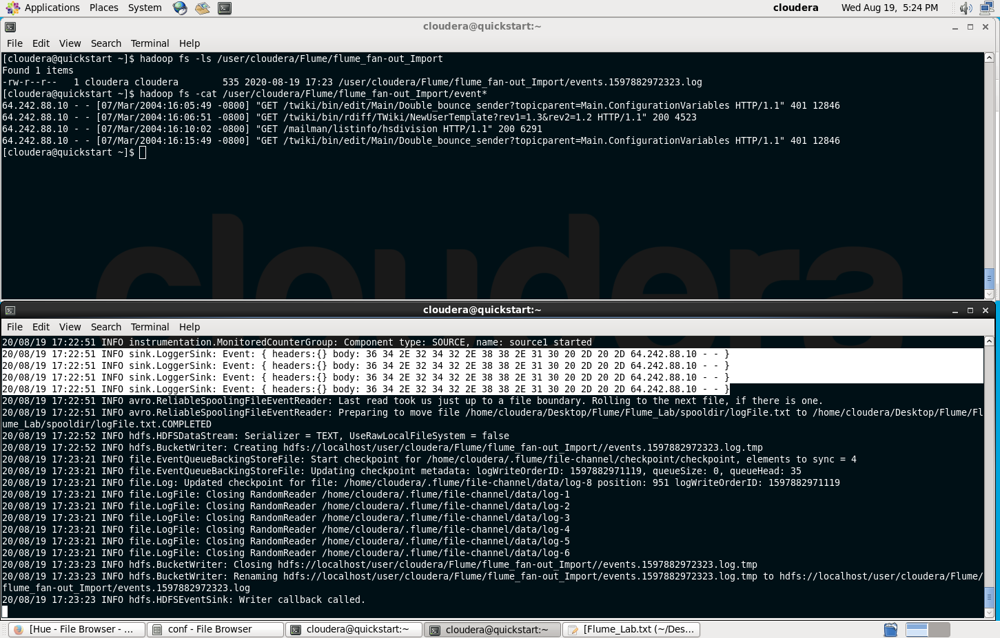
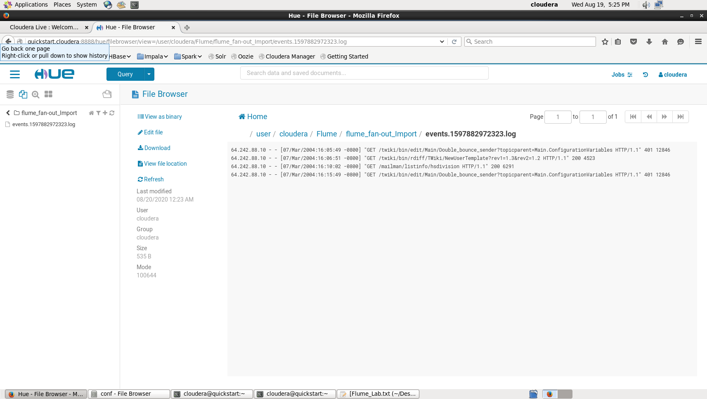
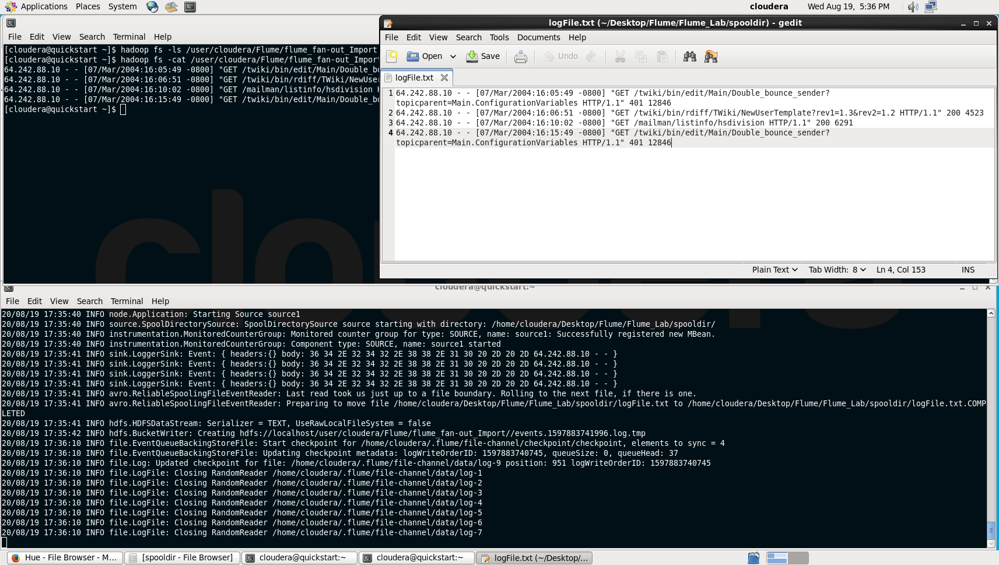
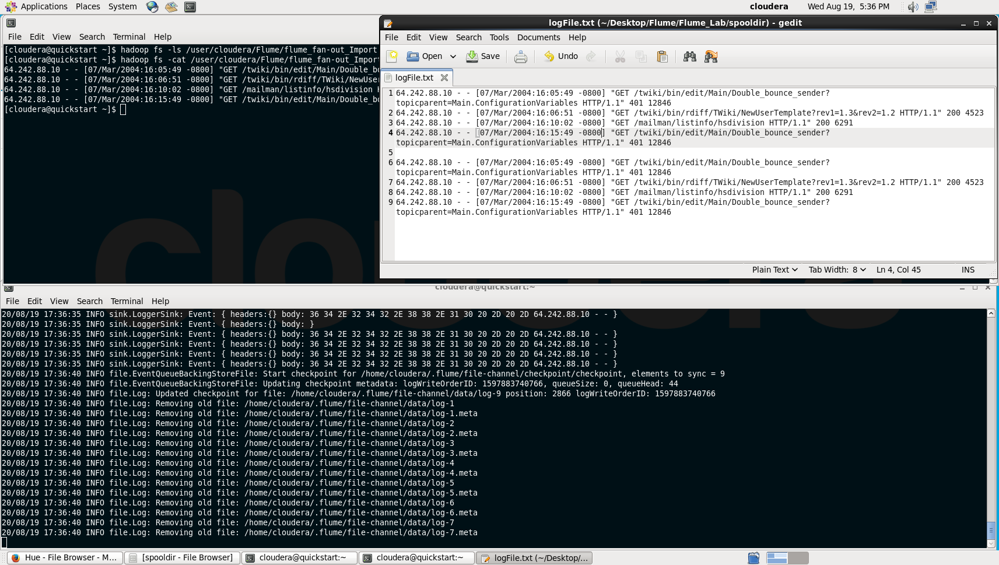
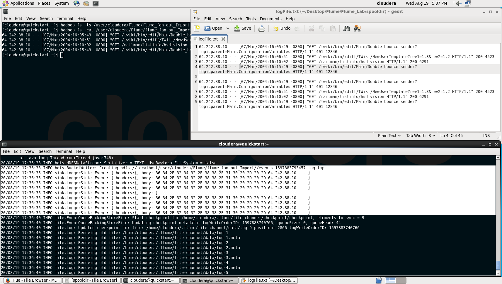
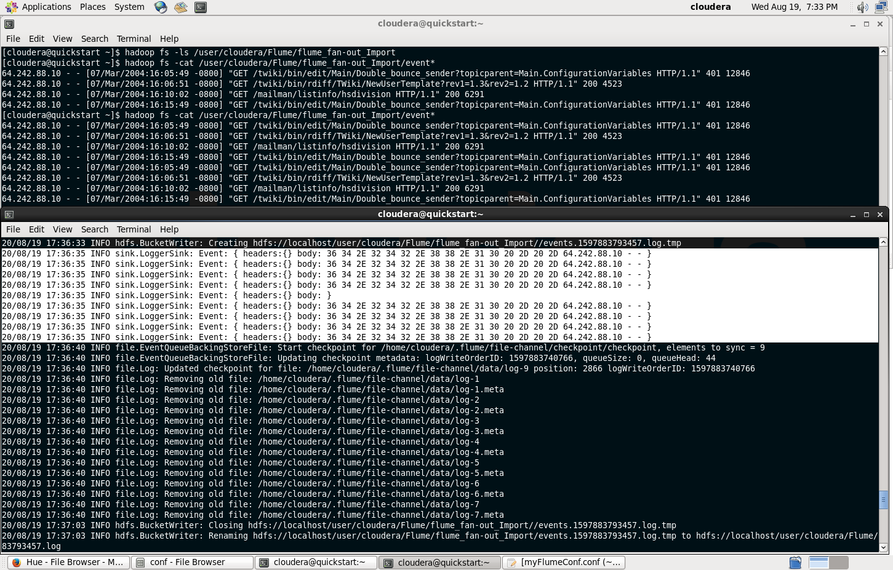
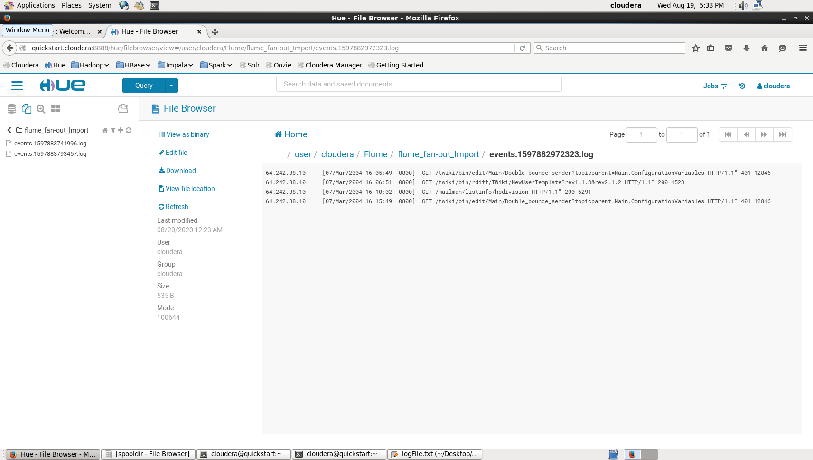

## Apache Flume
### Use Case: Create Flume Agent for data ingestion and fanning it out
### Log file ingestion
### Motivation: 
### - Being able to ingest data to be displayed in memory (console) and persisted in HDFS. 


Mauro Travieso Pena

---
[*] Create an HDFS directory which contains the HDFS sink output
```
$ hdfs dfs -mkdir /user/mpena/Flume
$ hdfs dfs -mkdir /user/mpena/Flume/flume_fan-out_Import
```

[*] In the local file system, for the source, create the corresponding directories which contain the Flume Agent .conf file as well as the spooldir 
```
$ mkdir /home/mpena/Flume/Flume_Lab
$ mkdir /home/mpena/Flume/Flume_Lab/conf
$ mkdir /home/mpena/Desktop/Flume/Flume_Lab/spooldir
```

[*] Copy the file logFile.txt into Flume_Lab/spooldir

[*] Create the Flume Agent configuration file named myFlume_fan-out.conf inside Flume_Lab/conf with the following set of commands

```
$ vi /home/mpena/Desktop/Flume/Flume_Lab/conf/myFlume_fan-out.conf
```
```
# Components of the Flume Agent
agent1.sources = source1
agent1.sinks = sink1a sink1b
agent1.channels = channel1a channel1b

# Binding the Source and the Sink to the corresponding channel 
agent1.sources.source1.channels = channel1a channel1b
agent1.sinks.sink1a.channel = channel1a
agent1.sinks.sink1b.channel = channel1b

# Source configuration
agent1.sources.source1.type = spooldir
agent1.sources.source1.spoolDir = /home/mpena/Desktop/Flume/Flume_Lab/spooldir/

# Sink1a configuration
agent1.sinks.sink1a.type = hdfs
agent1.sinks.sink1a.hdfs.path = hdfs://localhost/user/mpena/Flume/flume_fan-out_Import/
agent1.sinks.sink1a.hdfs.filePrefix = events
agent1.sinks.sink1a.hdfs.fileSuffix = .log
agent1.sinks.sink1a.hdfs.fileType = DataStream

# Sink1b configuration
agent1.sinks.sink1b.type = logger

# Channel configuration
agent1.channels.channel1a.type = file
agent1.channels.channel1b.type = memory
```

[*] To start the Flume Agent
```
$ flume-ng agent -n agent1 -c /home/mpena/Flume/Flume_Lab/conf/ -f /home/mpena/Flume/Flume_Lab/conf/myFlume_fan-out.conf
```

[*] To check if the files were created successfully:
```
$ hdfs dfs -ls /user/mpena/Flume/flume_fan-out_Import
$ hdfs dfs -cat /user/mpena/Flume/flume_fan-out_Import/events*
```

[*] To test:

When the spooldir/logFile.txt is modified (updated with new data), it is observed that the Flume Agent starts and updates the checkpoint metadata.

As a result, any modification done to the 'logFile.txt' file is directly reflected in the console output, as well as in HDFS as soon as it happens.

[*] The following figure show the sequence of the screen captures, after starting the Flume Agent, and
as a result of the applied commands to verify, as well as the HDFS browser imported files and content,
respectively:



In the upper terminal, it is shown the corresponding HDFS output, while in the lower terminal, the
console output is appreciated. In the console, because of their default logger sink extension is
exceeded, the event body content is truncated and represented with 16 bytes. Only the first 16 literals
of every line form the spooldir/logFile.txt can be appreciated.

In the next screen capture, it can be seen the HDFS browser resultant file (events.*.log) and content:



A description of the local filesystem spooldir/logFile.txt is depicted, while the Flume agent is still
running:



To test, if the spooldir/logFile.txt is modified, it is observed that the Flume Agent starts and updates the checkpoint metadata:



The update is printed in the lower console where the Flume Agent is running:



When the modification is performed in the spooldir/logFile.txt, The lower console prints the output and the Flume Agent starts and updates the checkpoint metadata. The HDFS output, is in the upper one.



To summarize, in this screen capture, it can be appreciated the HDFS browser files (events.*.log’s) and the data contained:



---


