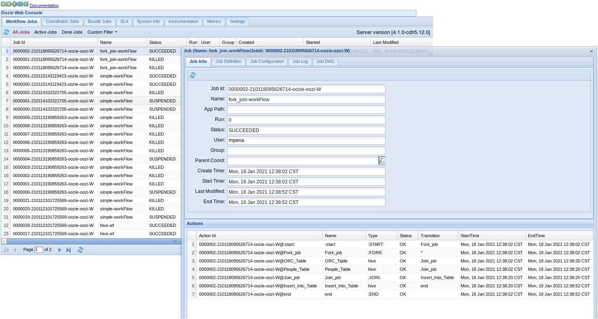
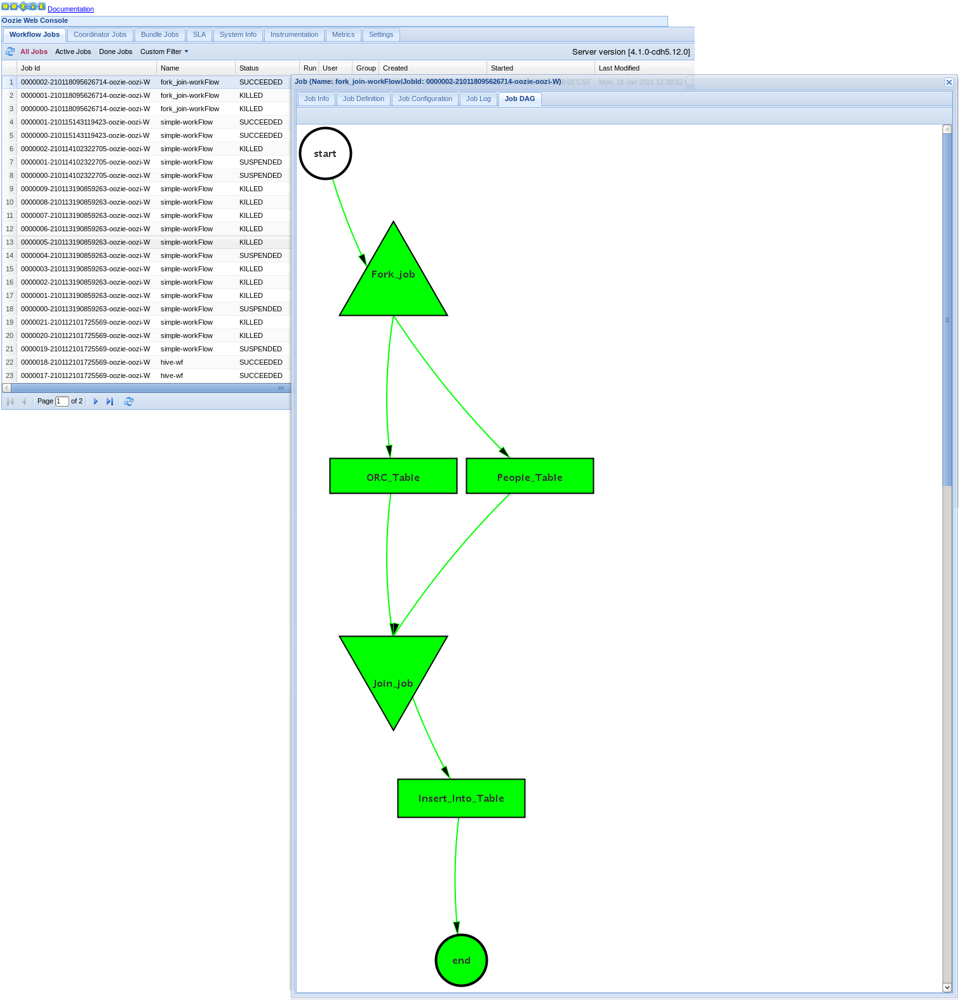

## Apache Oozie
### Use Case: Oozie-Hive Integration Fork and Join execution jobs

### Motivation: 
#### - Being able to create, ingest and perform operations over CSV data
#### - Manage field data from a standard properties Hive table to recipient specific fields Hive ORC data format table. 
#### - Appliying Oozie workflow fork and join jobs and placing job parameters into the corresponding properties file as best pratice.

### Mauro Travieso Pena

---
* **Oozie work flow definition:**
```
<!-- Workflow - Person Data - Hive Table -->
<!--    Job: Fork-Join Control Flow -->
<!-- Author: Mauro Travieso Pena -->

<workflow-app xmlns = "uri:oozie:workflow:0.4" name = "fork_join-workFlow">

   <!-- Start -->
   <start to = "Fork_job" />

   <!-- Fork -->    
   <fork name = "Fork_job">
      <path start = "People_Table" />
      <path start = "ORC_Table" />
   </fork>

   <!-- People_Table -->
   <action name = "People_Table">
      <hive xmlns = "uri:oozie:hive-action:0.4">
         <job-tracker>${jobTracker}</job-tracker>
         <name-node>${nameNode}</name-node>
	 <job-xml>conf.xml</job-xml>
         <script>${script_name_external}</script>
      </hive>
      <ok to = "Join_job" />
      <error to = "kill_job" />
   </action>

   <!-- ORC_Table -->
   <action name = "ORC_Table">
      <hive xmlns = "uri:oozie:hive-action:0.4">
         <job-tracker>${jobTracker}</job-tracker>
         <name-node>${nameNode}</name-node>
	 <job-xml>conf.xml</job-xml>
         <script>${script_name_orc}</script>
      </hive>
      <ok to = "Join_job" />
      <error to = "kill_job" />
   </action>

   <!-- Join -->
   <join name = "Join_job" to = "Insert_Into_Table" />
   <action name = "Insert_Into_Table">
      <hive xmlns = "uri:oozie:hive-action:0.4">
         <job-tracker>${jobTracker}</job-tracker>
         <name-node>${nameNode}</name-node>
	 <job-xml>conf.xml</job-xml>
         <script>${script_name_copy}</script>
      </hive>
      <ok to = "end" />
      <error to = "kill_job" />
   </action>
   
   <kill name = "kill_job">
      <message>Hive failed, error message[${wf:errorMessage(wf:lastErrorNode())}]</message>
   </kill>
	
   <end name = "end" />

</workflow-app>
```

* **Job properties definition:**
```
# Oozie job properties
nameNode=hdfs://nameNode:port
jobTracker=namenode:port
script_name_external=<path-to>/external.hql
script_name_orc=<path-to>/orc.hql
script_name_copy=<path-to>/copydata.hql
hive_database=oozie_hive
workflow_path=oozie/oozie_hive_fork_join/app
queueName=default
oozie.use.system.libpath=true
oozie.wf.application.path=${nameNode}/user/${user.name}/${workflow_path}
```

* **Hive scripts definition:**

***external.hql***
```
CREATE EXTERNAL TABLE ${hive_database}.people_table (
first_name STRING,
last_name STRING,
year_of_birth INT,
address STRING,
city STRING,
state STRING,
zip INT)
COMMENT 'People data hive external table'
ROW FORMAT DELIMITED
FIELDS TERMINATED BY ','
LINES TERMINATED BY '\n'
STORED AS TEXTFILE
LOCATION '/user/mpena/oozie/oozie_hive_fork_join/input'
TBLPROPERTIES("skip.header.line.count"="1");
```

***orc.hql***
```
CREATE EXTERNAL TABLE ${hive_database}.orc_table(
fullname STRING, 
yearofbirth INT,
age INT,         
address STRING,
zip INT)
COMMENT 'ORC data hive internal table'
STORED AS ORC;
```

***copydata.hql***
```
INSERT INTO TABLE ${hive_database}.orc_table
SELECT
CONCAT(first_name,' ',last_name) AS fullname,
year_of_birth AS yearofbirth,
(YEAR(CURRENT_DATE)-year_of_birth) AS age,
CONCAT(city,' ',state) AS address,
zip
FROM ${hive_database}.people_table;
```

* **To start the oozie job:**
```
$ oozie job -oozie http://ybolhdpm01.yotabites.com:11000/oozie/?user.name=mpena -config <path-to>/job.properties -run
```

* **Oozie Job Results:**

Job info:



Job DAG (Direct Acyclic Graph):



* **To test the scripts managed by Ozzie through HQL commands**
```
$ hive
```
```
hive> SHOW DATABASES;
OK
default
.
.
oozie_hive
.
.
```
```
hive> USE oozie_hive;
```
```
hive> SHOW TABLES;
OK
orc_table
people_table
Time taken: 0.012 seconds, Fetched: 2 row(s)
```
```
hive> SELECT * FROM people_table;
OK
Abby	Smith	1984	3456 main	Orlando	FL	45235
Amaya	Williams	1974	123 Orange	Newark	NJ	27656
Alchemy	Davis	1964	Warners	San Jose	CA	34789
Time taken: 0.06 seconds, Fetched: 3 row(s)
```
```
hive> SELECT * FROM orc_table;
OK
Abby Smith	1984	37	Orlando FL	45235
Amaya Williams	1974	47	Newark NJ	27656
Alchemy Davis	1964	57	San Jose CA	34789
Time taken: 0.048 seconds, Fetched: 3 row(s)
```
---
