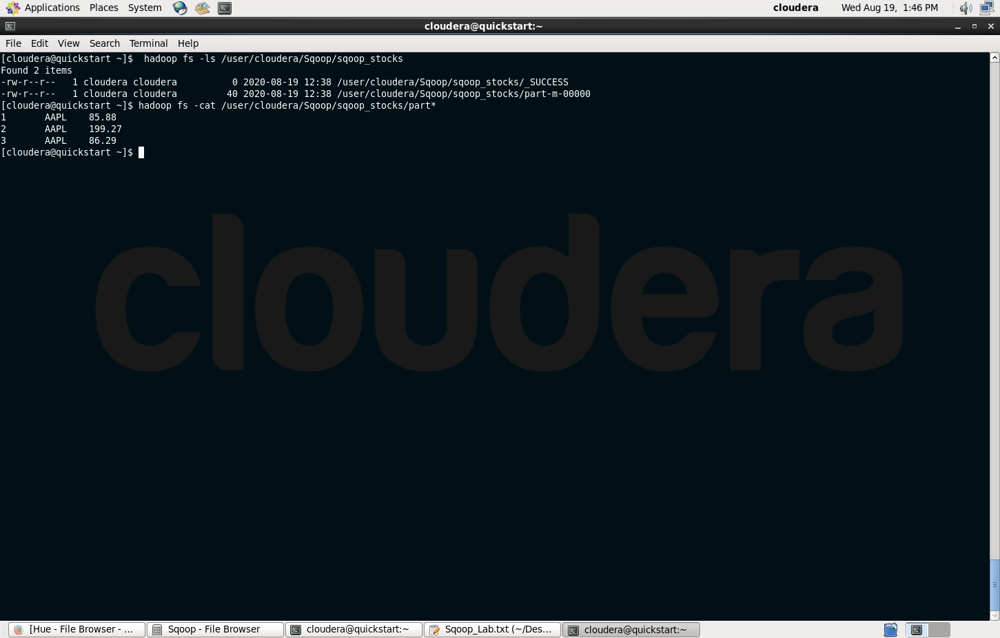

## Apache Sqoop
### Use Case: Transferring efficiently bulk data between Hadoop eco-systems and external datastores (RDBMS, Data warehouse). 
### Motivation: Being able to exchange stuctured data stored on MySQL, HDFS, Hive.  

Mauro Travieso Pena

---
* In the following steps, they are described the required commands to accomplish the import/export of the test data contained in MySQL “mpena_stocks” table:

[*] **Open MySQL console and create a database with an associated table**
```
mysql> CREATE TABLE mpena_stocks (
id INT NOT NULL PRIMARY KEY AUTO_INCREMENT,
symbol VARCHAR(6),
quote_date DATE,
open_price FLOAT(6,2),
high_price FLOAT(6,2),
low_price FLOAT (6,2));
```

[*] Create a directory in HDFS and import the data from MySQL table stocks
```
$ sqoop import \
--connect jdbc:mysql://localhost/sqoop_stocks \
--username hadoop-trainee -P \
--table mpena_stocks \
--columns id,symbol,open_price \
--target-dir=/user/mpena/Sqoop/sqoop_stocks;
```

**Notice** that using --columns option, it lets us to select the required columns & order from the main table to be imported into HDFS. 

Due to it is needed tab-separated format in the destination table --fields-terminated-by argument allows to fulfill this requirement. Because of the amount of small data, only one mapper is put to work. 

Note that when not primary key is defined, error would raise and it is needed to include --split-by argument, selecting the splitting column (“only integer values” column). When --split-by command is omitted, (number of mappers) -m 1 is mandatory. 

[*] To verify:
```
$ hdfs dfs -ls /user/mpena/Sqoop/sqoop_stocks
$ hdfs dfs -cat /user/mpena/Sqoop/sqoop_stocks/part*
$ hdfs dfs -cat /user/mpena/Sqoop/sqoop_stocks/part-m-00000
```

The following figures show the screen captures of the applied commands to verify, as well as the HDFS browser imported files and content, respectively:




[*] Using Sqoop to import the data stored in MySQL directly into a Hive table
```
$ hive
```
```
hive> CREATE DATABASE mpena_sqoop_stocks;
hive> exit;
```
```
$ sqoop import \
--connect jdbc:mysql://localhost/sqoop_stocks \
--username hadoop-trainee -P \
--table mpena_stocks \
--columns "id, symbol, open_price" \
--fields-terminated-by "\t" \
--hive-import \
--create-hive-table \
--hive-table sqoop_stocks.stocks \
--m 1;
```

[*] To verify:
```
$ hive
hive> SHOW TABLES LIKE 'mpena*';
hive> SELECT * FROM mpena_stocks;

-OR-

$ hdfs dfs -ls /<path-to>/hive/warehouse/sqoop_stocks.db/stocks
$ hdfs dfs -cat /<path-to>/hive/warehouse/sqoop_stocks.db/stocks/part*
```

In the following attached figures show the screen captures of the applied commands to verify, as well as the HDFS browser imported files and content, respectively:


[*] **Sqoop export from HDFS to MySQL**
```
mysql> CREATE TABLE stocks_hdfs_id_symbol_op (
id INT NOT NULL PRIMARY KEY AUTO_INCREMENT,
symbol VARCHAR(6),
open_price FLOAT(6,2));
```
```
$ sqoop export \
--connect jdbc:mysql://localhost/sqoop_stocks \
--username root -P \
--table stocks_hdfs_id_symbol_op \
--export-dir=/user/cloudera/Sqoop/sqoop_stocks/ \
--m 1;
```
```
mysql> SELECT * FROM stocks_id_symbol_op;
```

[*] **Sqoop export from Hive to MySQL**
```
mysql> CREATE TABLE stocks_hive_id_symbol_op (
id INT NOT NULL PRIMARY KEY AUTO_INCREMENT,
symbol VARCHAR(6),
open_price FLOAT(6,2));
```
```
$ sqoop export \
--connect jdbc:mysql://localhost/sqoop_stocks \
--username root -P \
--table stocks_hive_id_symbol_op \
--export-dir=/user/hive/warehouse/sqoop_stocks.db/stocks/ \
--m 1;
```
```
mysql> SELECT * FROM stocks_hive_id_symbol_op;
```

An illustration of the application commands to verify is shown in the next figures, containing the screen captures of the applied commands to check in MySQL, the tables and the content of them, as well as their descriptive structure after the Sqoop export command is applied to the HDFS and Hive contained data:


---