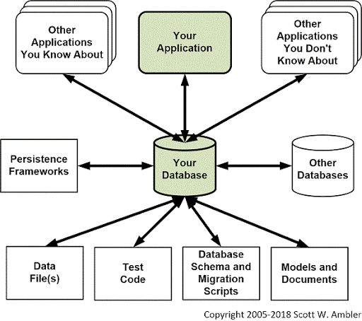

# DataBase Management

#### Mauro Travieso 

### Tasks

* What is a Database, what’s the need for Database?

A database is considered a persistance layer to store and perform operations on data.
<br>
<br>
It is an optimized organization of structural elements of information or data, ellectronically stored in a controlled system. 
<br>
<br>
It is in charge of maintaining the structural information of an organization, allowing data to be stored and retrieved quickly and safely, as well to be distributed accross the network.
<br>

<br>
According to the type of data is going to be stored, the internal structure and functionality of the RDBMS (Structured data) or NoSQL (NonStructured or Semi-structured data), the CAP theorem is applied. CAP stands for Consistency (the data is updated and the same), Availability (accessing the data all the time) and network Partitioning (communication breaks between operators).
<br>


* Understanding DML and DDL

*1.DDL – Data Definition Language:* 
```
Commands used to define the database schema. Used to create and modify the structure of the database objects in it. 

 - CREATE: create the database or its objects. 
 - DROP: delete objects from the database.  
 - ALTER: alter the structure of the database.
 - TRUNCATE: remove all records from a table, including spaces allocated.
 - COMMENT: add comments tro the data dictionary.
 - RENAME: rename an existing object in the database.
```

*2.DML - Data Manipulation Language:* 
```
Commands in charge of manipulating data present in the database.

 - INSERT: inserts data into a table in a database.
 - UPDATE: updates existing data whithin a database.
 - DELETE: deletes records from a database table. 
```

* Setup MYSQL database in your local machine (Important: Moving forward, all exercise should be written and completed in your local database)

#### Referential Activities:

[My SQL](https://dev.mysql.com/doc/mysql-getting-started/en/)

[TutorialsPoint](https://www.tutorialspoint.com/mysql/)

