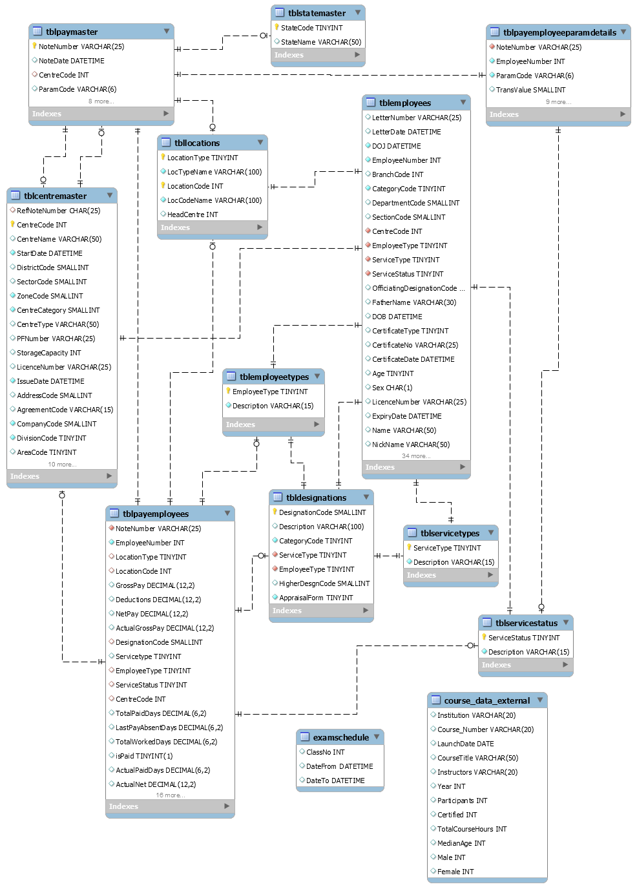

# DataBase Management

#### Mauro Travieso 

### Tasks:

**After setting up your local mysql database, import the Employee_DB.sql file into your database. It is a sample Employee Database with some dummy data in it. <br>
Read about different keys in database tables and understand it’s significance.**


### SQL Exercises:

* E-R Diagram:
* Create a E-R diagram model representation for the Employee Db.


* Queries:

* Write a query to Get a List of Employee who have a one part name:
```
SELECT Name 
FROM tblemployees 
WHERE LENGTH(Name) - LENGTH(REPLACE(Name, ' ', '')) +1 = 1;
```

* Write a query to Get a List of Employee who have a three part name:
```
SELECT Name 
FROM tblemployees 
WHERE LENGTH(Name) - LENGTH(REPLACE(Name, ' ', '')) +1 = 3;
```

* Write a query to get a list of Employee who have a First Middle Or last name as Ram, and not any thing else:
```
SELECT Name 
FROM tblemployees 
WHERE (Name = 'Ram') OR (Name REGEXP '[R][a][m][. ]') OR (Name REGEXP '[ ][R][a][m]');
```
-OR-
```
SELECT Name
FROM tblemployees
WHERE (Name LIKE 'RAM') OR 
(Name REGEXP '^[R][A][M][ ]') OR
(Name REGEXP '^[ ][R][A][M][.  ]') OR 
(Name REGEXP '[ ][R][A][M]');
```

* Write a query which gives employee types in the organization.
```
SELECT EmployeeType, Description
FROM tblemployeetypes;
```
-OR-
```
SELECT DISTINCT EmployeeType
FROM tblemployees;
```

* Write a Query to get all employees where reminder of employee number by 10 is a power of two:
```
SELECT Name
FROM tblemployees
WHERE MOD(EmployeeNumber, 10) IN (2,4,8); 
```
-OR-
```
SELECT Name
FROM tblemployees
WHERE EmployeeNumber % 10  IN (2,4,8);
```

* Write a query to get all employees sorted by Service Type and Name within a given Center
```
SELECT ServiceType, Name 
FROM tblemployees 
WHERE CentreCode = 21 
ORDER BY ServiceType ASC, Name ASC;
```
To obtain the CentreCode: 
```
SELECT DISTINCT CentreCode 
FROM tblemployees;
```

### Reading Activity:

[Oracle Docs](https://docs.oracle.com/cd/A87860_01/doc/java.817/a81358/05_dev1.htm)
[Microsoft](https://technet.microsoft.com/en-us/library/bb264565(v=sql.90).aspx)
[Youtube](https://www.youtube.com/watch?v=AJdwp0fAHf4)


