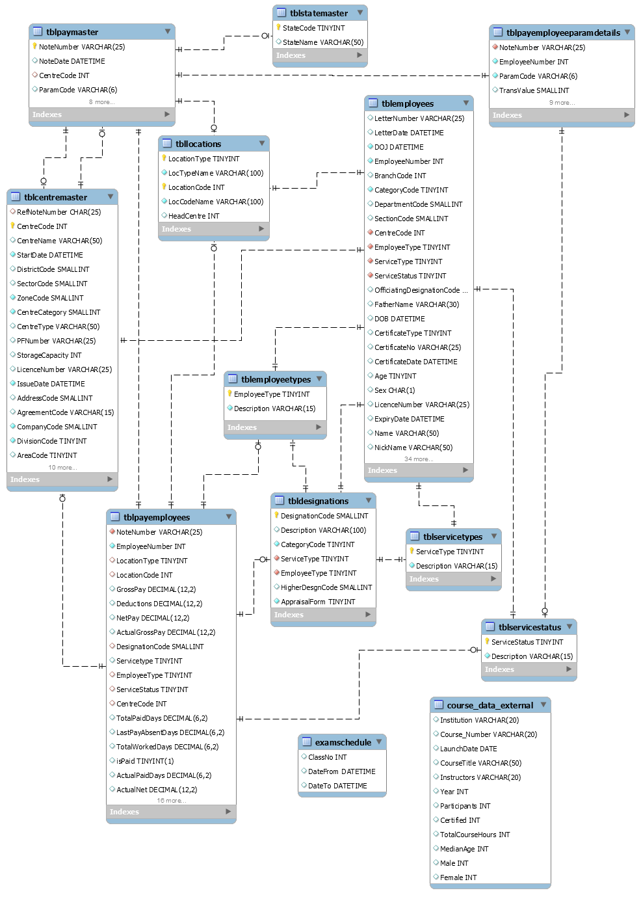

# DataBase Management

#### Mauro Travieso 

---

### Tasks

* **DDL, DML, DCL and TCL commands. When and where do you use them:**

They belong to categories of SQL commands, in charge of performing specific operations in the database:

*1.DDL – Data Definition Language:* 
```
Commands used to define the database schema. Used to create and modify the structure of the database objects in it. 

 - CREATE: create the database or its objects. 
 - DROP: delete objects from the database.  
 - ALTER: alter the structure of the database.
 - TRUNCATE: remove all records from a table, including spaces allocated.
 - COMMENT: add comments tro the data dictionary.
 - RENAME: rename an existing object in the database.
```

*2.DML - Data Manipulation Language:* 
```
Commands in charge of manipulating data present in the database.

 - INSERT: inserts data into a table in a database.
 - UPDATE: updates existing data whithin a database.
 - DELETE: deletes records from a database table. 
```

*3.TCL – Transaction Control Language:*
```
Commands that deal with the transactional operations within the database.

 - COMMIT: commits a transaction to apply the changes in the database.
 - ROLLBACK: in case an error occurs, this command rollbacks a transaction.
 - SAVEPOINT: sets a save point within a transaction.
 - SET TRANSACTION: specifies characteristics for the transaction.
```

* **Aggregate functions, GROUP BY, HAVING clause and their significance:**

An aggrgate function is in charge of performing a calculation on one or more values and returns a single value. It is often used with the clauses 'GROUP BY' and 'HAVING' in reference to the 'SELECT' statement.

 - GROUP BY:
 This statement groups rows that have the same values into summary rows, such as: 'find the total number of employees in every deparment'. It is often used with aggregate functions (COUNT, MAX, MIN, SUM, AVG) to group the result-set by one or moree columns.

 Syntax:
```
 SELECT column_name(s)
 FROM table_name
 WHERE condition
 GROUP BY column_name(s)
 ORDER BY column_name(s);
```
 i.e:
 ```  
 SELECT COUNT(EmployeeId), Department
 FROM Employees
 GROUP BY Department
 ORDER BY COUNT(EmployeeId) DESC;
```

 - HAVING:
 This clause was added to SQL due to WHERE keyword could not be used with aggregate functions.

 Syntax:
```
 SELECT column_name(s)
 FROM table_name
 WHERE condition
 GROUP BY column_name(s)
 HAVING condition
 ORDER BY column_name(s);
```
 i.e:
```
 SELECT COUNT(EmployeeId), Department
 FROM Employees
 GROUP BY Department
 HAVING COUNT(EmployeeId) > 5
 ORDER BY COUNT(EmployeeId) DESC;
```

### SQL Exercises:

* Write down all the different data types you observe in the entire database and its allowed values:
```
char(1) DEFAULT NULL,
char(1) NOT NULL,

varchar(6) NOT NULL,  
varchar(10) DEFAULT NULL,
varchar(15) NOT NULL
varchar(15) DEFAULT NULL,
varchar(20) DEFAULT NULL,
varchar(25) NOT NULL,  
varchar(25) DEFAULT NULL,
varchar(30) DEFAULT NULL,
varchar(50) DEFAULT NULL,
varchar(100) NOT NULL,
varchar(100) DEFAULT NULL,
varchar(200) DEFAULT NULL,
varchar(400) DEFAULT NULL,

date DEFAULT NULL,

datetime DEFAULT NULL,
datetime NOT NULL,

int NOT NULL,
int DEFAULT NULL,

tinyint unsigned NOT NULL,
tinyint unsigned DEFAULT NULL,
tinyint(1) DEFAULT NULL,

smallint DEFAULT NULL,
smallint DEFAULT NULL,
smallint NOT NULL,

decimal(5,2) DEFAULT NULL,
decimal(6,2) DEFAULT NULL,
decimal(10,2) DEFAULT NULL,
decimal(12,2) DEFAULT NULL,
decimal(15,2) DEFAULT NULL,
```
  
* Understand different types of DATE data types and values it can accept:

Date and Time data types:

| Data type	    | Description |
| ------------- | ----------- |
| DATE	        | A date. Format: YYYY-MM-DD. Supported range: '1000-01-01' to '9999-12-31' |
| DATETIME    	| A date and time combination. Format: YYYY-MM-DD hh:mm:ss. Supported range is from '1000-01-01 00:00:00' to '9999-12-31 23:59:59'. Adding DEFAULT and ON UPDATE in the column definition to get automatic initialization and updating to the current date and time. |
| TIMESTAMP	    | A timestamp. TIMESTAMP values are stored as the number of seconds since the Unix epoch ('1970-01-01 00:00:00' UTC). Format: YYYY-MM-DD hh:mm:ss. The supported range is from '1970-01-01 00:00:01' UTC to '2038-01-09 03:14:07' UTC. Automatic initialization and updating to the current date and time can be specified using DEFAULT CURRENT_TIMESTAMP and ON UPDATE CURRENT_TIMESTAMP in the column definition. |
| TIME	        | A time. Format: hh:mm:ss. The supported range is from '-838:59:59' to '838:59:59' |
| YEAR	        | A year in four-digit format. Values allowed in four-digit format: 1901 to 2155, and 0000. MySQL 8.0 does not support year in two-digit format. |


### E-R Diagram:

* Document the E-R Diagram in a word doc explaining each table and its relationship with other tables in the database. Your document should explain the entire database architecture in a precise manner. 

```
mysql> USE dbo;

mysql> SHOW TABLES;
```

| Tables_in_dbo              |
| -------------------------- |
| course_data_external       |
| examschedule               |
| tblcentremaster            |
| tbldesignations            |
| tblemployees               |
| tblemployeetypes           |
| tbllocations               |
| tblpayemployeeparamdetails |
| tblpayemployees            |
| tblpaymaster               |
| tblservicestatus           |
| tblservicetypes            |
| tblstatemaster             |

13 rows in set (0.00 sec)

The Database 'dbo' contains 13 tables described in the BD_Day3.docx file.



### Queries:

* Write a query to find the all the names which contain the word or a part of a word Suresh, sort the result in the order of similarity.
** Ex **: Suresh, Sures, Sure, Sur, Su, S (Names containing the word Suresh, later names containing Sures and so on)

```
SELECT Name
FROM tblemployees
WHERE
Name LIKE 'SURESH%' OR
Name LIKE 'SURES%' OR
Name LIKE 'SURE%' OR
Name LIKE 'SUR%' OR
Name LIKE 'SU%' OR
Name LIKE 'S%'
ORDER BY Name DESC;
```


* Display all names from tblEmployees by appending it with INDIAN at the end if the name starts from A-M, for names starting from N-Z append AMERICAN at the end.
** Ex **: Shyam should display as ShyamAMERICAN and Abdul should display as AbdulINDIAN
```
SELECT IF(Name REGEXP '^[A-M]', CONCAT(SUBSTRING_INDEX(Name, ' ', 1),"INDIAN"), CONCAT(SUBSTRING_INDEX(Name, ' ', 1),"AMERICAN"))
FROM tblemployees
ORDER BY Name;
```

* Write a query to find the name(s) having the largest number of characters in it. (Hint: Use aggregate functions)

```
SELECT 
SUBSTRING_INDEX(Name, ' ', 1) AS name, 
CHAR_LENGTH(SUBSTRING_INDEX(Name, ' ', 1)) AS length 
FROM tblemployees
ORDER BY length DESC 
LIMIT 1;
```


* Write a query to list all the employees whose name starts and ends with same character.

```
SELECT SUBSTRING_INDEX(Name, ' ', 1) AS name 
FROM tblemployees 
WHERE LEFT(name,1) = RIGHT(name,1);
```


* Write a query to list all employees whose first and second character in their names are similar.

```
SELECT SUBSTRING_INDEX(Name, ' ', 1) AS name 
FROM tblemployees  
WHERE LEFT(name,1) = SUBSTR(name,2,1);
```

* Write a query to get Max salary and Min salary of all the employees. (NOTE: You can skip any two of the above questions if you execute the query without aggregate functions)

```
SELECT tblemployees.Name, MAX(GrossPay), MIN(GrossPay), MAX(NetPay), MIN(NetPay) 
FROM tblpayemployees
INNER JOIN tblemployees ON tblemployees.EmployeeNumber = tblpayemployees.EmployeeNumber;
```

Without using aggregate functions:
```
SELECT tblemployees.Name, GrossPay AS max_grosspay
FROM tblpayemployees
INNER JOIN tblemployees ON tblemployees.EmployeeNumber = tblpayemployees.EmployeeNumber
ORDER BY GrossPay DESC
LIMIT 1;
```
```
SELECT tblemployees.Name, GrossPay AS min_grosspay
FROM tblpayemployees
INNER JOIN tblemployees ON tblemployees.EmployeeNumber = tblpayemployees.EmployeeNumber
ORDER BY GrossPay ASC
LIMIT 1;
```

### Reading Activity:

[sql joins](http://www.sql-join.com/)
[site-point-joins](https://www.sitepoint.com/understanding-sql-joins-mysql-database/)
[Microsoft](https://msdn.microsoft.com/en-us/library/ms181765.aspx)


