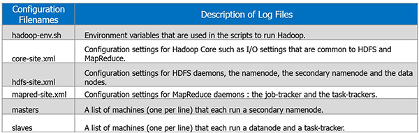

# Hadoop, HDFS, MapReduce, YARN

### Mauro Travieso 

---

### Tasks

#### Hadoop Misc

* **What is user impersonation in Hadoop?**

    To enable different users to run mapping and workflow jobs on a Hadoop cluster that uses Kerberos authentication, you must configure user impersonation in the Hadoop environment.

    A superuser with username *super* wants to submit job and access hdfs on behalf of a user *joe*. The superuser has kerberos credentials but user *joe* doesn’t have any. 
    
    The tasks are required to run as user *joe* and any file accesses on namenode are required to be done as user *joe*. 
    
    It is required that user *joe* can connect to the namenode or job tracker on a connection authenticated with *super*’s kerberos credentials. In other words *super* is impersonating the user joe.

    You can enable different users to run mappings in a Hadoop cluster that uses Kerberos authentication or connect to big data sources and targets that use Kerberos authentication. To enable different users to run mappings or connect to big data sources and targets, you must configure user impersonation.

    You can configure user impersonation for the native or Hadoop environment.

    Before you configure user impersonation, you must complete the following prerequisites:
        
        Complete the prerequisite tasks for running mappings on a Hadoop cluster with Kerberos authentication.
        Configure Kerberos authentication for the native or Hadoop environment.
        If the Hadoop cluster uses MapR, create a proxy directory for the user who will impersonate other users.

    If the Hadoop cluster does not use Kerberos authentication, you can specify a user name in the Hadoop connection to enable the Data Integration Service to impersonate that user.

    If the Hadoop cluster uses Kerberos authentication, you must specify a user name in the Hadoop connection.

* **What is Hadoop Distributed copy?**

    Hadoop Distributed Copy (distcp) is a tool for efficiently copying large amounts of data within or in between clusters. It uses the MapReduce framework to do the copying. The benefits of using MapReduce include parallelism, error handling, recovery, logging, and reporting. 
    
    The Hadoop Distributed Copy command (distcp) is useful when moving data between development, research, and production cluster environments.

    It expands a list of files and directories into input to map tasks, each of which will copy a partition of the files specified in the source list.

* **Try “hadoop distcp” command and observe the ouput.**

    Usage: $ hadoop distcp \<src\> \<dst\>

        Example: $ hadoop distcp hdfs://nn1:8020/file1 hdfs://nn2:8020/file2

        file1 from nn1 is copied to nn2 with file name file2

    Distcp is the best tool as of now. Sqoop ismpena used to copy data from relational database to HDFS and vice versa, but not between HDFS to HDFS.

* **Assuming a large file on HDFS at /user/foo/largefile.avro, give the distcp command to copy it to a location at /tmp/destination**

* **Go through the distcp documentation https://hadoop.apache.org/docs/r3.1.3/hadoop-distcp/DistCp.html**

To obtain the Hadoop version:
```
$ hadoop version
```
```
[mpena@yboledge02 ~]$ hadoop version
Hadoop 2.6.0-cdh5.14.0
```

To determine the namenode:
```
$ hdfs getconf -namenodes

$ hdfs dfsadmin -report
```

To show the port where the namenode is listening
```
$ hdfs getconf -confKey fs.defaultFS
``` 
```
[mpena@yboledge02 directory]$ hdfs getconf -confKey fs.defaultFS
hdfs://ybolcldrmstr.yotabites.com:8020
```

```
[mpena@yboledge02 directory]$ hdfs getconf -namenodes
ybolcldrmstr.yotabites.com

[mpena@yboledge02 directory]$ ping ybolcldrmstr.yotabites.com
PING ybolcldrmstr.yotabites.com (10.1.1.15) 56(84) bytes of data.
64 bytes from ybolcldrmstr.yotabites.com (10.1.1.15): icmp_seq=1 ttl=64 time=0.274 ms

ybolcldrmstr.yotabites.com = 10.1.1.15
```

To print out the secondary namenodes:
```
$ hdfs getconf -secondaryNameNodes
```

To print out the backup namenodes:
```
$ hdfs getconf -backupNodes
```

Using the distcp command:
```
$ hadoop distcp hdfs://10.1.1.15:8020/user/mpena/directory/largefile.avro hdfs://10.1.1.15:8020/tmp/mpena_directory/largefile.avro
```

```
.
.
.
20/12/11 16:18:52 INFO mapreduce.Job: Counters: 33
        File System Counters
                FILE: Number of bytes read=0
                FILE: Number of bytes written=154197
                FILE: Number of read operations=0
                FILE: Number of large read operations=0
                FILE: Number of write operations=0
                HDFS: Number of bytes read=394
                HDFS: Number of bytes written=23
                HDFS: Number of read operations=16
                HDFS: Number of large read operations=0
                HDFS: Number of write operations=4
        Job Counters
                Launched map tasks=1
                Other local map tasks=1
                Total time spent by all maps in occupied slots (ms)=5850
                Total time spent by all reduces in occupied slots (ms)=0
                Total time spent by all map tasks (ms)=5850
                Total vcore-milliseconds taken by all map tasks=5850
                Total megabyte-milliseconds taken by all map tasks=5990400
        Map-Reduce Framework
                Map input records=1
                Map output records=0
                Input split bytes=116
                Spilled Records=0
                Failed Shuffles=0
                Merged Map outputs=0
                GC time elapsed (ms)=63
                CPU time spent (ms)=1000
                Physical memory (bytes) snapshot=310751232
                Virtual memory (bytes) snapshot=2845810688
                Total committed heap usage (bytes)=551026688
        File Input Format Counters
                Bytes Read=255
        File Output Format Counters
                Bytes Written=0
        DistCp Counters
                Bytes Copied=23
                Bytes Expected=23
                Files Copied=1
[mpena@yboledge02 directory]$ hdfs dfs -ls /tmp/mpena_directory
Found 1 items
-rw-r--r--   3 mpena supergroup         23 2020-12-11 16:18 /tmp/mpena_directory/largefile.avro
```

To find the active namenode, we can try executing the test hdfs command on each of the namenodes and find the active name node corresponding to the successful run.

Below command executes successfully if the name node is active and fails if it is a standby node.
```
$ hadoop fs -test -e hdfs://<Name node>/
```

* **Write a shell script to list all the jar files in the output of hadoop classpath command.**
    
    To list the .jar in the classpath:
    ```
    $ hadoop classpath --glob
    ```
    
    To list the .jar in the classpath as a formatted list:
    ```
    classpath_list.sh

    for i in $(hadoop classpath | sed -e "s/:/ /g"); 
    do 
        echo $i | egrep "\.jar$" >/dev/null && python -c "import os,sys; print os.path.realpath(sys.argv[1])" $i
    done | sort | uniq
    ```
    
    ```
    $ ./classpath_list.sh 
    ```
   
    ```
    [mpena@yboledge02 directory]$ ./classpath_list.sh
    /opt/cloudera/parcels/CDH-5.14.0-1.cdh5.14.0.p0.24/jars/activation-1.1.jar
    /opt/cloudera/parcels/CDH-5.14.0-1.cdh5.14.0.p0.24/jars/aopalliance-1.0.jar
    /opt/cloudera/parcels/CDH-5.14.0-1.cdh5.14.0.p0.24/jars/apacheds-i18n-2.0.0-M15.jar
    /opt/cloudera/parcels/CDH-5.14.0-1.cdh5.14.0.p0.24/jars/apacheds-kerberos-codec-2.0.0-M15.jar
    /opt/cloudera/parcels/CDH-5.14.0-1.cdh5.14.0.p0.24/jars/api-asn1-api-1.0.0-M20.jar
    /opt/cloudera/parcels/CDH-5.14.0-1.cdh5.14.0.p0.24/jars/api-util-1.0.0-M20.jar
    /opt/cloudera/parcels/CDH-5.14.0-1.cdh5.14.0.p0.24/jars/asm-3.2.jar
    /opt/cloudera/parcels/CDH-5.14.0-1.cdh5.14.0.p0.24/jars/avro-1.7.6-cdh5.14.0.jar/opt/cloudera/parcels/CDH-5.14.0-1.cdh5.14.0.p0.24/jars/aws-java-sdk-bundle-1.11.134.jar
    .
    .
    .
    /opt/cloudera/parcels/CDH-5.14.0-1.cdh5.14.0.p0.24/jars/snappy-java-1.0.4.1.jar
    /opt/cloudera/parcels/CDH-5.14.0-1.cdh5.14.0.p0.24/jars/spark-1.6.0-cdh5.14.0-yarn-shuffle.jar
    /opt/cloudera/parcels/CDH-5.14.0-1.cdh5.14.0.p0.24/jars/stax-api-1.0-2.jar
    /opt/cloudera/parcels/CDH-5.14.0-1.cdh5.14.0.p0.24/jars/xercesImpl-2.9.1.jar
    /opt/cloudera/parcels/CDH-5.14.0-1.cdh5.14.0.p0.24/jars/xml-apis-1.3.04.jar
    /opt/cloudera/parcels/CDH-5.14.0-1.cdh5.14.0.p0.24/jars/xmlenc-0.52.jar
    /opt/cloudera/parcels/CDH-5.14.0-1.cdh5.14.0.p0.24/jars/xz-1.0.jar
    /opt/cloudera/parcels/CDH-5.14.0-1.cdh5.14.0.p0.24/jars/zookeeper-3.4.5-cdh5.14.0.jar
    ```
* * From the above list, identify the common *jars* across multiple directories.

    To find if a .jar file belongs to (a) different director(y)ies:
    ```
    $ find / -name "name_of_file.jar"
    ``` 

    To list the directories and to count the number of occurrences of that .jar file in the file system to obtain its frequency:
    ```
    $ find / "name_of_file.jar" | wc -l
    ```

* **Read About following commands:**

  As part of the HDFS User Commands, they can be found

* * hadoop fsck

    HDFS fsck is used to check the health of the file system, to find missing files, over replicated, under replicated and corrupted blocks.

    HDFS supports the fsck command to check for various inconsistencies. It it is designed for reporting problems with various files, for example, missing blocks for a file or under-replicated blocks. Unlike a traditional fsck utility for native file systems, this command does not correct the errors it detects. Normally NameNode automatically corrects most of the recoverable failures. By default fsck ignores open files but provides an option to select all files during reporting. The HDFS fsck command is not a Hadoop shell command. It can be run as 'bin/hadoop fsck'. fsck can be run on the whole file system or on a subset of files.

    ```
    Usage: hadoop fsck [GENERIC_OPTIONS] <path> [-move | -delete | -openforwrite] [-files [-blocks [-locations | -racks]]]
    ```

    | COMMAND_OPTION | Description |
    |---|---|
    |\<path\>|Start checking from this path.|
    |-move|	Move corrupted files to /lost+found|
    |-delete|Delete corrupted files.|
    |-openforwrite|Print out files opened for write.|
    |-files|Print out files being checked.|
    |-blocks|Print out block report.|
    |-locations|Print out locations for every block.|
    |-racks|Print out network topology for data-node locations.|

    Command for finding the block for a file:

    ```
    $ hdfs fsck / 
    ```

* * hadoop groups

    Usage: hdfs groups [username ...]

        Returns the group information given one or more usernames.

    Example: $hdfs groups ksc

        It gives all of the groups user 'ksc' belongs to.

* **What are hadoop Generic options & Shell options? List at least five uses of Generic and Shell options**

    All of the Hadoop commands and subprojects follow the same basic structure:

    Usage: shellcommand [SHELL_OPTIONS] [COMMAND] [GENERIC_OPTIONS] [COMMAND_OPTIONS]

    |FIELD|Description|
    |---|---|
    |shellcommand|The command of the project being invoked. For example, Hadoop |common uses hadoop, HDFS uses hdfs, and YARN uses yarn.|
    |SHELL_OPTIONS|Options that the shell processes prior to executing Java.|
    |COMMAND|Action to perform.|
    |GENERIC_OPTIONS|The common set of options supported by multiple commands.|
    |COMMAND_OPTIONS|Various commands with their options are described in this documention for the Hadoop common sub-project. HDFS and YARN are covered in other documents.|

    Associated to the hadoop commands, they are found:

    * * **Generic options:**

        Many subcommands honor a common set of configuration options to alter their behavior:

        |GENERIC_OPTION|Description|
        |---|---|
        |-archives \<comma separated list of archives\>|Specify comma separated archives to be unarchived on the compute machines. Applies only to job.|
        |-conf \<configuration file\> |Specify an application configuration file.|
        |-D \<property\>=\<value\>|Use value for given property.|
        |-files \<comma separated list of files\>|Specify comma separated files to be copied to the map reduce cluster. Applies only to job.|
        |-fs \<file:///\> or \<hdfs://namenode:port\>|Specify default filesystem URL to use. Overrides ‘fs.defaultFS’ property from configurations.|
        |-jt \<local\> or \<resourcemanager:port\>|Specify a ResourceManager. Applies only to job.|
        |-libjars \<comma seperated list of jars\>|Specify comma separated jar files to include in the classpath. Applies only to job.|

    * * **Shell options:**

        All of the shell commands will accept a common set of options. For some commands, these options are ignored. For example, passing ---hostnames on a command that only executes on a single host will be ignored.

        |SHELL_OPTION|Description|
        |---|---|
        |--buildpaths|Enables developer versions of jars.|
        |--config<br> confdir|Overwrites the default Configuration directory.Default is $HADOOP_HOME/etc/hadoop.|
        |--daemon mode|If the command supports daemonization (e.g., hdfs namenode), execute in the appropriate mode. Supported modes are start to start the process in daemon mode, stop to stop the process, and status to determine the active status of the process. status will return an LSB-compliant result code. If no option is provided, commands that support daemonization will run in the foreground. For commands that do not support daemonization, this option is ignored.|
        |--debug|Enables shell level configuration debugging information.|
        |--help|Shell script usage information.|
        |--hostnames|When --workers is used, override the workers file with a space delimited list of hostnames where to execute a multi-host subcommand. If --workers is not used, this option is ignored.|
        |--hosts|When --workers is used, override the workers file with another file that contains a list of hostnames where to execute a multi-host subcommand. If --workers is not used, this option is ignored.|
        |--loglevel<br> loglevel|Overrides the log level. Valid log levels are FATAL, ERROR, WARN, INFO, DEBUG, and TRACE. Default is INFO.|
        |--workers|If possible, execute this command on all hosts in the workers file.|
  
* **What is hadoop Credential provider API and where is it used? Consider a scenario of securing a database username/password, list the command for hadoop credential**

    The CredentialProvider API is an SPI framework for plugging in extensible credential providers. Credential providers are used to separate the use of sensitive tokens, secrets and passwords from the details of their storage and management. The ability to choose various storage mechanisms for protecting these credentials allows us to keep such sensitive assets out of clear text, away from prying eyes and potentially to be managed by third party solutions.

    * *Passwordless:*

    This command will generate *db.password.alias* and *db.user.alias* files on HDFS: 

    HDFS: Create alias and save password:

    ```
    $ hadoop credential create db.password.alias -value db_123 -provider jceks://hdfs/user/mpena/credentials/my_db_password_file_hdfs
    ```
    ```
    $ hadoop credential create db.user.alias -value user -provider jceks://hdfs/user/mpena/credentials/my_db_user_file_hdfs
    ```

    This command will generate *my_db_password_file_localfs* and *my_db_user_file_localfs*file on local FS:

    FS: Create alias and save use and password:

    ```
    $ hadoop credential create db.password.alias -value db_123 -provider jceks://file/home/mpena/credentials/my_db_password_file_localfs
    ```
    ```
    $ hadoop credential create db.user.alias -value user -provider jceks://file/home/mpena/credentials/my_db_user_file_localfs
    ```

    In the above command db.password.alias and db.user.alias are alias for our db user and password(user/db_123 in this example), and jceks://hdfs/users/mpena/credentilas/ are the HDFS path(/user/mpena/credentials) where we want to create *my_db_password_file_hdfs* and *my_db_user_file_hdfs* files which will be hidden and not a text file so it is secure.

    Java API to access the user and password:

    * *Fetch password using credential API:*
    
    ```
    import org.apache.hadoop.conf.Configuration
    import org.apache.hadoop.security.alias.CredentialProviderFactory
    
    object HC {
    
        def main(args: Array[String]): Unit = {
    
            //val path = "jceks://file/home/mpena/credentials/my_db_password_file_localfs"
            val path_p = "jceks://hdfs/user/mpena/credentials/my_db_password_file_hdfs"
            val conf_p = new Configuration()
            
            val provider_p = conf.get(path_p)
            conf.set(CredentialProviderFactory.CREDENTIAL_PROVIDER_PATH, path_p)
        
            val credentialProvider_p = CredentialProviderFactory.getProviders(conf_p).get(0)
            println(credentialProvider_p.getAliases)
            val password = credentialProvider.getCredentialEntry("db.password.alias").getCredential.mkString
            println(password)

            val path_u = "jceks://hdfs/user/mpena/credentials/my_db_user_file_hdfs"
            val conf_u = new Configuration()
        
            val provider_u = conf.get(path_u)
            conf.set(CredentialProviderFactory.CREDENTIAL_PROVIDER_PATH, path_u)
        
            val credentialProvider_u = CredentialProviderFactory.getProviders(conf_u).get(0)
            println(credentialProvider_u.getAliases)
            val user = credentialProvider.getCredentialEntry("db.user.alias").getCredential.mkString
            println(user)
        }
    }
    ```
    ```
    output
    [db.password.alias, aws.secret.key.password]
    db_123
    [db.user.alias, aws.secret.key.password]
    user
    ```

* **What is Distributed Cache, and how do we add files to distributed cache?, give a example or a command**

    Distributed Cache in Hadoop is a facility provided by the MapReduce framework. Distributed Cache can cache files when needed by the applications. It can cache read only text files, archives, jar files etc.

    Once we have cached a file for our job, Apache Hadoop will make it available on each datanodes where map/reduce tasks are running. Thus, we can access files from all the datanodes in our MapReduce job.

    Before launching, the files specified via -libjars were added to the task’s classpath.

    The process for implementing Hadoop DistributedCache is as follows:

    1) Firstly, copy the required file to the Hadoop HDFS.
    ```
    $ hadoop fs -copyFromLocal jar_file.jar /data/jar_file.jar
    ```
    
    2) Secondly, set up the application’s JobConf (Java).
    ```
    Configuration conf = getConf();
    Job job = Job.getInstance(conf);
    job.addCacheFile(new Path("hdfs://localhost:9000/data/jar_file.jar").toUri());
    ```
    
    Shell command line:
    ```
    $ DistributedCache.addFileToClasspath(new Path (“/data/jar-file.jar”), conf).
    ```

    3) Use the cached files in the Mapper/Reducer (Java).
    ```
    URI[] files = context.getCacheFiles();
    ```

* **Where to find Hadoop Configuration files on a cluster?**

    Hadoop configuration files are located at “$HADOOP_HOME/conf”. According to the Hadoop infrastructure, the changes are made to those configuration files if required. 

    

    All these files are available under ‘conf’ directory of Hadoop installation directory.

---