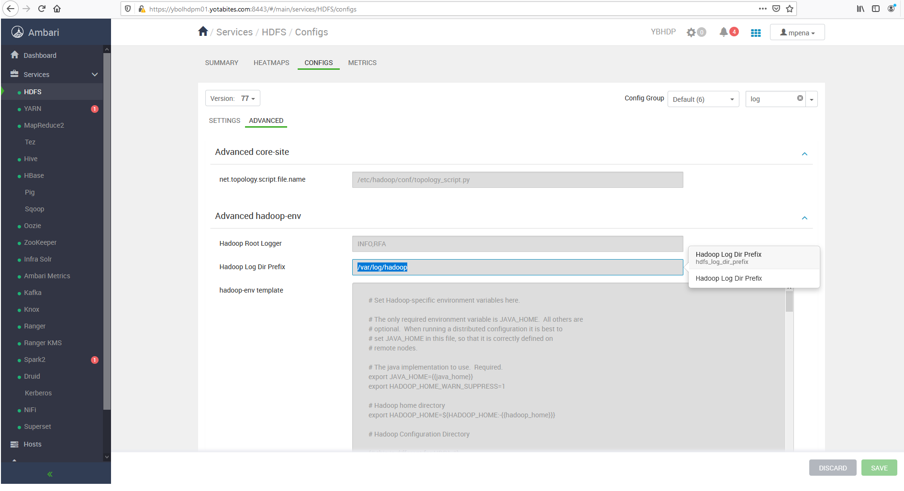
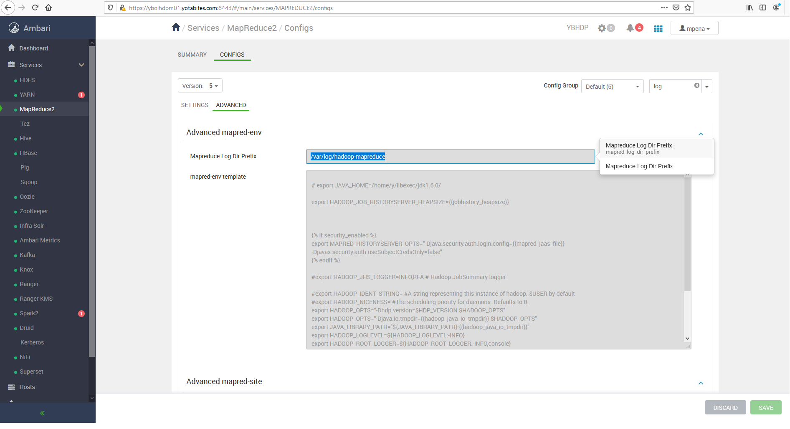

# Hadoop, HDFS, MapReduce, YARN

### Mauro Travieso 

---

### Tasks

#### File System

* **Try all the commands available as explained here, and document them with the output. Write code for following tasks in your choice of programming language:**

* *Copy file to HDFS from Local:*
    ```
    $ hdfs dfs -copyFromLocal '\<path-to-file\>/\<file_name\>' \<hdfs_target_dir\>
    ```
    Example:
    ```
    $ hdfs dfs -copyFromLocal 'home/mpena/test-copyFromLocal.txt' /user/mpena
    ```
    Procedure with output:
    ```
    [mpena@ybolhdpe01 ~]$ hdfs dfs -ls /user/mpena/
    Found 3 items
    drwxrwxrwx   - mpena hdfs          0 2020-12-04 00:00 /user/mpena/.Trash
    drwxrwxrwx   - mpena hdfs          0 2020-12-02 12:19 /user/mpena/.sparkStaging
    drwxrwxrwx   - mpena hdfs          0 2020-12-04 10:29 /user/mpena/hive
    [mpena@ybolhdpe01 ~]$ pwd
    /home/mpena
    [mpena@ybolhdpe01 ~]$ ls
    hive
    [mpena@ybolhdpe01 ~]$ touch test-copyFromLocal.txt
    [mpena@ybolhdpe01 ~]$ ls
    hive  test-copyFromLocal.txt
    [mpena@ybolhdpe01 ~]$ hdfs dfs -copyFromLocal test-copyFromLocal.txt /user/mpena
    [mpena@ybolhdpe01 ~]$ hdfs dfs -ls /user/mpena/
    Found 4 items
    drwxrwxrwx   - mpena hdfs          0 2020-12-04 00:00 /user/mpena/.Trash
    drwxrwxrwx   - mpena hdfs          0 2020-12-02 12:19 /user/mpena/.sparkStaging
    drwxrwxrwx   - mpena hdfs          0 2020-12-04 10:29 /user/mpena/hive
    -rw-r--r--   3 mpena hdfs          0 2020-12-06 14:30 /user/mpena/test-copyFromLocal.txt
    ```

* *Copy file to Local from HDFS:*
    ```
    $ hdfs dfs -copyToLocal '\<path-to-file\>/\<file_name\>' \<hdfs_target_dir\>
    ```
    Example:
    ```
    $ hdfs dfs -copyToLocal /user/mpena/hive/courses/external/csv/course_data_external.csv /home/mpena
    ```
    Procedure with output:
    ```
    [mpena@ybolhdpe01 ~]$ hdfs dfs -ls /user/mpena/hive/courses/external/csv
    Found 1 items
    -rwxrwxrwx   3 mpena hdfs      38156 2020-12-03 11:41 /user/mpena/hive/courses/external/csv/course_data_external.csv
    [mpena@ybolhdpe01 ~]$ pwd
    /home/mpena
    [mpena@ybolhdpe01 ~]$ ls
    hive  test-copyFromLocal.txt
    [mpena@ybolhdpe01 ~]$ hdfs dfs -copyToLocal /user/mpena/hive/courses/external/csv/course_data_external.csv /home/mpena
    [mpena@ybolhdpe01 ~]$ ls
    course_data_external.csv  hive  test-copyFromLocal.txt
    ```

* *Delete a file:*

    In HDFS:
    ```
    $ hdfs dfs -rm '\<path-to-file\>/\<file_name\>' 
    ```
    In Local File System (FS):
    ```
    $ rm '\<path-to-file\>/\<file_name\>' 
    ```

    Example:
    ```
    $ hdfs dfs -rm /user/mpena/hive/courses/external/csv/course_data_external.csv
    ```
    ```
    $ rm /home/mpena/course_data_external.csv
    ```

    Procedure with output:
    ```
    [mpena@ybolhdpe01 ~]$ pwd
    /home/mpena
    [mpena@ybolhdpe01 ~]$ ls
    course_data_external.csv  hive  test-copyFromLocal.txt
    [mpena@ybolhdpe01 ~]$ rm course_data_external.csv
    [mpena@ybolhdpe01 ~]$ rm test-copyFromLocal.txt
    [mpena@ybolhdpe01 ~]$ ls
    hive
    ```

* *Create a directory:*

    In HDFS:
    ```
    $ hdfs dfs -mkdir \<path-to-file\>/ 
    ```
    In Local File System (FS):
    ```
    $ mkdir \<path-to-file\> 
    ```

    Example:
    ```
    $ hdfs dfs -mkdir /user/mpena/directory
    ```
    ```
    $ mkdir /home/mpena/directory
    ```

    Procedure with output:

    In HDFS:
    ```
    [mpena@ybolhdpe01 ~]$ hdfs dfs -ls /user/mpena
    Found 4 items
    drwxrwxrwx   - mpena hdfs          0 2020-12-04 00:00 /user/mpena/.Trash
    drwxrwxrwx   - mpena hdfs          0 2020-12-02 12:19 /user/mpena/.sparkStaging
    drwxrwxrwx   - mpena hdfs          0 2020-12-04 10:29 /user/mpena/hive
    -rw-r--r--   3 mpena hdfs          0 2020-12-06 14:30 /user/mpena/test-copyFromLocal.txt
    [mpena@ybolhdpe01 ~]$ hdfs dfs -mkdir /user/mpena/directory
    [mpena@ybolhdpe01 ~]$ hdfs dfs -ls /user/mpena
    Found 5 items
    drwxrwxrwx   - mpena hdfs          0 2020-12-04 00:00 /user/mpena/.Trash
    drwxrwxrwx   - mpena hdfs          0 2020-12-02 12:19 /user/mpena/.sparkStaging
    drwxr-xr-x   - mpena hdfs          0 2020-12-06 15:55 /user/mpena/directory
    drwxrwxrwx   - mpena hdfs          0 2020-12-04 10:29 /user/mpena/hive
    -rw-r--r--   3 mpena hdfs          0 2020-12-06 14:30 /user/mpena/test-copyFromLocal.txt
    ```

    In FS:
    ```
    [mpena@ybolhdpe01 ~]$ pwd
    /home/mpena
    [mpena@ybolhdpe01 ~]$ ls
    hive
    [mpena@ybolhdpe01 ~]$ mkdir directory
    [mpena@ybolhdpe01 ~]$ ls
    directory  hive
    ```

* *Change permissions & ownership:*

    Hadoop HDFS file permissions are almost similar to the POSIX file system. In a Linux system, we usually create OS level users and make them members of an existing operating system group. But in Hadoop, we create directory and associate it with an owner and a group.

* *Hadoop HDFS File and Directory Permissions*

    The following sections show Hadoop HDFS file and directory permissions:

    Just like Linux operating system, Hadoop uses notation (r,w) to denote read and write permissions. There is an execute (x) permission for files but you cannot execute the HDFS files hence it is ignore on files if you use. Execute (x) permission applies to the directories indicate that you can access the subdirectories.

    *Hadoop HDFS File Permission Example:*

    You can use HDFS command hdfs dfs –ls /path/file.csv to check the file permissions. Below is the example of hdfs file permission:
    ```
    $ hdfs dfs -ls /test
    Found 2 items
    drwxr-xr-x - hdpadmin hdfs 0 2017-11-02 10:45 /test/test1
    -rw-r--r-- 3 hdpadmin hdfs 60 2017-10-26 11:43 /test/test_ext_tbl.txt
    ```

    In the above example, on the far left, there is a string of letters. The first letter determines whether a file is a directory or not, and then there are three sets of three letters each. Those sets denote owner, group, and other user permissions, and the “rwx” are read, write, and execute permissions.

    *To change directory permission:*

    Hadoop works on file system. To change the permission on any of the Hadoop folder you can use:
    ```
    hadoop fs -chmod <permission> <folder_name>.
    ```

    Consider you want to give owner as all permission, group and other only read and execute. You can use:
    ```
    hadoop fs -chmod 755 <folder_name>
    ```
    To give permission recursively on sub directories also, use -R with chmod.

    *Hadoop HDFS Change File Permission:*

    You can use the hdfs chmod command to change the file permission. Below is the command you can use:
    ```
    hdfs dfs -chmod [-R] \<mode | octal mode\> \<file or directory name\>

    -R modifies the files recursively. This is the only option currently supported.

    \<MODE\> Mode is the same as mode used for the shell’s command. The only letters recognized are ‘rwxXt’, 

    e.g. +t, a+r, g-w, +rwx, o=r.

    \<OCTALMODE\> Mode specified in 3 or 4 digits. If 4 digits, the first may be 1 or 0 to turn the sticky bit on or off, respectively. E.g. 775 or 777.
    ```

    To change the file permission:
    ```
    $ hdfs fs -ls /user/mpena
    $ hdfs fs -chmod -r /test*txt
    $ hdfs fs -ls /user/mpena
    ```
    Procedure with output:
    ```
    [mpena@ybolhdpe01 ~]$ hdfs dfs -ls /user/mpena
    Found 5 items
    drwxrwxrwx   - mpena hdfs          0 2020-12-04 00:00 /user/mpena/.Trash
    drwxrwxrwx   - mpena hdfs          0 2020-12-02 12:19 /user/mpena/.sparkStaging
    drwxr-xr-x   - mpena hdfs          0 2020-12-06 15:55 /user/mpena/directory
    drwxrwxrwx   - mpena hdfs          0 2020-12-04 10:29 /user/mpena/hive
    -rw-r--r--   3 mpena hdfs          0 2020-12-06 14:30 /user/mpena/test-copyFromLocal.txt
    [mpena@ybolhdpe01 ~]$ hdfs dfs -chmod -r /user/mpena/test*txt
    [mpena@ybolhdpe01 ~]$ hdfs dfs -ls /user/mpena
    Found 5 items
    drwxrwxrwx   - mpena hdfs          0 2020-12-04 00:00 /user/mpena/.Trash
    drwxrwxrwx   - mpena hdfs          0 2020-12-02 12:19 /user/mpena/.sparkStaging
    drwxr-xr-x   - mpena hdfs          0 2020-12-06 15:55 /user/mpena/directory
    drwxrwxrwx   - mpena hdfs          0 2020-12-04 10:29 /user/mpena/hive
    --w-------   3 mpena hdfs          0 2020-12-06 14:30 /user/mpena/test-copyFromLocal.txt
    ```

    *Create and Change HDFS directory owner:*

    Below is the command to create directory in the Hadoop ecosystem:
    ```
    $ hdfs dfs -mkdir /test/test1
    ```
    Verify the created directoy
    ```
    $ hdfs dfs -ls /test
    Found 2 items
    drwxr-xr-x - hdpadmin hdfs 0 2017-11-02 10:45 /test/test1
    -rw-r--r-- 3 hdpadmin hdfs 60 2017-10-26 11:43 /test/test_ext_tbl.txt
    ```

    Below is the command to change the owner of the HDFS directory:
    ```
    $hdfs dfs -chown -R hdpadmin:hdfs /test/
    ```

* Go through WEBHDFS and Write a shell script for following using CURL
  
    Hadoop REST API - WebHDFS:

    Hadoop provides a Java native API to support file system operations such as create, rename or delete files and directories, open, read or write files, set permissions, etc.

    WebHDFS REST API
    
    WebHDFS concept is based on HTTP operations like GET, PUT, POST and DELETE. Operations like OPEN, GETFILESTATUS, LISTSTATUS are using HTTP GET, others like CREATE, MKDIRS, RENAME, SETPERMISSIONS are relying on HTTP PUT. APPEND operations is based on HTTP POST, while DELETE is using HTTP DELETE. Authentication can be based on user.name query parameter (as part of the HTTP query string) or if security is turned on then it relies on Kerberos.

```
    $ kinit

    $ klist

    $ curl -s -i --negotiate -u:anyUser http://ybolhdpm01.yotabites.com:50070/webhdfs/v1/?op=LISTSTATUS

    $ curl -s -i --negotiate -u:mpena "http://ybolhdpm01.yotabites.com:50070/webhdfs/v1/?op=LISTSTATUS"

    [mpena@yboledge01 ~]$ curl -s -i --negotiate -u:mpena "http://ybolhdpm01.yotabites.com:50070/webhdfs/v1/user/mpena/?op=LISTSTATUS"
```

```
    [mpena@ybolhdpe01 ~]$ hdfs dfs -copyFromLocal /home/mpena/webhdfs_test.txt /user/mpena/
    [mpena@ybolhdpe01 ~]$ hdfs dfs -ls /user/mpena
    Found 6 items
    drwxrwxrwx   - mpena hdfs          0 2020-12-12 13:50 /user/mpena/.Trash
    drwxrwxrwx   - mpena hdfs          0 2020-12-09 11:47 /user/mpena/.sparkStaging
    drwxr-xr-x   - mpena hdfs          0 2020-12-07 12:00 /user/mpena/Tera-Test
    drwxr-xr-x   - mpena hdfs          0 2020-12-06 15:55 /user/mpena/directory
    drwxrwxrwx   - mpena hdfs          0 2020-12-04 10:29 /user/mpena/hive
    -rw-r--r--   3 mpena hdfs         71 2020-12-12 13:59 /user/mpena/webhdfs_test.txt
    [mpena@ybolhdpe01 ~]$ curl -s -i --negotiate -u:mpena "http://ybolhdpm01.yotabites.com:50070/webhdfs/v1/user/mpena/?op=LISTSTATUS"
    HTTP/1.1 401 Authentication required
    Date: Sat, 12 Dec 2020 19:59:57 GMT
    Date: Sat, 12 Dec 2020 19:59:57 GMT
    Pragma: no-cache
    X-FRAME-OPTIONS: SAMEORIGIN
    WWW-Authenticate: Negotiate
    Set-Cookie: hadoop.auth=; Path=/; HttpOnly
    Cache-Control: must-revalidate,no-cache,no-store
    Content-Type: text/html;charset=iso-8859-1
    Content-Length: 282

    HTTP/1.1 200 OK
    Date: Sat, 12 Dec 2020 19:59:57 GMT
    Cache-Control: no-cache
    Expires: Sat, 12 Dec 2020 19:59:57 GMT
    Date: Sat, 12 Dec 2020 19:59:57 GMT
    Pragma: no-cache
    X-FRAME-OPTIONS: SAMEORIGIN
    WWW-Authenticate: Negotiate YGoGCSqGSIb3EgECAgIAb1swWaADAgEFoQMCAQ+iTTBLoAMCARKiRARC4YxgTRzIpgoPO5rULh606fEyV6BH/ubx8P7IwfpSidK5djTjro11Hfkxg86sFMuJRuZ2gcCifh6MjVC8jhO2vTJ8
    Set-Cookie: hadoop.auth="u=mpena&p=mpena@YOTABITES.COM&t=kerberos&e=1607839197850&s=+W3kPH+1QCBn6g/TH40gl0LBvxZZIewXFUzNODXUaUA="; Path=/; HttpOnly
    Content-Type: application/json
    Transfer-Encoding: chunked

    {"FileStatuses":{"FileStatus":[
    {"accessTime":0,"blockSize":0,"childrenNum":1,"fileId":11099585,"group":"hdfs","length":0,"modificationTime":1607802642758,"owner":"mpena","pathSuffix":".Trash","permission":"777","replication":0,"storagePolicy":0,"type":"DIRECTORY"},
    {"accessTime":0,"blockSize":0,"childrenNum":0,"fileId":11086523,"group":"hdfs","length":0,"modificationTime":1607536041219,"owner":"mpena","pathSuffix":".sparkStaging","permission":"777","replication":0,"storagePolicy":0,"type":"DIRECTORY"},
    {"accessTime":0,"blockSize":0,"childrenNum":0,"fileId":11114403,"group":"hdfs","length":0,"modificationTime":1607364044803,"owner":"mpena","pathSuffix":"Tera-Test","permission":"755","replication":0,"storagePolicy":0,"type":"DIRECTORY"},
    {"accessTime":0,"blockSize":0,"childrenNum":0,"fileId":11113189,"group":"hdfs","length":0,"modificationTime":1607291748521,"owner":"mpena","pathSuffix":"directory","permission":"755","replication":0,"storagePolicy":0,"type":"DIRECTORY"},
    {"accessTime":0,"blockSize":0,"childrenNum":3,"fileId":11086137,"group":"hdfs","length":0,"modificationTime":1607099365357,"owner":"mpena","pathSuffix":"hive","permission":"777","replication":0,"storagePolicy":0,"type":"DIRECTORY"},
    {"accessTime":1607803167933,"blockSize":134217728,"childrenNum":0,"fileId":11175150,"group":"hdfs","length":71,"modificationTime":1607803168129,"owner":"mpena","pathSuffix":"webhdfs_test.txt","permission":"644","replication":3,"storagePolicy":0,"type":"FILE"}
    ]}}
    [mpena@ybolhdpe01 ~]$ hdfs dfs -ls /user/mpena
    Found 6 items
    drwxrwxrwx   - mpena hdfs          0 2020-12-12 13:50 /user/mpena/.Trash
    drwxrwxrwx   - mpena hdfs          0 2020-12-09 11:47 /user/mpena/.sparkStaging
    drwxr-xr-x   - mpena hdfs          0 2020-12-07 12:00 /user/mpena/Tera-Test
    drwxr-xr-x   - mpena hdfs          0 2020-12-06 15:55 /user/mpena/directory
    drwxrwxrwx   - mpena hdfs          0 2020-12-04 10:29 /user/mpena/hive
    -rw-r--r--   3 mpena hdfs         71 2020-12-12 13:59 /user/mpena/webhdfs_test.txt
    [mpena@ybolhdpe01 ~]$ curl -s -i --negotiate -u:mpena "http://ybolhdpm01.yotabites.com:50070/webhdfs/v1/user/mpena/webhdfs_test.txt?op=OPEN"
    HTTP/1.1 401 Authentication required
    Date: Sat, 12 Dec 2020 20:00:54 GMT
    Date: Sat, 12 Dec 2020 20:00:54 GMT
    Pragma: no-cache
    X-FRAME-OPTIONS: SAMEORIGIN
    WWW-Authenticate: Negotiate
    Set-Cookie: hadoop.auth=; Path=/; HttpOnly
    Cache-Control: must-revalidate,no-cache,no-store
    Content-Type: text/html;charset=iso-8859-1
    Content-Length: 298

    HTTP/1.1 307 Temporary Redirect
    Date: Sat, 12 Dec 2020 20:00:54 GMT
    Cache-Control: no-cache
    Expires: Sat, 12 Dec 2020 20:00:54 GMT
    Date: Sat, 12 Dec 2020 20:00:54 GMT
    Pragma: no-cache
    X-FRAME-OPTIONS: SAMEORIGIN
    WWW-Authenticate: Negotiate YGoGCSqGSIb3EgECAgIAb1swWaADAgEFoQMCAQ+iTTBLoAMCARKiRARCiYp60Hk1V3YLi43kdKYw8tRhNET6K0fpLcKS73WvKunYbqUg+NkRBkiQkzFW6lGAWKZWX67l0TzME0x8RLPZeW2n
    Set-Cookie: hadoop.auth="u=mpena&p=mpena@YOTABITES.COM&t=kerberos&e=1607839254787&s=HudSyEqoBd0jDPasUYKhTXwkRO5FQcwDc/IpuDwuyMA="; Path=/; HttpOnly
    Location: http://ybolhdpd01.yotabites.com:1022/webhdfs/v1/user/mpena/webhdfs_test.txt?op=OPEN&delegation=IgAFbXBlbmEFbXBlbmEAigF2WIq4BYoBdnyXPAWOT4yOA38UqQfkleeb1KMmORx4uMM7mVgoImwSV0VCSERGUyBkZWxlZ2F0aW9uDjEwLjEuMS40MTo4MDIw&namenoderpcaddress=YBHDP-HDFS&offset=0
    Content-Type: application/octet-stream
    Content-Length: 0

    [mpena@ybolhdpe01 ~]$ curl -s -i -L --negotiate -u:mpena "http://ybolhdpm01.yotabites.com:50070/webhdfs/v1/user/mpena/we
    bhdfs_test.txt?op=OPEN"
    HTTP/1.1 401 Authentication required
    Date: Sat, 12 Dec 2020 20:01:13 GMT
    Date: Sat, 12 Dec 2020 20:01:13 GMT
    Pragma: no-cache
    X-FRAME-OPTIONS: SAMEORIGIN
    WWW-Authenticate: Negotiate
    Set-Cookie: hadoop.auth=; Path=/; HttpOnly
    Cache-Control: must-revalidate,no-cache,no-store
    Content-Type: text/html;charset=iso-8859-1
    Content-Length: 298

    HTTP/1.1 307 Temporary Redirect
    Date: Sat, 12 Dec 2020 20:01:13 GMT
    Cache-Control: no-cache
    Expires: Sat, 12 Dec 2020 20:01:13 GMT
    Date: Sat, 12 Dec 2020 20:01:13 GMT
    Pragma: no-cache
    X-FRAME-OPTIONS: SAMEORIGIN
    WWW-Authenticate: Negotiate YGoGCSqGSIb3EgECAgIAb1swWaADAgEFoQMCAQ+iTTBLoAMCARKiRARCCpltyv4eVBBlHNzEfr4JeYwiGsxgQYG8e+a/0kAA2naJ22Fl0kMmNBzXR7S9uehQjyY5CQzf4wKkjpjkc/M2Kmq2
    Set-Cookie: hadoop.auth="u=mpena&p=mpena@YOTABITES.COM&t=kerberos&e=1607839273844&s=Ebgo9/ObRMcE/9uIjTfKcGob2rX6PemsAAUphbEJkpo="; Path=/; HttpOnly
    Location: http://ybolhdpd01.yotabites.com:1022/webhdfs/v1/user/mpena/webhdfs_test.txt?op=OPEN&delegation=IgAFbXBlbmEFbXBlbmEAigF2WIsCdYoBdnyXhnWOT42OA38U13vwn4Gl5TLD3Kd1y1ixTJD1bq0SV0VCSERGUyBkZWxlZ2F0aW9uDjEwLjEuMS40MTo4MDIw&namenoderpcaddress=YBHDP-HDFS&offset=0
    Content-Type: application/octet-stream
    Content-Length: 0

    HTTP/1.1 200 OK
    Access-Control-Allow-Methods: GET
    Access-Control-Allow-Origin: *
    Content-Type: application/octet-stream
    Connection: close
    Content-Length: 71

    * * * * * * * *
    This is a WebHDFS
    communication test.
    * * * * * * * *
    [mpena@ybolhdpe01 ~]$
```

   **Get Home directory**

```
    $ curl -i "http://ybolhdpm01.yotabites.com:50070/webhdfs/v1?user.name=mpena&op=GETHOMEDIRECTORY"

    [mpena@ybolhdpe01 ~]$ curl -s -i --negotiate -u:mpena "http://ybolhdpm01.yotabites.com:50070/webhdfs/v1/user/mpena/?op=GETHOMEDIRECTORY"
    HTTP/1.1 401 Authentication required
    Date: Sat, 12 Dec 2020 21:57:27 GMT
    Date: Sat, 12 Dec 2020 21:57:27 GMT
    Pragma: no-cache
    X-FRAME-OPTIONS: SAMEORIGIN
    WWW-Authenticate: Negotiate
    Set-Cookie: hadoop.auth=; Path=/; HttpOnly
    Cache-Control: must-revalidate,no-cache,no-store
    Content-Type: text/html;charset=iso-8859-1
    Content-Length: 282

    HTTP/1.1 200 OK
    Date: Sat, 12 Dec 2020 21:57:27 GMT
    Cache-Control: no-cache
    Expires: Sat, 12 Dec 2020 21:57:27 GMT
    Date: Sat, 12 Dec 2020 21:57:27 GMT
    Pragma: no-cache
    X-FRAME-OPTIONS: SAMEORIGIN
    WWW-Authenticate: Negotiate YGoGCSqGSIb3EgECAgIAb1swWaADAgEFoQMCAQ+iTTBLoAMCARKiRARC+g2/02AVDjv3lUX3sLICMICG4LNao2+3DsKe/nAh+qSwRdhyZaRoh66xgQM3/TaTGfjRbxaM/EkPDqgYYdmA3GcG
    Set-Cookie: hadoop.auth="u=mpena&p=mpena@YOTABITES.COM&t=kerberos&e=1607846247598&s=e4iUiUsdGy9IYEaQZZJdnOqCTwHeFwKd/jV+fRknaT0="; Path=/; HttpOnly
    Content-Type: application/json
    Transfer-Encoding: chunked

    {"Path":"/user/mpena"}
```

   **Create a directory:**

```
    [mpena@ybolhdpe01 ~]$ hdfs dfs -ls /user/mpena
    Found 6 items
    drwxrwxrwx   - mpena hdfs          0 2020-12-12 13:50 /user/mpena/.Trash
    drwxrwxrwx   - mpena hdfs          0 2020-12-09 11:47 /user/mpena/.sparkStaging
    drwxr-xr-x   - mpena hdfs          0 2020-12-07 12:00 /user/mpena/Tera-Test
    drwxr-xr-x   - mpena hdfs          0 2020-12-06 15:55 /user/mpena/directory
    drwxrwxrwx   - mpena hdfs          0 2020-12-04 10:29 /user/mpena/hive
    -rw-r--r--   3 mpena hdfs         71 2020-12-12 13:59 /user/mpena/webhdfs_test.txt
```
   *No authentication:*
```
    $ curl -X PUT "http://ybolhdpm01.yotabites.com:50070/webhdfs/v1/user/mpena/new_directory?user.name=mpena&op=MKDIRS"
```
   *With Kerberos authentication:*
```
    $ curl -X PUT --negotiate -u:mpena "http://ybolhdpm01.yotabites.com:50070/webhdfs/v1/user/mpena/webhdfs_directory?op=MKDIRS"
```
   *Result:*
```
    [mpena@ybolhdpe01 ~]$ hdfs dfs -ls /user/mpena
    Found 7 items
    drwxrwxrwx   - mpena hdfs          0 2020-12-12 13:50 /user/mpena/.Trash
    drwxrwxrwx   - mpena hdfs          0 2020-12-09 11:47 /user/mpena/.sparkStaging
    drwxr-xr-x   - mpena hdfs          0 2020-12-07 12:00 /user/mpena/Tera-Test
    drwxr-xr-x   - mpena hdfs          0 2020-12-06 15:55 /user/mpena/directory
    drwxrwxrwx   - mpena hdfs          0 2020-12-04 10:29 /user/mpena/hive
    drwxr-xr-x   - mpena hdfs          0 2020-12-12 16:05 /user/mpena/webhdfs_directory
    -rw-r--r--   3 mpena hdfs         71 2020-12-12 13:59 /user/mpena/webhdfs_test.txt
```

   * Copy/move a file
    
   *Copy a file without authentication:*
```
    $ curl -i -X PUT -L "http://$<Host_Name>:$<Port>/webhdfs/v1/foo/newFile?op=CREATE" -T newFile
```
   *Copy a file with authentication:*
```
    $ curl -i -X PUT -L --negotiate -u:mpena "http://ybolhdpm01.yotabites.com:50070/webhdfs/v1/user/mpena/webhdfs_directory/webhdfs_test.txt?op=CREATE" -T webhdfs_test.txt
```
   *Result:*
```
    [mpena@ybolhdpe01 ~]$ hdfs dfs -ls /user/mpena/webhdfs_directory
    [mpena@ybolhdpe01 ~]$ curl -i -X PUT -L --negotiate -u:mpena "http://ybolhdpm01.yotabites.com:50070/webhdfs/v1/user/mpena/webhdfs_directory/webhdfs_test.txt?op=CREATE" -T webhdfs_test.txt
    HTTP/1.1 401 Authentication required
    Date: Sat, 12 Dec 2020 22:19:00 GMT
    Date: Sat, 12 Dec 2020 22:19:00 GMT
    Pragma: no-cache
    X-FRAME-OPTIONS: SAMEORIGIN
    WWW-Authenticate: Negotiate
    Set-Cookie: hadoop.auth=; Path=/; HttpOnly
    Content-Length: 0
    Connection: close

    HTTP/1.1 100 Continue

    HTTP/1.1 307 Temporary Redirect
    Date: Sat, 12 Dec 2020 22:19:00 GMT
    Cache-Control: no-cache
    Expires: Sat, 12 Dec 2020 22:19:00 GMT
    Date: Sat, 12 Dec 2020 22:19:00 GMT
    Pragma: no-cache
    X-FRAME-OPTIONS: SAMEORIGIN
    WWW-Authenticate: Negotiate YGoGCSqGSIb3EgECAgIAb1swWaADAgEFoQMCAQ+iTTBLoAMCARKiRARCWi79Pmc51rNut7z091zaNnvayOFQuMlOPQZ5rdC3SwwiN43Bq7Q2zSTD14X9qGlIedlw2IdZWJC3fD2S9FYXDrjD
    Set-Cookie: hadoop.auth="u=mpena&p=mpena@YOTABITES.COM&t=kerberos&e=1607847540542&s=W0XCxAXgtXrNimDmn0bBls5d446Vjn8QqjOjDAta3Fo="; Path=/; HttpOnly
    Location: http://ybolhdpd02.yotabites.com:1022/webhdfs/v1/user/mpena/webhdfs_directory/webhdfs_test.txt?op=CREATE&delegation=IgAFbXBlbmEFbXBlbmEAigF2WQkmQIoBdn0VqkCOT5GOA4AUtGphuwQrVeJMb6Rj8O2IXK55bDYSV0VCSERGUyBkZWxlZ2F0aW9uDjEwLjEuMS40MTo4MDIw&namenoderpcaddress=YBHDP-HDFS&createflag=&createparent=true&overwrite=false
    Content-Type: application/octet-stream
    Content-Length: 0

    HTTP/1.1 100 Continue

    HTTP/1.1 201 Created
    Location: hdfs://YBHDP-HDFS/user/mpena/webhdfs_directory/webhdfs_test.txt
    Content-Length: 0
    Access-Control-Allow-Origin: *
    Connection: close

    [mpena@ybolhdpe01 ~]$ hdfs dfs -ls /user/mpena/webhdfs_directory
    Found 1 items
    -rw-r--r--   3 mpena hdfs         71 2020-12-12 16:19 /user/mpena/webhdfs_directory/webhdfs_test.txt
    [mpena@ybolhdpe01 ~]$ 
```

   *Move a file:*

   *Move a file without authentication:*
   ```
    $ curl -i -X PUT -L "http://$<Host_Name>:$<Port>/webhdfs/v1/foo/newFile?op=CREATE" -T newFile
   ```
   *Move a file with authentication:*
   ```
    $ curl -i -X PUT --negotiate -u:mpena "http://ybolhdpm01.yotabites.com:50070/webhdfs/v1/user/mpena/webhdfs_test.txt?op=RENAME&destination=/user/mpena/webhdfs_directory"
   ```
    
   *Result:*
   ```
    [mpena@ybolhdpe01 ~]$ hdfs dfs -ls /user/mpena/
    Found 7 items
    drwxrwxrwx   - mpena hdfs          0 2020-12-12 13:50 /user/mpena/.Trash
    drwxrwxrwx   - mpena hdfs          0 2020-12-09 11:47 /user/mpena/.sparkStaging
    drwxr-xr-x   - mpena hdfs          0 2020-12-07 12:00 /user/mpena/Tera-Test
    drwxr-xr-x   - mpena hdfs          0 2020-12-06 15:55 /user/mpena/directory
    drwxrwxrwx   - mpena hdfs          0 2020-12-04 10:29 /user/mpena/hive
    drwxr-xr-x   - mpena hdfs          0 2020-12-12 16:19 /user/mpena/webhdfs_directory
    -rw-r--r--   3 mpena hdfs         71 2020-12-12 13:59 /user/mpena/webhdfs_test.txt
    [mpena@ybolhdpe01 ~]$ hdfs dfs -ls /user/mpena/webhdfs_directory
    Found 1 items
    -rw-r--r--   3 mpena hdfs         71 2020-12-12 16:19 /user/mpena/webhdfs_directory/webhdfs_test.txt
    [mpena@ybolhdpe01 ~]$ hdfs dfs -ls /user/mpena/webhdfs_directory
    Found 1 items
    -rw-r--r--   3 mpena hdfs         71 2020-12-12 16:19 /user/mpena/webhdfs_directory/webhdfs_test.txt
    [mpena@ybolhdpe01 ~]$ hdfs dfs -rm /user/mpena/webhdfs_directory/webhdfs_test.txt
    20/12/12 16:59:50 INFO fs.TrashPolicyDefault: Moved: 'hdfs://YBHDP-HDFS/user/mpena/webhdfs_directory/webhdfs_test.txt' to trash at: hdfs://YBHDP-HDFS/user/mpena/.Trash/Current/user/mpena/webhdfs_directory/webhdfs_test.txt
    [mpena@ybolhdpe01 ~]$ curl -i -X PUT --negotiate -u:mpena "http://ybolhdpm01.yotabites.com:50070/webhdfs/v1/user/mpena/webhdfs_test.txt?op=RENAME&destination=/user/mpena/webhdfs_directory"
    HTTP/1.1 401 Authentication required
    Date: Sat, 12 Dec 2020 23:00:07 GMT
    Date: Sat, 12 Dec 2020 23:00:07 GMT
    Pragma: no-cache
    X-FRAME-OPTIONS: SAMEORIGIN
    WWW-Authenticate: Negotiate
    Set-Cookie: hadoop.auth=; Path=/; HttpOnly
    Content-Length: 0

    HTTP/1.1 200 OK
    Date: Sat, 12 Dec 2020 23:00:07 GMT
    Cache-Control: no-cache
    Expires: Sat, 12 Dec 2020 23:00:07 GMT
    Date: Sat, 12 Dec 2020 23:00:07 GMT
    Pragma: no-cache
    X-FRAME-OPTIONS: SAMEORIGIN
    WWW-Authenticate: Negotiate YGoGCSqGSIb3EgECAgIAb1swWaADAgEFoQMCAQ+iTTBLoAMCARKiRARCor4s/Zz8Vlf031oHh+pxskg5ibdZHo3TNSfk7MODqlUgxrAYDDhHoKUmtZblKTtFImKeu4QvX7KfncWmYmeTEGmW
    Set-Cookie: hadoop.auth="u=mpena&p=mpena@YOTABITES.COM&t=kerberos&e=1607850007904&s=38rOVv4R8+5ufPvmUcvznmugav5EHdLd/0JMSn/uteE="; Path=/; HttpOnly
    Content-Type: application/json
    Transfer-Encoding: chunked

    {"boolean":true}[mpena@ybolhdpe01 ~]$
    [mpena@ybolhdpe01 ~]$ hdfs dfs -ls /user/mpena/webhdfs_directory
    Found 1 items
    -rw-r--r--   3 mpena hdfs         71 2020-12-12 13:59 /user/mpena/webhdfs_directory/webhdfs_test.txt
    [mpena@ybolhdpe01 ~]$ hdfs dfs -ls /user/mpena/
    Found 6 items
    drwxrwxrwx   - mpena hdfs          0 2020-12-12 13:50 /user/mpena/.Trash
    drwxrwxrwx   - mpena hdfs          0 2020-12-09 11:47 /user/mpena/.sparkStaging
    drwxr-xr-x   - mpena hdfs          0 2020-12-07 12:00 /user/mpena/Tera-Test
    drwxr-xr-x   - mpena hdfs          0 2020-12-06 15:55 /user/mpena/directory
    drwxrwxrwx   - mpena hdfs          0 2020-12-04 10:29 /user/mpena/hive
    drwxr-xr-x   - mpena hdfs          0 2020-12-12 17:00 /user/mpena/webhdfs_directory
    [mpena@ybolhdpe01 ~]$ 
   ```

   * Delete a file

   ```
    $ curl -i -X DELETE --negotiate -u:mpena "http://ybolhdpm01.yotabites.com:50070/webhdfs/v1/user/mpena/webhdfs_test.txt?op=DELETE"
   ```

   ```
    [mpena@ybolhdpe01 ~]$ hdfs dfs -ls /user/mpena/webhdfs_directory
    Found 1 items
    -rw-r--r--   3 mpena hdfs         71 2020-12-12 13:59 /user/mpena/webhdfs_directory/webhdfs_test.txt
    [mpena@ybolhdpe01 ~]$ hdfs dfs -cat /user/mpena/webhdfs_directory/webhdfs_test.txt
    * * * * * * * *
    This is a WebHDFS
    communication test.
    * * * * * * * *
    [mpena@ybolhdpe01 ~]$ curl -i -X DELETE --negotiate -u:mpena "http://ybolhdpm01.yotabites.com:50070/webhdfs/v1/user/mpen
    a/webhdfs_directory/webhdfs_test.txt?op=DELETE"
    HTTP/1.1 401 Authentication required
    Date: Sat, 12 Dec 2020 23:09:07 GMT
    Date: Sat, 12 Dec 2020 23:09:07 GMT
    Pragma: no-cache
    X-FRAME-OPTIONS: SAMEORIGIN
    WWW-Authenticate: Negotiate
    Set-Cookie: hadoop.auth=; Path=/; HttpOnly
    Content-Length: 0

    HTTP/1.1 200 OK
    Date: Sat, 12 Dec 2020 23:09:07 GMT
    Cache-Control: no-cache
    Expires: Sat, 12 Dec 2020 23:09:07 GMT
    Date: Sat, 12 Dec 2020 23:09:07 GMT
    Pragma: no-cache
    X-FRAME-OPTIONS: SAMEORIGIN
    WWW-Authenticate: Negotiate YGoGCSqGSIb3EgECAgIAb1swWaADAgEFoQMCAQ+iTTBLoAMCARKiRARCcSzScbnlS7J6yeHhks7ZSXzyqISolNEqJPBr9+tGN3zvuyQqdjEno4Y3ba2hBBVxeFu+/7pUH8fzghmnEzoeKUSd
    Set-Cookie: hadoop.auth="u=mpena&p=mpena@YOTABITES.COM&t=kerberos&e=1607850547329&s=LYFlXqAPhoaC+Q6tRukkpksjjYpP9wecYq4Vp0XAJXk="; Path=/; HttpOnly
    Content-Type: application/json
    Transfer-Encoding: chunked

    {"boolean":true}[mpenahdfs dfs -ls /user/mpena/webhdfs_directory
    [mpena@ybolhdpe01 ~]$ 
   ```

   * Change permissions of a file:
    
   Without authentication:
   ```
    $ curl -i -X PUT "http://ybolhdpm01.yotabites.com:50070/webhdfs/v1/user/mpena/directory/largefile.avro?user.name=mpena&op=SETPERMISSION&permission=700"
   ```
   With authentication:
   ```
    $ curl -i -X PUT --negotiate -u:mpena "http://ybolhdpm01.yotabites.com:50070/webhdfs/v1/user/mpena/directory/largefile.avro?op=SETPERMISSION&permission=700"
   ``` 
   Result:
   ```
    [mpena@ybolhdpe01 directory]$ hdfs dfs -ls /user/mpena/directory
    Found 1 items
    -rw-r--r--   3 mpena hdfs         23 2020-12-12 17:15 /user/mpena/directory/largefile.avro
    [mpena@ybolhdpe01 directory]$ curl -i -X PUT --negotiate -u:mpena "http://ybolhdpm01.yotabites.com:50070/webhdfs/v1/user/mpena/directory/largefile.avro?op=SETPERMISSION&permission=700"
    HTTP/1.1 401 Authentication required
    Date: Sat, 12 Dec 2020 23:21:10 GMT
    Date: Sat, 12 Dec 2020 23:21:10 GMT
    Pragma: no-cache
    X-FRAME-OPTIONS: SAMEORIGIN
    WWW-Authenticate: Negotiate
    Set-Cookie: hadoop.auth=; Path=/; HttpOnly
    Content-Length: 0

    HTTP/1.1 200 OK
    Date: Sat, 12 Dec 2020 23:21:10 GMT
    Cache-Control: no-cache
    Expires: Sat, 12 Dec 2020 23:21:10 GMT
    Date: Sat, 12 Dec 2020 23:21:10 GMT
    Pragma: no-cache
    X-FRAME-OPTIONS: SAMEORIGIN
    WWW-Authenticate: Negotiate YGoGCSqGSIb3EgECAgIAb1swWaADAgEFoQMCAQ+iTTBLoAMCARKiRARC+9/YTDQLjILLADhWIaOzlziKKdtgSryycaYcnPJ9TTdtt0sir3O2WF7Ku9nIA27Hh2KdeBAPO1epve/FJoeKFQVn
    Set-Cookie: hadoop.auth="u=mpena&p=mpena@YOTABITES.COM&t=kerberos&e=1607851270827&s=KDhtLWdw8Uo7EkK9yjejJTWyWPN2X/cEOCierhaq46U="; Path=/; HttpOnly
    Content-Type: application/octet-stream
    Content-Length: 0

    [mpena@ybolhdpe01 directory]$ hdfs dfs -ls /user/mpena/directory
    Found 1 items
    -rwx------   3 mpena hdfs         23 2020-12-12 17:15 /user/mpena/directory/largefile.avro
   ```

   * Read & Write a file from & to HDFS using webhdfs:
   ```
    $ curl -i -X POST "http://<HOST>:<PORT>/webhdfs/v1/<PATH>?op=CONCAT&sources=<PATHS>"

    $ curl -i -X POST --negotiate -u:mpena "http://ybolhdpm01.yotabites.com:50070/webhdfs/v1/user/mpena/directory/largefile.avro?op=CONCAT&sources=/user/mpena/webhdfs_test.txt"

    $ curl -i -X POST --negotiate -u:mpena ""http://ybolhdpm01.yotabites.com:50070/webhdfs/v1/user/mpena/directory/part-01-000000-000?op=CONCAT&sources=/user/mpena/directory/part-02-000000-000,/user/mpena/directory//part-04-000000-000"

    Where these 3 files would be concatenated into PATH_TO_YOUR_HDFS_FOLDER/part-01-000000-000 file. Note that this will only work if the file sizes are exact multiples of "dfs.block.size".
   ```

   **Append files**
   ```
    $ curl -i -X POST --negotiate -u:mpena "http://ybolhdpm01.yotabites.com:50070/webhdfs/v1/user/mpena/directory/largefile.avro?op=APPEND&data=true --header "Content-Type:application/octet-stream" --header "Transfer-Encoding:chunked" -T "/user/mpena/webhdfs_test.txt"
   ```

---

* **Map Reduce**

* **What is the difference between Mapreduce in hadoop version1 and version2?**

    |MapReduce1 (Hadoop 1.0)|MapReduce2 (Hadoop 2.0)|
    |---|---|
    |The Job execution process is controlled by JobTracker daemon running in the single NameNode and the TraskTracker daemon running in the Datanode. Only MapReduce jobs/tasks can be executed.|YARN substitutes the JobTracker, dividing it into two main components (daemons): Resource Manager (one daemon to manage the cluster resources) and Application Master (one per application to manage the applications life cycle).|
    |One Job Tracker per cluster receives the task and keeps the record of each job. Then, it distributes the task to the  TaskTracker running on the DataNode machines.|Client sends their requests to the single Resource Manager (Scheduler and Application Manager) in the cluster which distributes them across the Node Managers (Containers and Application Master).|
    |Job Tracker monitors the Heartbeats received from the TaskTrakers, reschedule the failed tasks, as well as in charge of the intermediate merging on the TaskTracker results. It also stores the history of complete jobs.|Under YARN, different versions of MapReduce can be run at the same time in the same cluster. Besides, other tasks different from MapReduce ones can be executed according to the Application Master. |
    |Fixed number of static dedicated slots for the tasks in the TaskTracker. Specific slots for Map and for Reduce tasks are configured only to compute the designated task.	High Cluster utilization with variable size containers. The resources are allocated according to the necessities and can be dynamically redistributed.|High Cluster utilization with variable size containers. The resources are allocated according to the necessities and can be dynamically redistributed.|

* **How many mappers will run for a input file of 1024 MB, with a block size of 64 MB**

    Calculate number of Mappers in Hadoop

    Firstly it depends on if the files can be split by Hadoop (splittable) or not. Most files can be split. Example of files that cannot be split are some zipped or compressed files.

    For Splittable files

        1) Calculate the total size of the input files by adding the size of all the files

        2) No of Mappers = Total size calculated / Input split size defined in Hadoop configuration

    How to calculate the number of Mappers In Hadoop:

        The number of blocks of input file defines the number of map-task in the Hadoop Map-phase,
        which can be calculated with the help of the below formula.

        Number of Mappers = (total data size) / (input split size)

    In this case:

        Total size calculated = 1024MB (1GB)

        Input split size = 64MB

        Total Number of Mappers = Number of input splits = (2^30GB/2^20)MB / 64MB = 16 Mappers

* **List the configuration option to limit number of mappers to 2**

    First point to keep in mind is that the number of map tasks for a given job is handled by the number of input splits, not by the mapred.map.tasks parameter. For each input split a map task is released. So, over the lifetime of a mapreduce job the number of map tasks is equal to the number of input splits. mapred.map.tasks is just a hint to the InputFormat for the number of maps.

    In your example, Hadoop has determined there are 24 input splits that will release 24 map tasks in total. But, eventually, it is you who has got the control regarding how many map tasks can be executed in parallel by each of the task trackers.

        -Dmapreduce.job.map=2 
        -Dmapreduce.job.reduces=2

    Also in your example, the -D parts are not picked up:

    They should come after the classname part like this:

    ```
    hadoop jar <your-script.jar> <main class> -Dmapreduce.max.split.size=10486 <input file> <output directory>
    hadoop jar My_Class_Name.jar My_Class_Name -Dmapreduce.job.map=5 input_test_file.txt output_dir
    ```

* **List the configuration option to limit number of reducers to 0,2**
    ```
    $ SET mapreduce.job.reduces=X_int
    ```

    Where X_int represents the maximum number of reducers.

* **When number of reducers are ‘0’ what is the phenomenon called as?**

    Identity Mapper:

    If there is no reducer defined, in that case, the output generated by the mapper task will be considered as final output and stored in HDFS. This means it is map only. The data is not sorted and directly stored in HDFS. If we want the output from mapper to be sorted, we can use Identity reducer.

    In a map-only job, the map does all task with its InputSplit and the reducer does no job. Between map and reduce phases there is key, sort, and shuffle phase. Sort and shuffle phase are responsible for sorting the keys in ascending order. Then grouping values based on same keys. This phase is very expensive. If reduce phase is not required we should avoid it. Avoiding reduce phase would eliminate sort and shuffle phase as well. This also saves network congestion. As in shuffling an output of mapper travels to the reducer, when data size is huge, large data travel to the reducer.


* **How is data shuffled and sorted between Mapper and Reducer, (looking for default Shuffle class and Sort techniques)?**

    In Hadoop, the process by which the intermediate output from mappers is transferred to the reducer is called Shuffling. Reducer gets 1 or more keys and associated values on the basis of reducers. Intermediated key-value generated by mapper is sorted automatically by key.

    Shuffle phase in Hadoop transfers the map output from Mapper to a Reducer in MapReduce. Sort phase in MapReduce covers the merging and sorting of map outputs. Data from the mapper are grouped by the key, split among reducers and sorted by the key. Every reducer obtains all values associated with the same key. Shuffle and sort phase in Hadoop occur simultaneously and are done by the MapReduce framework.

* **What is a Partitioner and how is it useful?**

    A partitioner works like a condition in processing an input dataset. The partition phase takes place after the Map phase and before the Reduce phase.

    Partitioner in Hadoop MapReduce redirects the mapper output to the reducer by determining which reducer is responsible for the particular key.

    The number of partitioners is equal to the number of reducers. That means a partitioner will divide the data according to the number of reducers. Therefore, the data passed from a single partitioner is processed by a single Reducer.

    A partitioner partitions the key-value pairs of intermediate Map-outputs. It partitions the data using a user-defined condition, which works like a hash function. The total number of partitions is same as the number of Reducer tasks for the job

* **What is a Counter, and how is it useful?**

    Hadoop Counters provides a way to measure the progress or the number of operations that occur within map/reduce job. Counters in Hadoop MapReduce are a useful channel for gathering statistics about the MapReduce job: for quality control or for application-level. They are also useful for problem diagnosis.

    Counters represent Hadoop global counters, defined either by the MapReduce framework or applications. Each Hadoop counter is named by an “Enum” and has a long for the value. Counters are bunched into groups, each comprising of counters from a particular Enum class.

    Hadoop Counters validate that:

        The correct number of bytes was read and written.
        The correct number of tasks was launched and successfully ran.
        The amount of CPU and memory consumed is appropriate for our job and cluster nodes.

* **TeraGen and TeraSort are two examples available in Hadoop libraries, TeraGen is used for generating data and TeraSort is used for sorting the generated data.**

    *Package org.apache.hadoop.examples.terasort Description*

    This package consists of 3 map/reduce applications for Hadoop (Benchmark programs) to check and test the custer performance.
    
    * TeraGen is a map/reduce program to generate the data.
    * TeraSort samples the input data and uses map/reduce to sort the data into a total order.
    * TeraValidate is a map/reduce program that validates the output is sorted.
    
    **TeraGen** generates output data that is byte for byte equivalent to the C version including the newlines and specific keys. It divides the desired number of rows by the desired number of tasks and assigns ranges of rows to each map. The map jumps the random number generator to the correct value for the first row and generates the following rows.

    **TeraSort** is a standard map/reduce sort, except for a custom partitioner that uses a sorted list of N-1 sampled keys that define the key range for each reduce. In particular, all keys such that sample[i-1] <= key < sample[i] are sent to reduce i. This guarantees that the output of reduce i are all less than the output of reduce i+1. To speed up the partitioning, the partitioner builds a two level tier that quickly indexes into the list of sample keys based on the first two bytes of the key. TeraSort generates the sample keys by sampling the input before the job is submitted and writing the list of keys into HDFS. The input and output format, which are used by all 3 applications, read and write the text files in the right format. The output of the reduce has replication set to 1, instead of the default 3, because the contest does not require the output data be replicated on to multiple nodes.

    **TeraValidate** ensures that the output is globally sorted. It creates one map per a file in the output directory and each map ensures that each key is less than or equal to the previous one. The map also generates records with the first and last keys of the file and the reduce ensures that the first key of file i is greater that the last key of file i-1. Any problems are reported as output of the reduce with the keys that are out of order.

* **Run TeraGen to produce a 10 GB file and run TeraSort to sort the produced file.**

    In Cloudera cluster, create a directory in HDFS, where the process is taking place:
    ```
    $ hdfs dfs -mkdir /user/mpena/Tera-Test 
    ```
    Find the .jar file diectory:
    ```
    $ find / -name "hadoop-mapreduce-examples.jar"

    /opt/cloudera/parcels/CDH-5.14.0-1.cdh5.14.0.p0.24/lib/hadoop-mapreduce/hadoop-mapreduce-examples.jar
    ```
    ```
    $ find / -name "hadoop-mapreduce-client-jobclient-tests.jar"

    /opt/cloudera/parcels/CDH-5.14.0-1.cdh5.14.0.p0.24/lib/hadoop-mapreduce/hadoop-mapreduce-client-jobclient-tests.jar
    ```
    For best performance:
    ```
    Set the replication factor to 1: 
        $ hdfs dfs -setrep -R 1 /user/mpena/Tera-Test

    Once the files are created 
        $ hdfs dfs -setrep 1 /user/mpena/Tera-Test/TeraGen-10
        $ hdfs dfs -setrep 1 /user/mpena/Tera-Test/TeraSort-10

    Increase the terasort number of reducer tasks (by default, it is set to 1): 
        mapred.reduce.tasks=4
    ```

    In general, every row (record) is 100 bytes long, so 500,000 rows = 50 MB total
    
    i.e., to write 100 GB of Data, it is used 1 billion rows, so according to this equivalence:
    ```
      10 GB =    100,000,000 records 
      50 GB =    500,000,000 rows   
     100 GB =  1,000,000,000 rows
    1000 GB =  1 TB
       1 TB = 10,000,000,000 records 
    ```
    TeraGen
    ```
    $ hadoop jar /\<path-to-file\>/*.jar teragen \<number-of-records\> \<destiny-file-name\> 
    -OR-
    $ yarn jar /\<path-to-file\>/*.jar teragen \<number-of-records\> \<destiny-file-name\> 

    $ hadoop jar /opt/cloudera/parcels/CDH-5.14.0-1.cdh5.14.0.p0.24/lib/hadoop-mapreduce/hadoop-mapreduce-examples.jar teragen 100000000 /user/mpena/Tera-Test/TeraGen-10GB 
    ```
    ```
    [mpena@yboledge02 ~]$ hdfs dfs -ls -h /user/mpena/Tera-Test/TeraGen-10GB
    Found 3 items
    -rw-r--r--   3 mpena mpena          0 2020-12-07 13:23 /user/mpena/Tera-Test/TeraGen-10GB/_SUCCESS
    -rw-r--r--   3 mpena mpena      4.7 G 2020-12-07 13:23 /user/mpena/Tera-Test/TeraGen-10GB/part-m-00000
    -rw-r--r--   3 mpena mpena      4.7 G 2020-12-07 13:23 /user/mpena/Tera-Test/TeraGen-10GB/part-m-00001
    
    [mpena@yboledge02 ~]$ hdfs dfs -setrep 1 /user/mpena/Tera-Test/
    Replication 1 set: /user/mpena/Tera-Test/TeraGen-10GB/_SUCCESS
    Replication 1 set: /user/mpena/Tera-Test/TeraGen-10GB/part-m-00000
    Replication 1 set: /user/mpena/Tera-Test/TeraGen-10GB/part-m-00001
    ```

    TeraSort
    ```
    $ hadoop jar /\<path-to-file\>/*.jar terasort \<origin-file-name-to-sort\> \<destiny-file-name-sorted\> 
   
    $ hadoop jar /opt/cloudera/parcels/CDH-5.14.0-1.cdh5.14.0.p0.24/lib/hadoop-mapreduce/hadoop-mapreduce-examples.jar terasort mapred.reduce.tasks=4 /user/mpena/Tera-Test/TeraGen-10GB /user/mpena/Tera-Test/TeraSort-10GB

    $ hadoop jar /opt/cloudera/parcels/CDH-5.14.0-1.cdh5.14.0.p0.24/lib/hadoop-mapreduce/hadoop-mapreduce-examples.jar terasort /user/mpena/Tera-Test/TeraGen-10GB /user/mpena/Tera-Test/TeraSort-10GB
    ```
    ```
    20/12/07 13:43:32 INFO mapreduce.Job: Counters: 39
        File System Counters
                FILE: Number of bytes read=12540
                FILE: Number of bytes written=4382476838
                FILE: Number of read operations=0
                FILE: Number of large read operations=0
                FILE: Number of write operations=0
                HDFS: Number of bytes read=10000011400
                HDFS: Number of bytes written=0
                HDFS: Number of read operations=228
                HDFS: Number of large read operations=0
                HDFS: Number of write operations=0
        Job Counters
                Failed reduce tasks=49
                Killed reduce tasks=15
                Launched map tasks=76
                Launched reduce tasks=64
                Data-local map tasks=30
                Rack-local map tasks=46
                Total time spent by all maps in occupied slots (ms)=2157863
                Total time spent by all reduces in occupied slots (ms)=4048595
                Total time spent by all map tasks (ms)=2157863
                Total time spent by all reduce tasks (ms)=4048595
                Total vcore-milliseconds taken by all map tasks=2157863
                Total vcore-milliseconds taken by all reduce tasks=4048595
                Total megabyte-milliseconds taken by all map tasks=2209651712
                Total megabyte-milliseconds taken by all reduce tasks=4145761280
        Map-Reduce Framework
                Map input records=100000000
                Map output records=100000000
                Map output bytes=10200000000
                Map output materialized bytes=4370872076
                Input split bytes=11400
                Combine input records=0
                Spilled Records=100000000
                Failed Shuffles=0
                Merged Map outputs=0
                GC time elapsed (ms)=25667
                CPU time spent (ms)=1088180
                Physical memory (bytes) snapshot=48205582336
                Virtual memory (bytes) snapshot=216734339072
                Total committed heap usage (bytes)=52075954176
        File Input Format Counters
                Bytes Read=10000000000
    20/12/07 13:43:32 INFO terasort.TeraSort: done

    ```
    TeraValidate
    ```
    $ hadoop jar /\<path-to-file\>/*.jar teravalidate \<origin-file-name-sorted\> \<destiny-file-name-validated\> 
   
    $ hadoop jar /opt/cloudera/parcels/CDH-5.14.0-1.cdh5.14.0.p0.24/lib/hadoop-mapreduce/hadoop-mapreduce-examples.jar teravalidate /user/mpena/Tera-Test/TeraSort-10GB /user/mpena/Tera-Test/TeraValid-10GB
    ```
    Output speed measurement (TeraSort performance MB/s):
    ```
    $ hadoop jar /\<path-to-file\>/*.jar TestDFSIO -write -nrFiles 10 -fileSize 5MB
    $ yarn jar /hadoop-mapreduce-client-jobclient-tests.jar TestDFSIO -write -nrFiles 10 -fileSize 1000 

    $ hadoop jar /\<path-to-file\>/*.jar TestDFSIO -read -nrFiles 10 -fileSize 5MB 
    $ yarn jar /opt/cloudera/parcels/CDH-5.14.0-1.cdh5.14.0.p0.24/lib/hadoop-mapreduce/hadoop-mapreduce-client-jobclient-tests.jar TestDFSIO -read -nrFiles 10 -fileSize 1000 

    ```
    To check the results:
    ```
    $ ls
    $ cat TestDFSIO_results.log
    ```

* **Analyze the log of these mapreduce jobs and answer following:**

    * *What are different types of counters?*
    
        Date & Time
        Number of files
        Total MBytes processed
        Throughput mb/sec
        Average 10 rate mb/sec
        10 rate std deviation
        Test exec time in seconds

        ```
         File System Counters
                FILE: Number of bytes read=12540
                FILE: Number of bytes written=4382472782
                FILE: Number of read operations=0
                FILE: Number of large read operations=0
                FILE: Number of write operations=0
                HDFS: Number of bytes read=10000011400
                HDFS: Number of bytes written=0
                HDFS: Number of read operations=228
                HDFS: Number of large read operations=0
                HDFS: Number of write operations=0
        Job Counters
                Failed reduce tasks=49
                Killed reduce tasks=15
                Launched map tasks=76
                Launched reduce tasks=64
                Data-local map tasks=27
                Rack-local map tasks=49
                Total time spent by all maps in occupied slots (ms)=2292200
                Total time spent by all reduces in occupied slots (ms)=4077794
                Total time spent by all map tasks (ms)=2292200
                Total time spent by all reduce tasks (ms)=4077794
                Total vcore-milliseconds taken by all map tasks=2292200
                Total vcore-milliseconds taken by all reduce tasks=4077794
                Total megabyte-milliseconds taken by all map tasks=2347212800
                Total megabyte-milliseconds taken by all reduce tasks=4175661056
        Map-Reduce Framework
                Map input records=100000000
                Map output records=100000000
                Map output bytes=10200000000
                Map output materialized bytes=4370872076
                Input split bytes=11400
                Combine input records=0
                Spilled Records=100000000
                Failed Shuffles=0
                Merged Map outputs=0
                GC time elapsed (ms)=25557
                CPU time spent (ms)=1091300
                Physical memory (bytes) snapshot=48151195648
                Virtual memory (bytes) snapshot=216728449024
                Total committed heap usage (bytes)=51997310976
        File Input Format Counters
                Bytes Read=10000000000
        20/12/14 10:57:39 INFO terasort.TeraSort: done
        ```

    * *How to calculate time taken by mapper and reducer, is it average time?*

        Total execution time in seconds (Test exe time in seconds) calculates the time taken by mapper and reducer and it is measured as an absolute value.

* **Navigate to YARN UI and dig into the Application to find on which nodes does the mapper and reducer ran**

**Pending!!!**


* **How to obtain the log of a Map Reduce Application?**

* Getting the Logs:

The first thing to do if you run into trouble is to find the logs. Ambari Server logs are found at /var/log/ambari-server/ambari-server.log Ambari Agent logs are found at /var/log/ambari-agent/ambari-agent.log.

```
[mpena@ybolhdpe01 log]$ cd ambari-agent/
[mpena@ybolhdpe01 ambari-agent]$ ls
ambari-agent.log     ambari-agent.log.17  ambari-agent.log.25  ambari-agent-pkgmgr.log  ambari-alerts.log.16  ambari-alerts.log.24
ambari-agent.log.1   ambari-agent.log.18  ambari-agent.log.3   ambari-alerts.log        ambari-alerts.log.17  ambari-alerts.log.25
ambari-agent.log.10  ambari-agent.log.19  ambari-agent.log.4   ambari-alerts.log.1      ambari-alerts.log.18  ambari-alerts.log.3
ambari-agent.log.11  ambari-agent.log.2   ambari-agent.log.5   ambari-alerts.log.10     ambari-alerts.log.19  ambari-alerts.log.4
ambari-agent.log.12  ambari-agent.log.20  ambari-agent.log.6   ambari-alerts.log.11     ambari-alerts.log.2   ambari-alerts.log.5
ambari-agent.log.13  ambari-agent.log.21  ambari-agent.log.7   ambari-alerts.log.12     ambari-alerts.log.20  ambari-alerts.log.6
ambari-agent.log.14  ambari-agent.log.22  ambari-agent.log.8   ambari-alerts.log.13     ambari-alerts.log.21  ambari-alerts.log.7
ambari-agent.log.15  ambari-agent.log.23  ambari-agent.log.9   ambari-alerts.log.14     ambari-alerts.log.22  ambari-alerts.log.8
ambari-agent.log.16  ambari-agent.log.24  ambari-agent.out     ambari-alerts.log.15     ambari-alerts.log.23  ambari-alerts.log.9
```

* Log files in Hadoop eco system:

There are two mechanisms to check logs:

* From Ambari UI, navigate to MapReduce2 and then find the QuickLinks on the top of the screen. Navigate to JobHistory Logs

* Alternatively, navigate to /var/log/hadoop-mapreduce/mapred directory where all the mapreduce job related logs can be found out.

* To know log directory for hadoop daemons. We can use Apache ambari to find out log directory for a service. default log directory for any service is /var/log

In Ambari WebUI: 
```
Click on HDFS --> Configs --> type log in filter box.

It is found the Hadoop Log Dir Prefix: /var/log/hadoop
```

```
Click on MapRedduce2 --> Configs --> type log in filter box.

It is found the Hadoop Log Dir Prefix: /var/log/hadoop-mapreduce
```


Using command line: 
```
$ tail -f /var/log/hadoop/hdfs

$ tail -f /var/log/hadoop-mapreduce/hdfs
```

Command used for job logs: 
```
$ mapred job -logs [job_id]
```


* **Go through Hadoop Streaming and write a python Map Reduce code for word count. If you are Java developer, write Map Reduce code and execute it, document the whole process**

**Python code:**

***Mapper:***
```
/////////
mapper.py

#!/usr/bin/python
import sys
#Word Count
#input comes from standard input STDIN
for line in sys.stdin:
    #remove leading and trailing whitespaces
    line = line.strip() 
    #split the line into words and returns as a list
    words = line.split()
    for word in words:
        #write the results to standard output STDOUT
        print '%s\t%s' % (word,1) 
        #Emit the word

```
***Reducer.py***
```
//////////
reducer.py

#!/usr/bin/python
import sys
from operator import itemgetter
import sys

# using a dictionary to map words to their counts
current_word = None
current_count = 0
word = None

# input comes from STDIN
for line in sys.stdin:
    line = line.strip()
    word, count = line.split('\t', 1)
    try:
        count = int(count)
    except ValueError:
        continue

    if current_word == word:
        current_count += count
    else:
        if current_word:
            print '%s\t%s' % (current_word, current_count)
        current_count= count
        current_word = word

if current_word == word:
    print '%s\t%s' % (current_word, current_count)	

```
***Input Data:***
```
//////////
sample.txt
Bus Car bus car bus car train bus TRAIN BUS buS caR CAR car BUS TRAIN
```
***Directions:***

[*] Copy sample.txt in HDFS
```
$ hdfs dfs -copyFromLocal sample.txt /user/mpena/hadoop_streaming/input/
```
[*] To give the corresponding permissions to the .py scripts (mapper/reducer):
```
$ chmod +x *.py
```
[*] To test the mapper and reducer .py script:
```
$ echo "foo foo quux labs foo bar quux" | /home/mpena/MapReduce_Streaming/mapper.py
```
```
$ echo "foo foo quux labs foo bar quux" | /home/mpena/MapReduce_Streaming/mapper.py | sort -k1,1 | /home/mpena/MapReduce_Streaming/reducer.py
```
[*] Find the hadoop-streaming .jar file:
```
$ find / -name "hadoop-streaming*.jar"

/usr/hdp/3.1.4.0-315/oozie/share/lib/mapreduce-streaming/hadoop-streaming-3.1.1.3.1.4.0-315.jar
/usr/hdp/3.1.4.0-315/hadoop-mapreduce/hadoop-streaming-3.1.1.3.1.4.0-315.jar
/usr/hdp/3.1.4.0-315/hadoop-mapreduce/hadoop-streaming.jar
```
[*] If namenode safemode is active:
```
$ hdfs dfsadmin -safemode leave
```
[*] To run the hadoop-streaming job:
```
$ hadoop jar /usr/lib/hadoop-mapreduce/hadoop-streaming.jar \
-files mapper.py -files reducer.py \
-mapper "python /home/mpena/MapReduce_Streaming/mapper.py" \
-reducer "python /home/mpena/MapReduce_Streaming/reducer.py" \
-input /user/mpena/hadoop_streaming/input/* \
-output /user/mpena/hadoop_streaming/output/
```
[*] To test if the ouptput directory was created
```
$ hdfs dfs -ls /user/mpena/hadoop_streaming/output/
```
[*] To test if the ouptput file was created
```
$ hdfs dfs -cat /user/mpena/hadoop_streaming/output/part-*
```

---