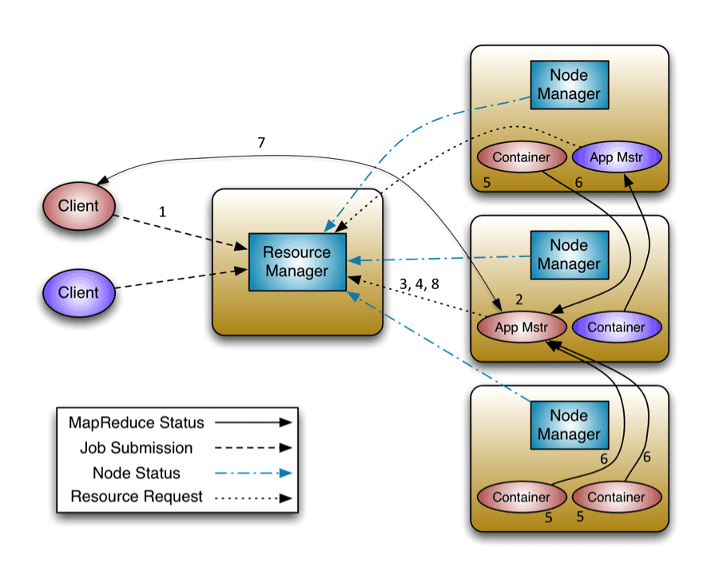
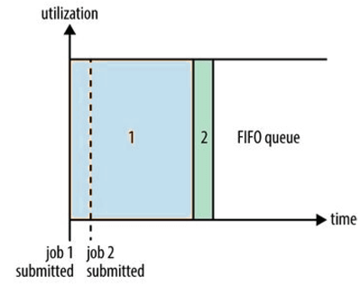
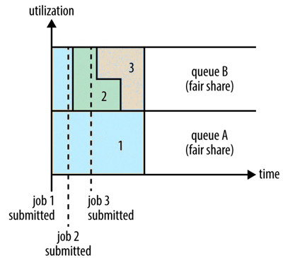
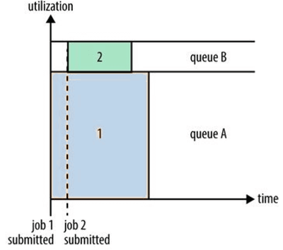
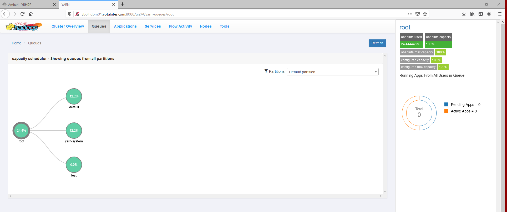

# Hadoop, HDFS, MapReduce, YARN 

### Mauro Travieso 

---

### Tasks

#### YARN

* **Go through YARN Architecture and answer following questions**

* **What is a Resource Manager?**

    The Resource Manager is the core component of YARN – Yet Another Resource Negotiator. In analogy, it occupies the place of JobTracker of MRV1. Hadoop YARN is designed to provide a generic and flexible framework to administer the computing resources in the Hadoop cluster.

* **What is the web port for Resource Manager?**

    |Default port Used|Protocol|Configuration Parameter|Description|
    |---|---|---|---|
    |8088/8090|http/https|yarn.resourcemanager.webapp.address<br>yarn.resourcemanager.webapp.https.address|The http/https address of the RM web application.|

* **What is a Node Manager?**

    Each slave node in Yet Another Resource Negotiator (YARN) has a Node Manager daemon, which acts as a slave for the Resource Manager. As with the TaskTracker, each slave node has a service that ties it to the processing service (Node Manager) and the storage service (DataNode) that enable Hadoop to be a distributed system.

    The Hadoop Yarn Node Manager is the per-machine/per-node framework agent who is responsible for containers, monitoring their resource usage and reporting the same to the ResourceManager. Overseeing container’s lifecycle management, NodeManager also tracks the health of the node on which it is running, controls auxiliary services which different YARN applications may exploit at any point in time. 

* **What is web ui port for Node Manager?**

    |Default port Used|Protocol|Configuration Parameter|Description|
    |---|---|---|---|
    |8042/8044|http/https|yarn.nodemanager.webapp.address<br>yarn.nodemanager.webapp.https.address|The http/https address of the NM web application.|

* **What is Application Master, and which port does AM runs?**

    The Application Master in Hadoop V2.x is started by the Node Manager once received the Resource Manager task along with the block list, and during the application execution, it is in charge of managing the applications life cycle (one per application with short lifetime), at the task level scheduling and monitoring (by executing every application task), inside of an available Container. It previously requests the resources from the NodeManager(s)). Also, it allocates other Node Manager’s Container(s) when task execution failure is present, and its job continues even if the Resource Manager is offline. 

	Technically, it is a daemon running inside the Container of the DataNode machine’s Node Manager (previously known as TaskTracker). This Node Manager is composed by the Container (various size container(s), replacing the fixed size slot mechanism) and the Application Master (	that separates the cluster resources manager from job coordination using the slave machines (DataNodes) in the cluster to manage the job life cycle of a specific task).

    ApplicationMaster (AM) details: the host on which the AM is running, the rpc port (if any) on which it is listening for requests from clients and a token that the client needs to communicate with the AM.

    The RPC dynamic port range should be restricted to a smaller, more manageable port range that is easier to block by using a firewall or IPsec policy. By default, RPC dynamically allocates ports in the range of 1024 to 5000 for endpoints that do not specify a port on which to listen.

* **What is a Container?**

    A container is a set of physical resources (CPU cores, RAM, disks, etc.) on a single node. The tasks of a container are listed below:

    It grants the right to an application to use a specific amount of resources (memory, CPU, etc.) on a specific host.

    YARN containers are particularly managed by a Container Launch context which is Container Life Cycle (CLC). This record contains a map of environment variables, dependencies stored in remotely accessible storage, security tokens, payload for Node Manager services, and the command necessary to create the process.

* **What is Queue in YARN?**

    A queue is a scheduler data structure that allows scheduler implementation to categorize apps into queue.

    Queue definitions and properties such as capacity, ACLs can be changed, at runtime.

    Administrators can add additional queues at runtime.

    Queues cannot be deleted at runtime.

    Administrators can stop queues at runtime. Existing applications continue to completion

    If a queue is in STOPPED state, new applications cannot be submitted.

    A stopped queue can be started.

    Yarn - Yarn CLI
    ```
        $ yarn queue
        $ yarn top
        $ yarn queue -status <QueueName>
    ```

* **What are different states of an Application in YARN?**

    The application state in YARN can be one of “NEW”, “NEW_SAVING”, “SUBMITTED”, “ACCEPTED”, “RUNNING”, “FINISHED”, “FAILED”, “KILLED”

    The general application flow for YARN is:

    Client contacts the Resource Manager and requests a new application ID. The RM sends back a application ID and total available resources. The application state is NEW.

    Client contacts the Resource Manager(RM) with the details of the application it wants to run. RM accepts the request and the status is moved to NEW_SAVING RM then saves the job info into its state store. The state is now SUBMITTED.

    RM then passes this info to the Scheduler. The scheduler a this stage will check if there are enough AM resources for the Queue and if the user has required permissions. If scheduler accepts the request, the application is moved to ACCEPTED The scheduler will schedule the application to be run. RM brokers and allocates resources for Application Master (AM) container and starts it. At this point the application has moved to RUNNING.

    From here on its the AM who co-ordinates with the RM to broker resources for required container resources and checks back periodically with RM about the current status.

    If the job finishes as expected, the status is set FINISHED otherwise FAILED.

    If the client kills the job in between, the status is set to KILLED.

    Now, to map this to the 8 execution steps in the image below

    Step 1 == NEW, NEW_SAVING, SUBMITTED

    Step 2 == ACCEPTED
    
    Steps 3,4,5,6 == RUNNING
    
    Steps 7 and 8 can be any of the end states of the application.

    

* **What is the configuration property that specifies the amount of RAM and CPU a node manager can consume on a node?**

    Configuring YARN NodeManager Resources (yarn-site.xml)

    **yarn.nodemanager.resource.memory-mb** – specifies the amount of memory per worker node allocated for YARN application usage

    In yarn-site.xml I would set:
    ```
        <name>yarn.nodemanager.resource.memory-mb</name>
        <value>40960</value>
    ```
    This means on each node we'll assign 40GB RAM for YARN to use, remember to leave memory for the OS.

    **yarn.scheduler.minimum-allocation-mb** – the minimum size container that YARN will allocate; a container request for less memory will be bumped up to this minimum

    ```
        <name>yarn.scheduler.minimum-allocation-mb</name>
        <value>2048</value>
    ```
    We want to allow for a maximum of 20 Containers, and thus need (40 GB total RAM) / (20 # of Containers) = 2 GB minimum per container:

    **yarn.nodemanager.resource.cpu-vcores** – the number of “virtual” cores per worker node; not always set in the YARN configuration; defaults to the number of cores discovered on worker nodes.

    YARN uses the MB of memory and virtual cores per node to allocate and track resource usage.
 
    For example, a 5 node cluster with 12 GB of memory allocated per node for YARN has a total memory capacity of 60GB. For a default 2GB container size, YARN has room to allocate 30 containers of 2GB each. The number of cores has to be taken into account also.


* **What is the configuration property that specifies the amount of RAM and CPU a container can consume in a Node Manager?**

    **yarn.scheduler.maximum-allocation-mb**  8192 (This value changes based on cluster ram capacity)

    Description:The maximum allocation for every container request at the RM, in MBs. Memory requests higher than this won't take effect, and will get capped to this value

    In same way the number of cores to assign for each job. 

    **yarn.scheduler.minimum-allocation-vcores 1 (value)**

    Description:The minimum allocation for every container request at the RM, in terms of virtual CPU cores. Requests lower than this won't take effect, and the specified value will get allocated the minimum 

    **yarn.scheduler.maximum-allocation-vcores 32(value)**

    Description: The maximum allocation for every container request at the RM, in terms of virtual CPU cores. Requests higher than this won't take effect, and will get cancelled.

* **Refer YARN COMMANDS and answer following:**

    ***Get logs for Yarn Application id***

    You can access container log files using the YARN ResourceManager web UI, but more options are available when you use the yarn logs CLI command.

    *View all Log Files for a Running Application:*

    Use the following command format to view all logs for a running application:
    ```
    $ yarn logs -applicationId <Application ID>
    ```
    View a Specific Log Type for a Running Application

    Use the following command format to view all logs of a particular type for a running application:
    ```
    $ yarn logs -applicationId <Application ID> -log_files <log_file_type>
    ```
    For example, to view only the stderr error logs:
    ```
    $ yarn logs -applicationId <Application ID> -log_files stderr
    ```
    The -logFiles option also supports Java regular expressions, so the following format would return all types of log files:
    ```
    $ yarn logs -applicationId <Application ID> -log_files .* 
    ```
    *View ApplicationMaster Log Files:*

    Use the following command format to view all ApplicationMaster container log files for a running application:
    ```
    $ yarn logs -applicationId <Application ID> -am ALL
    ```
    Use the following command format to view only the first ApplicationMaster container log files:
    ```
    $ yarn logs -applicationId <Application ID> -am 1
    ```
    ***Change a Running Application from one queue to another queue***

    If running Yarn you can change the current job's queue by
   
    ```
    $ yarn application -movetoqueue <app_id> -queue <queue_name>
    ```
    ***Kill a Yarn Application***
        
    *hadoop job -kill job_id* and *yarn application -kill application_id* both command is used to kill a job running on Hadoop.

    If you are using MapReduce Version1(MR V1) and you want to kill a job running on Hadoop, then you can use 
    ```
    $ hadoop job -kill job_id 
    ```
    to kill a job and it will kill all jobs( both running and queued).

    In MapReduce Version2(MR V2 or YARN) when you submit a MapReduce job, It process through a application master and hence the job called application.There could be multiple task running within a application. 

    If you want to kill a application, then you can use 
    ```
    $ yarn application -kill application_id 

    $ yarn application -kill application_1459542433815_0002
    ```
    command to kill the application. It will kill all running and queued jobs under the application.

    If you want to kill a task in YARN, then you can use 
    ```
    $ hadoop job -kill-task <task-id> 
    ```
    to kill a particular task in YARN

    ***Get status of a Yarn Application***

    To get application ID status use:

    ```
    $ yarn application -status

    $ yarn application -status application_1459542433815_0002
    ```
    Prints the status of the application. If app ID is provided, it prints the generic YARN application status. If name is provided, it prints the application specific status based on app’s own implementation, and -appTypes option must be specified unless it is the default yarn-service type.

    ***Update priority of a Yarn Application***

    Changing application priority at runtime:

    If you want to change application priority at runtime you can also use the CLI like this:
    ```
    $ yarn application -appId <ApplicationId> -updatePriority <Priority>
    ```

    ***List all Running, Killed, Finished Applications***

    Lists applications from the RM. Supports optional use of -appTypes to filter applications based on application type, and -appStates to filter applications based on application state.

    -appStates States works with -list to filter applications based on input comma-separated list of application states. The valid application state can be one of the following: 

        ALL, NEW, NEW_SAVING, SUBMITTED, ACCEPTED, RUNNING, FINISHED, FAILED, KILLED

    ```
    $ yarn application -list -appStates RUNNING, FINISHED, KILLED
    ```

    ***Navigate to Resource Manager UI and answer following questions:***

    Accessing YARN Web User Interface

    Access the YARN Web User Interface to monitor clusters, queues, applications, services, and flow activities.
    ```
        1) In Ambari Web, browse to Services > > YARN > > Summary.
    
        2) Under Quick Links, click ResourceManager UI.
    ```
    The YARN Web User Interface loads on a separate browser window.

    **Pending!!! Due to Access Denied**

    Find different states of applications

    Find AM of a running Application
    ```
        $ yarn application -status <application_ID>
    ```
    ```
    [mpena@ybolhdpe01 ~]$ yarn application -status application_1607758500061_0010
    20/12/14 12:15:19 INFO client.AHSProxy: Connecting to Application History server at ybolhdpm02.yotabites.com/10.1.1.42:10200
    20/12/14 12:15:19 INFO conf.Configuration: found resource resource-types.xml at file:/etc/hadoop/3.1.4.0-315/0/resource-types.xml
    Application Report :
            Application-Id : application_1607758500061_0010
            Application-Name : Spark shell
            Application-Type : SPARK
            User : mpena
            Queue : default
            Application Priority : 0
            Start-Time : 1607969334273
            Finish-Time : 0
            Progress : 10%
            State : RUNNING
            Final-State : UNDEFINED
            Tracking-URL : http://ybolhdpe01.yotabites.com:4043
            RPC Port : 0
            AM Host : 10.1.1.43
            Aggregate Resource Allocation : 1935639 MB-seconds, 1136 vcore-seconds
            Aggregate Resource Preempted : 0 MB-seconds, 0 vcore-seconds
            Log Aggregation Status : NOT_START
            Diagnostics :
            Unmanaged Application : false
            Application Node Label Expression : <Not set>
            AM container Node Label Expression : <DEFAULT_PARTITION>
            TimeoutType : LIFETIME  ExpiryTime : UNLIMITED  RemainingTime : -1seconds
    ```
    Find App ID of a running Application

    Check the Scheduler

    Find out the Cluster Capacity, (Total Number of nodes & Resources Available on the cluster)

    ***What is a YARN Queue and List different available queues?***
    
    The fundamental unit of scheduling in YARN is a queue. ... Queues can be set up in a hierarchy that reflects the database structure, resource requirements, and access restrictions required by the various organizations, groups, and users that utilize cluster resources.

    **Hierarchical Queue Characteristics**
    
    There are two types of queues: parent queues and leaf queues.

    Parent queues enable the management of resources across organizations and sub- organizations. They can contain more parent queues or leaf queues. They do not themselves accept any application submissions directly.

    Leaf queues are the queues that live under a parent queue and accept applications. Leaf queues do not have any child queues, and therefore do not have any configuration property that ends with ".queues".

    There is a top-level parent root queue that does not belong to any organization, but instead represents the cluster itself.

    Using parent and leaf queues, administrators can specify capacity allocations for various organizations and sub-organizations.
    
    One way is to use ResourceManager REST API, for example:
    ```
    $ curl '<resourcemanager_host>:<http_port>/ws/v1/cluster/scheduler' | jq '.scheduler.schedulerInfo.queues.queue[] | .queueName’
    ```
    will list all top level queues.
    ```
    $ curl '<resourcemanager_host>:<http_port>/ws/v1/cluster/scheduler' | jq .
    ```
    gives you all kind of information about scheduler/queues, thus using jq you can get any information out of it.

    ***Consider Yarn Application application_1516806604516_0002***

    *What does 1516806604516 and 0002 represent?*

    According to the API, The ApplicationId represents the globally unique identifier for an application. The globally unique nature of the identifier is achieved by using the "cluster timestamp" i.e. The start-time of the ResourceManager along with a monotonically increasing counter for the application.

    In this case: 
    ```
    1516806604516 = cluster timestamp

    0002 = monotonically increasing counter for the application
    ```

        monotonic increasing (not comparable) meaning: (mathematics, of a function) always increasing or remaining constant, and never decreasing; contrast this with strictly increasing

    ***What is a Yarn Scheduler? And different types of Yarn Schedulers?***

    It is the job of the YARN scheduler to allocate resources to applications according to some defined policy. YARN has a pluggable scheduling component. The ResourceManager acts as a pluggable global scheduler that manages and controls all the containers (resources).

    Scheduling in general is a difficult problem and there is no one “best” policy, which is why YARN provides a choice of schedulers and configurable policies. They are as follows:

        The FIFO scheduler
        
        The Fair scheduler
        
        The Capacity scheduler

    **What is FIFO Scheduler?**

    FIFO means First In First Out. As the name indicates, the job submitted first will get priority to execute; in other words, the job runs in the order of submission. FIFO is a queue-based scheduler. It is a very simple approach to scheduling and it does not guarantee performance efficiency, as each job would use a whole cluster for execution. So other jobs may keep waiting to finish their execution.

    

    **What is Fair Scheduler?**

    The fair scheduler is one of the most famous pluggable schedulers for large clusters. It enables memory-intensive applications to share cluster resources in a very efficient way. Fair scheduling is a policy that enables the allocation of resources to applications in a way that all applications get, on average, an equal share of the cluster resources over a given period.

    

    **What is Capacity Scheduler?**

    The Capacity scheduler is designed to allow applications to share cluster resources in a predictable and simple fashion. These are commonly known as “job queues”. The main idea behind capacity scheduling is to allocate available resources to the running applications, based on individual needs and requirements. 
    
    

    **Difference among the above ones**

    The FIFO Scheduler has the merit of being simple to understand and not needing any configuration, but it’s not suitable for shared clusters. Large applications will use all the resources in a cluster, so each application has to wait its turn. On a shared cluster it is better to use the Capacity Scheduler or the Fair Scheduler. Both of these allow longrunning jobs to complete in a timely manner, while still allowing users who are running concurrent smaller ad hoc queries to get results back in a reasonable time.

    The advantage of using the fair scheduling policy is that every queue would get a minimum share of the cluster resources. It is very important to note that when a queue contains applications that are waiting for the resources, they would get the minimum resource share. On the other hand, if the queues resources are more than enough for the application, then the excess amount would be distributed equally among the running applications.

    There are additional benefits when running the application using capacity scheduling, as they can access the excess capacity resources that are not being used by any other applications.

    **Which scheduler is being used in our cluster?**
    
    To check in the files, where the Resource Manager has its properties, it could be found the scheduler implemented in the cluster:

    yarn-site.xml
    fair-scheduler.xml
    capacity-scheduler.xml
    
    ```
    $ find / -name "yarn-site.xml"

    $ vi <path-to>/yarn-site.xml
    ```

    Also, from Ambari UI --> YARN --> ResourceManager UI -> Queues, it can be found that the current Cluster Scheduler is: Capacity Scheduler 

     


    **Write code for following using YARN REST API’s:**

    By querying YARN RM, Prepare a dataset with below params
    ```
    appid:
    username:
    appname:
    start time:
    finish time:
    duration:
    status:
    queue:
    ```
    And write above information into a HBase table. Schedule it to run every day at 1 AM.

    [*] In *app_status_table.sql* script, place the corresponding commands for managing the table HBase table through Hive queries

    ```
    USE traineedb;

    CREATE EXTERNAL TABLE mpena_scheduled_job (
    appid STRING,
    username STRING,
    appname STRING,
    start_time STRING,
    finish_time STRING,
    duration STRING,
    status STRING,
    queue STRING)
    STORED BY 'org.apache.hadoop.hive.hbase.HBaseStorageHandler'
    WITH SERDEPROPERTIES ("hbase.columns.mapping" = ":key, cf1:username, cf1:appname, cf1:start_time, cf1:finish_time, cf1:duration, cf1:status, cf1:queue")
    TBLPROPERTIES ("hbase.table.name" = "mpena_hive_table_scheduled");

    DROP EXTERNAL TABLE IF EXISTS mpena_staging;

    CREATE EXTERNAL TABLE mpena_staging (json STRING)
    LOCATION '/home/mpena/App_Status_Scheduler/apps_status.json';

    INSERT OVERWRITE TABLE mpena_hive_table_scheduled
    SELECT
    get_json_object(json, "$.id") AS appid,
    get_json_object(json, "$.user") AS username,
    get_json_object(json, "$.name") AS appname,
    get_json_object(json, "$.startedTime") AS start_time,
    get_json_object(json, "$.finishedTime") AS finish_time,
    get_json_object(json, "$.elapsedTime") AS duration,
    get_json_object(json, "$.finalStatus") AS status,
    get_json_object(json, "$.queue") AS queue
    FROM mpena_staging;
    ```

    [*] To grant executing permissions in the file system:
    ```
    $ chmod 777 app_status_table.sql
    ```

    [*] Creating the executable file *app_status_scheduler.sh* containing the .json file as a result of the YARN REST API quering the http GET request, granting the .json file required permissions and running Hive script from command shell
    ```
    curl --negotiate -u:mpena http://ybolhdpm02.yotabites.com:8088/ws/v1/cluster/apps?states=NEW%2CNEW_SAVING%2CSUBMITTED%2CACCEPTED%2CRUNNING%2CFINISHED%2CFAILED%2CKILLED > apps_status.json

    chmod 777 app_status.json

    hive -f app_status_table.sql
    ```

    [*] Changing the file permissions to be executed
    ```
    $ chmod 777 app_status_scheduler.sh 

    - OR -

    $ chmod u+x app_status_scheduler.sh
    ```

    [*] To execute (for testing purposes)
    ```
    $ sh app_status_scheduler.sh
    ```

    [*] To schedule the cron job: 'Schedule it to run every day at 1 AM'
    ```
    $ crontab -e 
    ```
    ```
    59 0 * * * /bin/sh /home/mpena/App_Status_Scheduler/app_status_scheduler.sh
    ```

    [*] Once the cron job is executed
    ```
    [mpena@ybolhdpe01 ~]$ You have new mail in /var/spool/mail/mpena
    [mpena@ybolhdpe01 ~]$ cat /var/spool/mail/mpena
    ```

---    