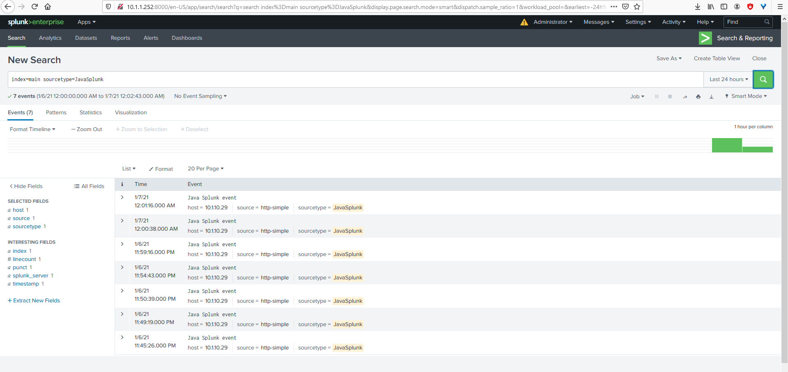

## Splunk Enterprise - Java SDK
#### Use Case: Splunk-Java Integration
#### Log file analysis
#### Motivation: 
##### - Being able to perform SQL operations on unstructured/structured data that is fetched from Hadoop cluster to Splunk Enterprise. 
##### - Fetching data from Splunk through queries like Splunk App Search
##### - Sending Events to splunkd server (Splunk Enterprise Server) 

#### Author: Mauro Travieso Pena

---
* **IDE Output:**

***Connection and session establishment with Splunk Enterprise Server***
```
Sucessfully connected with session token: Splunk SS_NxtuKTkGV35ZfTDJSpNAuFdAYLVx64^s8bWx9p5MyVe0_D8LcxGAn8YsxVwC7Yzxxb3QvnsytcMepNg2XdyrUPYFH27PLnt1wxo
```

***Getting Service info***
```
Info:
 rtsearch_enabled: 1
 startup_time: 1609992191
 kvStoreStatus: ready
 master_guid: 7E438A7C-A019-4133-8FCA-FA526A97196F
 dfs_enabled: 0
 serverName: localhost.localdomain
 physicalMemoryMB: 7820
 isTrial: 1
 licenseSignature: f226fc41edf65c48f5df599829cea1b8
 max_users: 4294967295
 cpu_arch: x86_64
 mode: normal
 licenseKeys: [5C52DA5145AD67B8188604C49962D12F2C3B2CF1B82A6878E46F68CA2812807B]
 shutting_down: 0
 isFree: 0
 os_build: #1 SMP Wed Mar 7 19:03:37 UTC 2018
 host: localhost.localdomain
 activeLicenseSubgroup: Production
 health_version: 12
 license_labels: [Splunk Enterprise   Splunk Analytics for Hadoop Download Trial]
 os_name_extended: Linux
 eai:acl: {owner=system, can_write=1, removable=0, perms={read=[*], write=[]}, modifiable=0, sharing=system, can_list=1}
 licenseState: OK
 addOns: {DFS={type=add_on, parameters={vCPU=0}}, hadoop={type=external_results_provider, parameters={guid=6F416E61-B40E-461C-A782-CBC186E98133, erp_type=report, maxNodes=200}}}
 isForwarding: 0
 os_version: 3.10.0-693.21.1.el7.x86_64
 numberOfCores: 2
 version: 8.1.1
 numberOfVirtualCores: 2
 product_type: enterprise
 activeLicenseGroup: Trial
 build: 08187535c166
 host_fqdn: localhost.localdomain
 master_uri: self
 health_info: yellow
 fips_mode: 0
 guid: 7E438A7C-A019-4133-8FCA-FA526A97196F
 os_name: Linux
 server_roles: [indexer, license_master, kv_store]
 staticAssetId: 72319739C34993AA34658608F753D49723CE26FDB14A6C7624ACC0DC9B6730C6
 host_resolved: localhost.localdomain
```
---
***Searching through Query arguments (Splunk Enterprise):***<br>
```
Search: index=hdfs_logs | head 1
```


***Integration for searching through Query arguments (output_mode -> XML):***<br>
```
Search: index=hdfs_logs | head 1
```

* Query results: 
```

<?xml version='1.0' encoding='UTF-8'?>
<results preview='0'>
<meta>
<fieldOrder>
<field>_confstr</field>
<field>_raw</field>
<field>_time</field>
<field>host</field>
<field>index</field>
<field>linecount</field>
<field>source</field>
<field>sourcetype</field>
<field>splunk_server</field>
</fieldOrder>
</meta>
	<result offset='0'>
		<field k='_confstr'>
			<value><text>source::/user/splunkmr/yarn-root-resourcemanager-localhost.localdomain.log|host::localhost.localdomain||1</text></value>
		</field>
		<field k='_raw'><v xml:space='preserve' trunc='0'>2021-01-05 22:55:19,987 INFO org.apache.hadoop.yarn.server.resourcemanager.ResourceManager: STARTUP_MSG: 
/************************************************************
STARTUP_MSG: Starting ResourceManager
STARTUP_MSG:   host = localhost.localdomain/127.0.0.1
STARTUP_MSG:   args = []
STARTUP_MSG:   version = 2.10.1
STARTUP_MSG:   classpath = /opt/hadoop-2.10.1/etc/hadoop:/opt/hadoop-2.10.1/etc/hadoop:/opt/hadoop-2.10.1/etc/hadoop:/opt/hadoop-2.10.1/share/hadoop/common/lib/commons-collections-3.2.2.jar:/opt/hadoop-2.10.1/share/hadoop/common/lib/servlet-api-2.5.jar:/opt/hadoop-2.10.1/share/hadoop/common/lib/jetty-6.1.26.jar:/opt/hadoop-2.10.1/share/hadoop/common/lib/jetty-util-6.1.26.jar:/opt/hadoop-2.10.1/share/hadoop/common/lib/jetty-sslengine-6.1.26.jar:/opt/hadoop-2.10.1/share/hadoop/common/lib/jsp-api-2.1.jar:/opt/hadoop-2.10.1/share/hadoop/common/lib/jersey-core-1.9.jar:/opt/hadoop-2.10.1/share/hadoop/common/lib/jersey-json-1.9.jar:/opt/hadoop-2.10.1/share/hadoop/common/lib/jettison-1.1.jar:/opt/hadoop-2.10.1/share/hadoop/common/lib/jaxb-impl-2.2.3-1.jar:/opt/hadoop-2.10.1/share/hadoop/common/lib/jaxb-api-2.2.2.jar:/opt/hadoop-2.10.1/share/hadoop/common/lib/stax-api-1.0-2.jar:/opt/hadoop-2.10.1/share/hadoop/common/lib/activation-1.1.jar:/opt/hadoop-2.10.1/share/hadoop/common/lib/jackson-core-asl-1.9.13.jar:/opt/hadoop-2.10.1/share/hadoop/common/lib/jackson-mapper-asl-1.9.13.jar:/opt/hadoop-2.10.1/share/hadoop/common/lib/jackson-jaxrs-1.9.13.jar:/opt/hadoop-2.10.1/share/hadoop/common/lib/jackson-xc-1.9.13.jar:/opt/hadoop-2.10.1/share/hadoop/common/lib/jersey-server-1.9.jar:/opt/hadoop-2.10.1/share/hadoop/common/lib/asm-3.2.jar:/opt/hadoop-2.10.1/share/hadoop/common/lib/log4j-1.2.17.jar:/opt/hadoop-2.10.1/share/hadoop/common/lib/jets3t-0.9.0.jar:/opt/hadoop-2.10.1/share/hadoop/common/lib/java-xmlbuilder-0.4.jar:/opt/hadoop-2.10.1/share/hadoop/common/lib/commons-lang-2.6.jar:/opt/hadoop-2.10.1/share/hadoop/common/lib/commons-configuration-1.6.jar:/opt/hadoop-2.10.1/share/hadoop/common/lib/commons-digester-1.8.jar:/opt/hadoop-2.10.1/share/hadoop/common/lib/commons-beanutils-1.9.4.jar:/opt/hadoop-2.10.1/share/hadoop/common/lib/commons-lang3-3.4.jar:/opt/hadoop-2.10.1/share/hadoop/common/lib/slf4j-api-1.7.25.jar:/opt/hadoop-2.10.1/share/hadoop/common/lib/slf4j-log4j12-1.7.25.jar:/opt/hadoop-2.10.1/share/hadoop/common/lib/avro-1.7.7.jar:/opt/hadoop-2.10.1/share/hadoop/common/lib/paranamer-2.3.jar:/opt/hadoop-2.10.1/share/hadoop/common/lib/snappy-java-1.0.5.jar:/opt/hadoop-2.10.1/share/hadoop/common/lib/commons-compress-1.19.jar:/opt/hadoop-2.10.1/share/hadoop/common/lib/protobuf-java-2.5.0.jar:/opt/hadoop-2.10.1/share/hadoop/common/lib/gson-2.2.4.jar:/opt/hadoop-2.10.1/share/hadoop/common/lib/hadoop-auth-2.10.1.jar:/opt/hadoop-2.10.1/share/hadoop/common/lib/nimbus-jose-jwt-7.9.jar:/opt/hadoop-2.10.1/share/hadoop/common/lib/jcip-annotations-1.0-1.jar:/opt/hadoop-2.10.1/share/hadoop/common/lib/json-smart-1.3.1.jar:/opt/hadoop-2.10.1/share/hadoop/common/lib/apacheds-kerberos-codec-2.0.0-M15.jar:/opt/hadoop-2.10.1/share/hadoop/common/lib/apacheds-i18n-2.0.0-M15.jar:/opt/hadoop-2.10.1/share/hadoop/common/lib/api-asn1-api-1.0.0-M20.jar:/opt/hadoop-2.10.1/share/hadoop/common/lib/api-util-1.0.0-M20.jar:/opt/hadoop-2.10.1/share/hadoop/common/lib/zookeeper-3.4.14.jar:/opt/hadoop-2.10.1/share/hadoop/common/lib/spotbugs-annotations-3.1.9.jar:/opt/hadoop-2.10.1/share/hadoop/common/lib/audience-annotations-0.5.0.jar:/opt/hadoop-2.10.1/share/hadoop/common/lib/netty-3.10.6.Final.jar:/opt/hadoop-
2.10.1/share/hadoop/common/lib/curator-framework-2.13.0.jar:/opt/hadoop-2.10.1/share/hadoop/common/lib/curator-client-2.13.0.jar:/opt/hadoop-2.10.1/share/hadoop/common/lib/jsch-0.1.55.jar:/opt/hadoop-2.10.1/share/hadoop/common/lib/curator-recipes-2.13.0.jar:/opt/hadoop-2.10.1/share/hadoop/common/lib/htrace-core4-4.1.0-incubating.jar:/opt/hadoop-2.10.1/share/hadoop/common/lib/stax2-api-3.1.4.jar:/opt/hadoop-2.10.1/share/hadoop/common/lib/woodstox-core-5.0.3.jar:/opt/hadoop-2.10.1/share/hadoop/common/lib/junit-4.11.jar:/opt/hadoop-2.10.1/share/hadoop/common/lib/hamcrest-core-1.3.jar:/opt/hadoop-2.10.1/share/hadoop/common/lib/mockito-all-1.8.5.jar:/opt/hadoop-2.10.1/share/hadoop/common/lib/hadoop-annotations-2.10.1.jar:/opt/hadoop-2.10.1/share/hadoop/common/lib/guava-11.0.2.jar:/opt/hadoop-2.10.1/share/hadoop/common/lib/jsr305-3.0.2.jar:/opt/hadoop-2.10.1/share/hadoop/common/lib/commons-cli-1.2.jar:/opt/hadoop-2.10.1/share/hadoop/common/lib/commons-math3-3.1.1.jar:/opt/hadoop-2.10.1/share/hadoop/common/lib/xmlenc-0.52.jar:/opt/hadoop-2.10.1/share/hadoop/common/lib/httpclient-4.5.2.jar:/opt/hadoop-2.10.1/share/hadoop/common/lib/httpcore-4.4.4.jar:/opt/hadoop-2.10.1/share/hadoop/common/lib/commons-logging-1.1.3.jar:/opt/hadoop-2.10.1/share/hadoop/common/lib/commons-codec-1.4.jar:/opt/hadoop-2.10.1/share/hadoop/common/lib/commons-io-2.4.jar:/opt/hadoop-2.10.1/share/hadoop/common/lib/commons-net-3.1.jar:/opt/hadoop-2.10.1/share/hadoop/common/hadoop-common-2.10.1.jar:/opt/hadoop-2.10.1/share/hadoop/common/hadoop-common-2.10.1-tests.jar:/opt/hadoop-2.10.1/share/hadoop/common/hadoop-nfs-2.10.1.jar:/opt/hadoop-2.10.1/share/hadoop/hdfs:/opt/hadoop-2.10.1/share/hadoop/hdfs/lib/commons-codec-1.4.jar:/opt/hadoop-2.10.1/share/hadoop/hdfs/lib/log4j-1.2.17.jar:/opt/hadoop-2.10.1/share/hadoop/hdfs/lib/commons-logging-1.1.3.jar:/opt/hadoop-2.10.1/share/hadoop/hdfs/lib/jsr305-3.0.2.jar:/opt/hadoop-2.10.1/share/hadoop/hdfs/lib/netty-3.10.6.Final.jar:/opt/hadoop-2.10.1/share/hadoop/hdfs/lib/guava-11.0.2.jar:/opt/hadoop-2.10.1/share/hadoop/hdfs/lib/commons-cli-1.2.jar:/opt/hadoop-2.10.1/share/hadoop/hdfs/lib/xmlenc-0.52.jar:/opt/hadoop-2.10.1/share/hadoop/hdfs/lib/commons-io-2.4.jar:/opt/hadoop-2.10.1/share/hadoop/hdfs/lib/servlet-api-2.5.jar:/opt/hadoop-2.10.1/share/hadoop/hdfs/lib/jetty-6.1.26.jar:/opt/hadoop-2.10.1/share/hadoop/hdfs/lib/jetty-util-6.1.26.jar:/opt/hadoop-2.10.1/share/hadoop/hdfs/lib/jersey-core-1.9.jar:/opt/hadoop-2.10.1/share/hadoop/hdfs/lib/jackson-core-asl-1.9.13.jar:/opt/hadoop-2.10.1/share/hadoop/hdfs/lib/jackson-mapper-asl-1.9.13.jar:/opt/hadoop-2.10.1/share/hadoop/hdfs/lib/jersey-server-1.9.jar:/opt/hadoop-2.10.1/share/hadoop/hdfs/lib/asm-3.2.jar:/opt/hadoop-2.10.1/share/hadoop/hdfs/lib/commons-lang-2.6.jar:/opt/hadoop-2.10.1/share/hadoop/hdfs/lib/protobuf-java-2.5.0.jar:/opt/hadoop-2.10.1/share/hadoop/hdfs/lib/htrace-core4-4.1.0-incubating.jar:/opt/hadoop-2.10.1/share/hadoop/hdfs/lib/hadoop-hdfs-client-2.10.1.jar:/opt/hadoop-2.10.1/share/hadoop/hdfs/lib/okhttp-2.7.5.jar:/opt/hadoop-2.10.1/share/hadoop/hdfs/lib/okio-1.6.0.jar:/opt/hadoop-2.10.1/share/hadoop/hdfs/lib/commons-daemon-1.0.13.jar:/opt/hadoop-2.10.1/share/hadoop/hdfs/lib/netty-all-4.1.50.Final.jar:/opt/hadoop-2.10.1/share/hadoop/hdfs/lib/xercesImpl-2.12.0.jar:/opt/hadoop-2.10.1/share/hadoop/hdfs/lib/xml-apis-1.4.01.jar:/opt/hadoop-2.10.1/share/hadoop/hdfs/lib/leveldbjni-all-1.8.jar:/opt/hadoop-2.10.1/share/hadoop/hdfs/lib/jackson-databind-2.9.10.6.jar:/opt/hadoop-2.10.1/share/hadoop/hdfs/lib/jackson-annotations-2.9.10.jar:/opt/hadoop-2.10.1/share/hadoop/hdfs/lib/jackson-core-2.9.10.jar:/opt/hadoop-2.10.1/share/hadoop/hdfs/hadoop-hdfs-2.10.1.jar:/opt/hadoop-2.10.1/share/hadoop/hdfs/hadoop-hdfs-2.10.1-tests.jar:/opt/hadoop-2.10.1/share/hadoop/hdfs/hadoop-hdfs-client-2.10.1.jar:/opt/hadoop-2.10.1/share/hadoop/hdfs/hadoop-hdfs-client-2.10.1-tests.jar:/opt/hadoop-2.10.1/share/hadoop/hdfs/hadoop-hdfs-native-client-2.10.1.jar:/opt/hadoop-2.10.1/share/hadoop/hdfs/hadoop-hdfs-native-client-2.10.1-tests.jar:/opt/hadoop-2.10.1/share/hadoop/hdfs/hadoop-hdfs-rbf-2.10.1.j
ar:/opt/hadoop-2.10.1/share/hadoop/hdfs/hadoop-hdfs-rbf-2.10.1-tests.jar:/opt/hadoop-2.10.1/share/hadoop/hdfs/hadoop-hdfs-nfs-2.10.1.jar:/opt/hadoop-2.10.1/share/hadoop/yarn:/opt/hadoop-2.10.1/share/hadoop/yarn/lib/commons-cli-1.2.jar:/opt/hadoop-2.10.1/share/hadoop/yarn/lib/log4j-1.2.17.jar:/opt/hadoop-2.10.1/share/hadoop/yarn/lib/commons-compress-1.19.jar:/opt/hadoop-2.10.1/share/hadoop/yarn/lib/servlet-api-2.5.jar:/opt/hadoop-2.10.1/share/hadoop/yarn/lib/commons-codec-1.4.jar:/opt/hadoop-2.10.1/share/hadoop/yarn/lib/jetty-util-6.1.26.jar:/opt/hadoop-2.10.1/share/hadoop/yarn/lib/jersey-core-1.9.jar:/opt/hadoop-2.10.1/share/hadoop/yarn/lib/jersey-client-1.9.jar:/opt/hadoop-2.10.1/share/hadoop/yarn/lib/jackson-core-asl-1.9.13.jar:/opt/hadoop-2.10.1/share/hadoop/yarn/lib/jackson-mapper-asl-1.9.13.jar:/opt/hadoop-2.10.1/share/hadoop/yarn/lib/jackson-jaxrs-1.9.13.jar:/opt/hadoop-2.10.1/share/hadoop/yarn/lib/jackson-xc-1.9.13.jar:/opt/hadoop-2.10.1/share/hadoop/yarn/lib/guice-servlet-3.0.jar:/opt/hadoop-2.10.1/share/hadoop/yarn/lib/guice-3.0.jar:/opt/hadoop-2.10.1/share/hadoop/yarn/lib/javax.inject-1.jar:/opt/hadoop-2.10.1/share/hadoop/yarn/lib/aopalliance-1.0.jar:/opt/hadoop-2.10.1/share/hadoop/yarn/lib/commons-io-2.4.jar:/opt/hadoop-2.10.1/share/hadoop/yarn/lib/jersey-server-1.9.jar:/opt/hadoop-2.10.1/share/hadoop/yarn/lib/asm-3.2.jar:/opt/hadoop-2.10.1/share/hadoop/yarn/lib/jersey-json-1.9.jar:/opt/hadoop-2.10.1/share/hadoop/yarn/lib/jettison-1.1.jar:/opt/hadoop-2.10.1/share/hadoop/yarn/lib/jaxb-impl-2.2.3-1.jar:/opt/hadoop-2.10.1/share/hadoop/yarn/lib/jersey-guice-1.9.jar:/opt/hadoop-2.10.1/share/hadoop/yarn/lib/commons-math3-3.1.1.jar:/opt/hadoop-2.10.1/share/hadoop/yarn/lib/xmlenc-0.52.jar:/opt/hadoop-2.10.1/share/hadoop/yarn/lib/httpclient-4.5.2.jar:/opt/hadoop-2.10.1/share/hadoop/yarn/lib/httpcore-4.4.4.jar:/opt/hadoop-2.10.1/share/hadoop/yarn/lib/commons-net-3.1.jar:/opt/hadoop-2.10.1/share/hadoop/yarn/lib/commons-collections-3.2.2.jar:/opt/hadoop-2.10.1/share/hadoop/yarn/lib/jetty-6.1.26.jar:/opt/hadoop-2.10.1/share/hadoop/yarn/lib/jetty-sslengine-6.1.26.jar:/opt/hadoop-2.10.1/share/hadoop/yarn/lib/jsp-api-2.1.jar:/opt/hadoop-2.10.1/share/hadoop/yarn/lib/jets3t-0.9.0.jar:/opt/hadoop-2.10.1/share/hadoop/yarn/lib/java-xmlbuilder-0.4.jar:/opt/hadoop-2.10.1/share/hadoop/yarn/lib/commons-configuration-1.6.jar:/opt/hadoop-2.10.1/share/hadoop/yarn/lib/commons-digester-1.8.jar:/opt/hadoop-2.10.1/share/hadoop/yarn/lib/commons-beanutils-1.9.4.jar:/opt/hadoop-2.10.1/share/hadoop/yarn/lib/commons-lang3-3.4.jar:/opt/hadoop-2.10.1/share/hadoop/yarn/lib/avro-1.7.7.jar:/opt/hadoop-2.10.1/share/hadoop/yarn/lib/paranamer-2.3.jar:/opt/hadoop-2.1
STARTUP_MSG:   build = https://github.com/apache/hadoop -r 1827467c9a56f133025f28557bfc2c562d78e816; compiled by &apos;centos&apos; on 2020-09-14T13:17Z
STARTUP_MSG:   java = 1.8.0_275
************************************************************/</v></field>
		<field k='_time'>
			<value><text>2021-01-05T22:55:19.987-06:00</text></value>
		</field>
		<field k='host'>
			<value><text>localhost.localdomain</text></value>
		</field>
		<field k='index'>
			<value><text>hdfs_logs</text></value>
		</field>
		<field k='linecount'>
			<value><text>10</text></value>
		</field>
		<field k='source'>
			<value><text>/user/splunkmr/yarn-root-resourcemanager-localhost.localdomain.log</text></value>
		</field>
		<field k='splunk_server'>
			<value><text>localhost.localdomain</text></value>
		</field>
	</result>
</results>
re/hadoop/hdfs/lib/jackson-annotations-2.9.10.jar:/opt/hadoop-2.10.1/share/hadoop/hdfs/lib/jackson-core-2.9.10.jar:/opt/hadoop-2.10.1/share/hadoop/hdfs/hadoop-hdfs-2.10.1.jar:/opt/hadoop-2.10.1/share/hadoop/hdfs/hadoop-hdfs-2.10.1-tests.jar:/opt/hadoop-2.10.1/share/hadoop/hdfs/hadoop-hdfs-client-2.10.1.jar:/opt/hadoop-2.10.1/share/hadoop/hdfs/hadoop-hdfs-client-2.10.1-tests.jar:/opt/hadoop-2.10.1/share/hadoop/hdfs/hadoop-hdfs-native-client-2.10.1.jar:/opt/hadoop-2.10.1/share/hadoop/hdfs/hadoop-hdfs-native-client-2.10.1-tests.jar:/opt/hadoop-2.10.1/share/hadoop/hdfs/hadoop-hdfs-rbf-2.10.1.j
```
***Integration for searching through Query arguments (output_mode -> JSON):***<br>
```
Search: index=hdfs_logs | head 1
```

* Query results: 
```
{"preview":false,"init_offset":0,"messages":[],"fields":[{"name":"_confstr"},{"name":"_raw"},{"name":"_time"},{"name":"host"},{"name":"index"},{"name":"linecount"},{"name":"source"},{"name":"sourcetype"},{"name":"splunk_server"}],"results":[{"_confstr":"source::/user/splunkmr/yarn-root-resourcemanager-localhost.localdomain.log|host::localhost.localdomain||1","_raw":"2021-01-05 22:55:19,987 INFO org.apache.hadoop.yarn.server.resourcemanager.ResourceManager: STARTUP_MSG: \n/************************************************************\nSTARTUP_MSG: Starting ResourceManager\nSTARTUP_MSG:   host = localhost.localdomain/127.0.0.1\nSTARTUP_MSG:   args = []\nSTARTUP_MSG:   version = 2.10.1\nSTARTUP_MSG:   classpath = /opt/hadoop-2.10.1/etc/hadoop:/opt/hadoop-2.10.1/etc/hadoop:/opt/hadoop-2.10.1/etc/hadoop:/opt/hadoop-2.10.1/share/hadoop/common/lib/commons-collections-3.2.2.jar:/opt/hadoop-2.10.1/share/hadoop/common/lib/servlet-api-2.5.jar:/opt/hadoop-2.10.1/share/hadoop/common/lib/jetty-6.1.26.jar:/opt/hadoop-2.10.1/share/hadoop/common/lib/jetty-util-6.1.26.jar:/opt/hadoop-2.10.1/share/hadoop/common/lib/jetty-sslengine-6.1.26.jar:/opt/hadoop-2.10.1/share/hadoop/common/lib/jsp-api-2.1.jar:/opt/hadoop-2.10.1/share/hadoop/common/lib/jersey-core-1.9.jar:/opt/hadoop-2.10.1/share/hadoop/common/lib/jersey-json-1.9.jar:/opt/hadoop-2.10.1/share/hadoop/common/lib/jettison-1.1.jar:/opt/hadoop-2.10.1/share/hadoop/common/lib/jaxb-impl-2.2.3-1.jar:/opt/hadoop-2.10.1/share/hadoop/common/lib/jaxb-api-2.2.2.jar:/opt/hadoop-2.10.1/share/hadoop/common/lib/stax-api-1.0-2.jar:/opt/hadoop-2.10.1/share/hadoop/common/lib/activation-1.1.jar:/opt/hadoop-2.10.1/share/hadoop/common/lib/jackson-core-asl-1.9.13.jar:/opt/hadoop-2.10.1/share/hadoop/common/lib/jackson-mapper-asl-1.9.13.jar:/opt/hadoop-2.10.1/share/hadoop/common/lib/jackson-jaxrs-1.9.13.jar:/opt/hadoop-2.10.1/share/hadoop/common/lib/jackson-xc-1.9.13.jar:/opt/hadoop-2.10.1/share/hadoop/common/lib/jersey-server-1.9.jar:/opt/hadoop-2.10.1/share/hadoop/common/lib/asm-3.2.jar:/opt/hadoop-2.10.1/share/hadoop/common/lib/log4j-1.2.17.jar:/opt/hadoop-2.10.1/share/hadoop/common/lib/jets3t-0.9.0.jar:/opt/hadoop-2.10.1/share/hadoop/common/lib/java-xmlbuilder-0.4.jar:/opt/hadoop-2.10.1/share/hadoop/common/lib/commons-lang-2.6.jar:/opt/hadoop-2.10.1/share/hadoop/common/lib/commons-configuration-1.6.jar:/opt/hadoop-2.10.1/share/hadoop/common/lib/commons-digester-1.8.jar:/opt/hadoop-2.10.1/share/hadoop/common/lib/commons-beanutils-1.9.4.jar:/opt/hadoop-2.10.1/share/hadoop/common/lib/commons-lang3-3.4.jar:/opt/hadoop-2.10.1/share/hadoop/common/lib/slf4j-api-1.7.25.jar:/opt/hadoop-2.10.1/share/hadoop/common/lib/slf4j-log4j12-1.7.25.jar:/opt/hadoop-2.10.1/share/hadoop/common/lib/avro-1.7.7.jar:/opt/hadoop-2.10.1/share/hadoop/common/lib/paranamer-2.3.jar:/opt/hadoop-2.10.1/share/hadoop/common/lib/snappy-java-1.0.5.jar:/opt/hadoop-2.10.1/share/hadoop/common/lib/commons-compress-1.19.jar:/opt/hadoop-2.10.1/share/hadoop/common/lib/protobuf-java-2.5.0.jar:/opt/hadoop-2.10.1/share/hadoop/common/lib/gson-2.2.4.jar:/opt/hadoop-2.10.1/share/hadoop/common/lib/hadoop-auth-2.10.1.jar:/opt/hadoop-2.10.1/share/hadoop/common/lib/nimbus-jose-jwt-7.9.jar:/opt/hadoop-2.10.1/share/hadoop/common/lib/jcip-annotations-1.0-1.jar:/opt/hadoop-2.10.1/share/hadoop/common/lib/json-smart-1.3.1.jar:/opt/hadoop-2.10.1/share/hadoop/common/lib/apacheds-kerberos-codec-2.0.0-M15.jar:/opt/hadoop-2.10.1/share/hadoop/common/lib/apacheds-i18n-2.0.0-M15.jar:/opt/hadoop-2.10.1/share/hadoop/common/lib/api-asn1-api-1.0.0-M20.jar:/opt/hadoop-2.10.1/share/hadoop/common/lib/api-util-1.0.0-M20.jar:/opt/hadoop-2.10.1/share/hadoop/common/lib/zookeeper-3.4.14.jar:/opt/hadoop-2.10.1/share/hadoop/common/lib/spotbugs-annotations-3.1.9.jar:/opt/hadoop-2.10.1/share/hadoop/common/lib/audience-annotations-0.5.0.jar:/opt/hadoop-2.10.1/share/hadoop/common/lib/netty-3.10.6.Final.jar:/opt/hadoop-2.10.1/share/hadoop/common/lib/curator-framework-2.13.0.jar:/opt/hadoop-2.10.1/share/hadoop/common/lib/curator-client-2.13.0.jar:/opt/hadoop-2.10.1/share/hadoop/common/lib/jsch-0.1
.55.jar:/opt/hadoop-2.10.1/share/hadoop/common/lib/curator-recipes-2.13.0.jar:/opt/hadoop-2.10.1/share/hadoop/common/lib/htrace-core4-4.1.0-incubating.jar:/opt/hadoop-2.10.1/share/hadoop/common/lib/stax2-api-3.1.4.jar:/opt/hadoop-2.10.1/share/hadoop/common/lib/woodstox-core-5.0.3.jar:/opt/hadoop-2.10.1/share/hadoop/common/lib/junit-4.11.jar:/opt/hadoop-2.10.1/share/hadoop/common/lib/hamcrest-core-1.3.jar:/opt/hadoop-2.10.1/share/hadoop/common/lib/mockito-all-1.8.5.jar:/opt/hadoop-2.10.1/share/hadoop/common/lib/hadoop-annotations-2.10.1.jar:/opt/hadoop-2.10.1/share/hadoop/common/lib/guava-11.0.2.jar:/opt/hadoop-2.10.1/share/hadoop/common/lib/jsr305-3.0.2.jar:/opt/hadoop-2.10.1/share/hadoop/common/lib/commons-cli-1.2.jar:/opt/hadoop-2.10.1/share/hadoop/common/lib/commons-math3-3.1.1.jar:/opt/hadoop-2.10.1/share/hadoop/common/lib/xmlenc-0.52.jar:/opt/hadoop-2.10.1/share/hadoop/common/lib/httpclient-4.5.2.jar:/opt/hadoop-2.10.1/share/hadoop/common/lib/httpcore-4.4.4.jar:/opt/hadoop-2.10.1/share/hadoop/common/lib/commons-logging-1.1.3.jar:/opt/hadoop-2.10.1/share/hadoop/common/lib/commons-codec-1.4.jar:/opt/hadoop-2.10.1/share/hadoop/common/lib/commons-io-2.4.jar:/opt/hadoop-2.10.1/share/hadoop/common/lib/commons-net-3.1.jar:/opt/hadoop-2.10.1/share/hadoop/common/hadoop-common-2.10.1.jar:/opt/hadoop-2.10.1/share/hadoop/common/hadoop-common-2.10.1-tests.jar:/opt/hadoop-2.10.1/share/hadoop/common/hadoop-nfs-2.10.1.jar:/opt/hadoop-2.10.1/share/hadoop/hdfs:/opt/hadoop-2.10.1/share/hadoop/hdfs/lib/commons-codec-1.4.jar:/opt/hadoop-2.10.1/share/hadoop/hdfs/lib/log4j-1.2.17.jar:/opt/hadoop-2.10.1/share/hadoop/hdfs/lib/commons-logging-1.1.3.jar:/opt/hadoop-2.10.1/share/hadoop/hdfs/lib/jsr305-3.0.2.jar:/opt/hadoop-2.10.1/share/hadoop/hdfs/lib/netty-3.10.6.Final.jar:/opt/hadoop-2.10.1/share/hadoop/hdfs/lib/guava-11.0.2.jar:/opt/hadoop-2.10.1/share/hadoop/hdfs/lib/commons-cli-1.2.jar:/opt/hadoop-2.10.1/share/hadoop/hdfs/lib/xmlenc-0.52.jar:/opt/hadoop-2.10.1/share/hadoop/hdfs/lib/commons-io-2.4.jar:/opt/hadoop-2.10.1/share/hadoop/hdfs/lib/servlet-api-2.5.jar:/opt/hadoop-2.10.1/share/hadoop/hdfs/lib/jetty-6.1.26.jar:/opt/hadoop-2.10.1/share/hadoop/hdfs/lib/jetty-util-6.1.26.jar:/opt/hadoop-2.10.1/share/hadoop/hdfs/lib/jersey-core-1.9.jar:/opt/hadoop-2.10.1/share/hadoop/hdfs/lib/jackson-core-asl-1.9.13.jar:/opt/hadoop-2.10.1/share/hadoop/hdfs/lib/jackson-mapper-asl-1.9.13.jar:/opt/hadoop-2.10.1/share/hadoop/hdfs/lib/jersey-server-1.9.jar:/opt/hadoop-2.10.1/share/hadoop/hdfs/lib/asm-3.2.jar:/opt/hadoop-2.10.1/share/hadoop/hdfs/lib/commons-lang-2.6.jar:/opt/hadoop-2.10.1/share/hadoop/hdfs/lib/protobuf-java-2.5.0.jar:/opt/hadoop-2.10.1/share/hadoop/hdfs/lib/htrace-core4-4.1.0-incubating.jar:/opt/hadoop-2.10.1/share/hadoop/hdfs/lib/hadoop-hdfs-client-2.10.1.jar:/opt/hadoop-2.10.1/share/hadoop/hdfs/lib/okhttp-2.7.5.jar:/opt/hadoop-2.10.1/share/hadoop/hdfs/lib/okio-1.6.0.jar:/opt/hadoop-2.10.1/share/hadoop/hdfs/lib/commons-daemon-1.0.13.jar:/opt/hadoop-2.10.1/share/hadoop/hdfs/lib/netty-all-4.1.50.Final.jar:/opt/hadoop-2.10.1/share/hadoop/hdfs/lib/xercesImpl-2.12.0.jar:/opt/hadoop-2.10.1/share/hadoop/hdfs/lib/xml-apis-1.4.01.jar:/opt/hadoop-2.10.1/share/hadoop/hdfs/lib/leveldbjni-all-1.8.jar:/opt/hadoop-2.10.1/share/hadoop/hdfs/lib/jackson-databind-2.9.10.6.jar:/opt/hadoop-2.10.1/share/hadoop/hdfs/lib/jackson-annotations-2.9.10.jar:/opt/hadoop-2.10.1/share/hadoop/hdfs/lib/jackson-core-2.9.10.jar:/opt/hadoop-2.10.1/share/hadoop/hdfs/hadoop-hdfs-2.10.1.jar:/opt/hadoop-2.10.1/share/hadoop/hdfs/hadoop-hdfs-2.10.1-tests.jar:/opt/hadoop-2.10.1/share/hadoop/hdfs/hadoop-hdfs-client-2.10.1.jar:/opt/hadoop-2.10.1/share/hadoop/hdfs/hadoop-hdfs-client-2.10.1-tests.jar:/opt/hadoop-2.10.1/share/hadoop/hdfs/hadoop-hdfs-native-client-2.10.1.jar:/opt/hadoop-2.10.1/share/hadoop/hdfs/hadoop-hdfs-native-client-2.10.1-tests.jar:/opt/hadoop-2.10.1/share/hadoop/hdfs/hadoop-hdfs-rbf-2.10.1.jar:/opt/hadoop-2.10.1/share/hadoop/hdfs/hadoop-hdfs-rbf-2.10.1-tests.jar:/opt/hadoop-2.10.1/share/hadoop/hdfs/hadoop-hdfs-nfs-2.10.1.jar:/opt/hadoop-2.10.1/share/hadoop/yarn:/opt/h
adoop-2.10.1/share/hadoop/yarn/lib/commons-cli-1.2.jar:/opt/hadoop-2.10.1/share/hadoop/yarn/lib/log4j-1.2.17.jar:/opt/hadoop-2.10.1/share/hadoop/yarn/lib/commons-compress-1.19.jar:/opt/hadoop-2.10.1/share/hadoop/yarn/lib/servlet-api-2.5.jar:/opt/hadoop-2.10.1/share/hadoop/yarn/lib/commons-codec-1.4.jar:/opt/hadoop-2.10.1/share/hadoop/yarn/lib/jetty-util-6.1.26.jar:/opt/hadoop-2.10.1/share/hadoop/yarn/lib/jersey-core-1.9.jar:/opt/hadoop-2.10.1/share/hadoop/yarn/lib/jersey-client-1.9.jar:/opt/hadoop-2.10.1/share/hadoop/yarn/lib/jackson-core-asl-1.9.13.jar:/opt/hadoop-2.10.1/share/hadoop/yarn/lib/jackson-mapper-asl-1.9.13.jar:/opt/hadoop-2.10.1/share/hadoop/yarn/lib/jackson-jaxrs-1.9.13.jar:/opt/hadoop-2.10.1/share/hadoop/yarn/lib/jackson-xc-1.9.13.jar:/opt/hadoop-2.10.1/share/hadoop/yarn/lib/guice-servlet-3.0.jar:/opt/hadoop-2.10.1/share/hadoop/yarn/lib/guice-3.0.jar:/opt/hadoop-2.10.1/share/hadoop/yarn/lib/javax.inject-1.jar:/opt/hadoop-2.10.1/share/hadoop/yarn/lib/aopalliance-1.0.jar:/opt/hadoop-2.10.1/share/hadoop/yarn/lib/commons-io-2.4.jar:/opt/hadoop-2.10.1/share/hadoop/yarn/lib/jersey-server-1.9.jar:/opt/hadoop-2.10.1/share/hadoop/yarn/lib/asm-3.2.jar:/opt/hadoop-2.10.1/share/hadoop/yarn/lib/jersey-json-1.9.jar:/opt/hadoop-2.10.1/share/hadoop/yarn/lib/jettison-1.1.jar:/opt/hadoop-2.10.1/share/hadoop/yarn/lib/jaxb-impl-2.2.3-1.jar:/opt/hadoop-2.10.1/share/hadoop/yarn/lib/jersey-guice-1.9.jar:/opt/hadoop-2.10.1/share/hadoop/yarn/lib/commons-math3-3.1.1.jar:/opt/hadoop-2.10.1/share/hadoop/yarn/lib/xmlenc-0.52.jar:/opt/hadoop-2.10.1/share/hadoop/yarn/lib/httpclient-4.5.2.jar:/opt/hadoop-2.10.1/share/hadoop/yarn/lib/httpcore-4.4.4.jar:/opt/hadoop-2.10.1/share/hadoop/yarn/lib/commons-net-3.1.jar:/opt/hadoop-2.10.1/share/hadoop/yarn/lib/commons-collections-3.2.2.jar:/opt/hadoop-2.10.1/share/hadoop/yarn/lib/jetty-6.1.26.jar:/opt/hadoop-2.10.1/share/hadoop/yarn/lib/jetty-sslengine-6.1.26.jar:/opt/hadoop-2.10.1/share/hadoop/yarn/lib/jsp-api-2.1.jar:/opt/hadoop-2.10.1/share/hadoop/yarn/lib/jets3t-0.9.0.jar:/opt/hadoop-2.10.1/share/hadoop/yarn/lib/java-xmlbuilder-0.4.jar:/opt/hadoop-2.10.1/share/hadoop/yarn/lib/commons-configuration-1.6.jar:/opt/hadoop-2.10.1/share/hadoop/yarn/lib/commons-digester-1.8.jar:/opt/hadoop-2.10.1/share/hadoop/yarn/lib/commons-beanutils-1.9.4.jar:/opt/hadoop-2.10.1/share/hadoop/yarn/lib/commons-lang3-3.4.jar:/opt/hadoop-2.10.1/share/hadoop/yarn/lib/avro-1.7.7.jar:/opt/hadoop-2.10.1/share/hadoop/yarn/lib/paranamer-2.3.jar:/opt/hadoop-2.1\nSTARTUP_MSG:   build = https://github.com/apache/hadoop -r 1827467c9a56f133025f28557bfc2c562d78e816; compiled by 'centos' on 2020-09-14T13:17Z\nSTARTUP_MSG:   java = 1.8.0_275\n************************************************************/","_time":"2021-01-05T22:55:19.987-06:00","host":"localhost.localdomain","index":"hdfs_logs","linecount":"10","source":"/user/splunkmr/yarn-root-resourcemanager-localhost.localdomain.log","splunk_server":"localhost.localdomain"}], "highlighted":{}}1/share/hadoop/hdfs/lib/netty-all-4.1.50.Final.jar:/opt/hadoop-2.10.1/share/hadoop/hdfs/lib/xercesImpl-2.12.0.jar:/opt/hadoop-2.10.1/share/hadoop/hdfs/lib/xml-apis-1.4.01.jar:/opt/hadoop-2.10.1/share/hadoop/hdfs/lib/leveldbjni-all-1.8.jar:/opt/hadoop-2.10.1/share/hadoop/hdfs/lib/jackson-databind-2.9.10.6.jar:/opt/hadoop-2.10.1/share/hadoop/hdfs/lib/jackson-annotations-2.9.10.jar:/opt/hadoop-2.10.1/share/hadoop/hdfs/lib/jackson-core-2.9.10.jar:/opt/hadoop-2.10.1/share/hadoop/hdfs/hadoop-hdfs-2.10.1.jar:/opt/hadoop-2.10.1/share/hadoop/hdfs/hadoop-hdfs-2.10.1-tests.jar:/opt/hadoop-2.10.1/share/hadoop/hdfs/hadoop-hdfs-client-2.10.1.jar:/opt/hadoop-2.10.1/share/hadoop/hdfs/hadoop-hdfs-client-2.10.1-tests.jar:/opt/hadoop-2.10.1/share/hadoop/hdfs/hadoop-hdfs-native-client-2.10.1.jar:/opt/hadoop-2.10.1/share/hadoop/hdfs/hadoop-hdfs-native-client-2.10.1-tests.jar:/opt/hadoop-2.10.1/share/hadoop/hdfs/hadoop-hdfs-rbf-2.10.1.jar:/opt/hadoop-2.10.1/share/hadoop/hdfs/hadoop-hdfs-rbf-2.10.1-tests.jar:/opt/hadoop-2.10.1/share/hadoop/hdfs/hadoop-hdfs-nfs-2.10.1.jar:/opt/hadoop-2.10.1/share/hadoop/yarn:/opt/h

```
***Integration for searching through Query arguments (output_mode -> CSV):***<br>
```
Search: index=hdfs_logs | head 1
```

* Query results:
```
"_confstr","_raw","_time",host,index,linecount,source,sourcetype,"splunk_server"
"source::/user/splunkmr/yarn-root-resourcemanager-localhost.localdomain.log|host::localhost.localdomain||1","2021-01-05 22:55:19,987 INFO org.apache.hadoop.yarn.server.resourcemanager.ResourceManager: STARTUP_MSG: 
/************************************************************
STARTUP_MSG: Starting ResourceManager
STARTUP_MSG:   host = localhost.localdomain/127.0.0.1
STARTUP_MSG:   args = []
STARTUP_MSG:   version = 2.10.1
STARTUP_MSG:   classpath = /opt/hadoop-2.10.1/etc/hadoop:/opt/hadoop-2.10.1/etc/hadoop:/opt/hadoop-2.10.1/etc/hadoop:/opt/hadoop-2.10.1/share/hadoop/common/lib/commons-collections-3.2.2.jar:/opt/hadoop-2.10.1/share/hadoop/common/lib/servlet-api-2.5.jar:/opt/hadoop-2.10.1/share/hadoop/common/lib/jetty-6.1.26.jar:/opt/hadoop-2.10.1/share/hadoop/common/lib/jetty-util-6.1.26.jar:/opt/hadoop-2.10.1/share/hadoop/common/lib/jetty-sslengine-6.1.26.jar:/opt/hadoop-2.10.1/share/hadoop/common/lib/jsp-api-2.1.jar:/opt/hadoop-2.10.1/share/hadoop/common/lib/jersey-core-1.9.jar:/opt/hadoop-2.10.1/share/hadoop/common/lib/jersey-json-1.9.jar:/opt/hadoop-2.10.1/share/hadoop/common/lib/jettison-1.1.jar:/opt/hadoop-2.10.1/share/hadoop/common/lib/jaxb-impl-2.2.3-1.jar:/opt/hadoop-2.10.1/share/hadoop/common/lib/jaxb-api-2.2.2.jar:/opt/hadoop-2.10.1/share/hadoop/common/lib/stax-api-1.0-2.jar:/opt/hadoop-2.10.1/share/hadoop/common/lib/activation-1.1.jar:/opt/hadoop-2.10.1/share/hadoop/common/lib/jackson-core-asl-1.9.13.jar:/opt/hadoop-2.10.1/share/hadoop/common/lib/jackson-mapper-asl-1.9.13.jar:/opt/hadoop-2.10.1/share/hadoop/common/lib/jackson-jaxrs-1.9.13.jar:/opt/hadoop-2.10.1/share/hadoop/common/lib/jackson-xc-1.9.13.jar:/opt/hadoop-2.10.1/share/hadoop/common/lib/jersey-server-1.9.jar:/opt/hadoop-2.10.1/share/hadoop/common/lib/asm-3.2.jar:/opt/hadoop-2.10.1/share/hadoop/common/lib/log4j-1.2.17.jar:/opt/hadoop-2.10.1/share/hadoop/common/lib/jets3t-0.9.0.jar:/opt/hadoop-2.10.1/share/hadoop/common/lib/java-xmlbuilder-0.4.jar:/opt/hadoop-2.10.1/share/hadoop/common/lib/commons-lang-2.6.jar:/opt/hadoop-2.10.1/share/hadoop/common/lib/commons-configuration-1.6.jar:/opt/hadoop-2.10.1/share/hadoop/common/lib/commons-digester-1.8.jar:/opt/hadoop-2.10.1/share/hadoop/common/lib/commons-beanutils-1.9.4.jar:/opt/hadoop-2.10.1/share/hadoop/common/lib/commons-lang3-3.4.jar:/opt/hadoop-2.10.1/share/hadoop/common/lib/slf4j-api-1.7.25.jar:/opt/hadoop-2.10.1/share/hadoop/common/lib/slf4j-log4j12-1.7.25.jar:/opt/hadoop-2.10.1/share/hadoop/common/lib/avro-1.7.7.jar:/opt/hadoop-2.10.1/share/hadoop/common/lib/paranamer-2.3.jar:/opt/hadoop-2.10.1/share/hadoop/common/lib/snappy-java-1.0.5.jar:/opt/hadoop-2.10.1/share/hadoop/common/lib/commons-compress-1.19.jar:/opt/hadoop-2.10.1/share/hadoop/common/lib/protobuf-java-2.5.0.jar:/opt/hadoop-2.10.1/share/hadoop/common/lib/gson-2.2.4.jar:/opt/hadoop-2.10.1/share/hadoop/common/lib/hadoop-auth-2.10.1.jar:/opt/hadoop-2.10.1/share/hadoop/common/lib/nimbus-jose-jwt-7.9.jar:/opt/hadoop-2.10.1/share/hadoop/common/lib/jcip-annotations-1.0-1.jar:/opt/hadoop-2.10.1/share/hadoop/common/lib/json-smart-1.3.1.jar:/opt/hadoop-2.10.1/share/hadoop/common/lib/apacheds-kerberos-codec-2.0.0-M15.jar:/opt/hadoop-2.10.1/share/hadoop/common/lib/apacheds-i18n-2.0.0-M15.jar:/opt/hadoop-2.10.1/share/hadoop/common/lib/api-asn1-api-1.0.0-M20.jar:/opt/hadoop-2.10.1/share/hadoop/common/lib/api-util-1.0.0-M20.jar:/opt/hadoop-2.10.1/share/hadoop/common/lib/zookeeper-3.4.14.jar:/opt/hadoop-2.10.1/share/hadoop/common/lib/spotbugs-annotations-3.1.9.jar:/opt/hadoop-2.10.1/share/hadoop/common/lib/audience-annotations-0.5.0.jar:/opt/hadoop-2.10.1/share/hadoop/common/lib/netty-3.10.6.Final.jar:/opt/hadoop-2.10.1/share/hadoop/common/lib/curator-framework-2.13.0.jar:/opt/hadoop-2.10.1/share/hadoop/common/lib/curator-client-2.13.0.jar:/opt/hadoop-2.10.1/share/hadoop/common/lib/jsch-0.1.55.jar:/opt/hadoop-2.10.1/share/hadoop/common/lib/curator-recipes-2.13.0.jar:/opt/hadoop-2.10.1/share/hadoop/common/lib/htrace-core4-4.1.0-incubating.jar:/opt/hadoop-2.10.1/share/hadoo
p/common/lib/stax2-api-3.1.4.jar:/opt/hadoop-2.10.1/share/hadoop/common/lib/woodstox-core-5.0.3.jar:/opt/hadoop-2.10.1/share/hadoop/common/lib/junit-4.11.jar:/opt/hadoop-2.10.1/share/hadoop/common/lib/hamcrest-core-1.3.jar:/opt/hadoop-2.10.1/share/hadoop/common/lib/mockito-all-1.8.5.jar:/opt/hadoop-2.10.1/share/hadoop/common/lib/hadoop-annotations-2.10.1.jar:/opt/hadoop-2.10.1/share/hadoop/common/lib/guava-11.0.2.jar:/opt/hadoop-2.10.1/share/hadoop/common/lib/jsr305-3.0.2.jar:/opt/hadoop-2.10.1/share/hadoop/common/lib/commons-cli-1.2.jar:/opt/hadoop-2.10.1/share/hadoop/common/lib/commons-math3-3.1.1.jar:/opt/hadoop-2.10.1/share/hadoop/common/lib/xmlenc-0.52.jar:/opt/hadoop-2.10.1/share/hadoop/common/lib/httpclient-4.5.2.jar:/opt/hadoop-2.10.1/share/hadoop/common/lib/httpcore-4.4.4.jar:/opt/hadoop-2.10.1/share/hadoop/common/lib/commons-logging-1.1.3.jar:/opt/hadoop-2.10.1/share/hadoop/common/lib/commons-codec-1.4.jar:/opt/hadoop-2.10.1/share/hadoop/common/lib/commons-io-2.4.jar:/opt/hadoop-2.10.1/share/hadoop/common/lib/commons-net-3.1.jar:/opt/hadoop-2.10.1/share/hadoop/common/hadoop-common-2.10.1.jar:/opt/hadoop-2.10.1/share/hadoop/common/hadoop-common-2.10.1-tests.jar:/opt/hadoop-2.10.1/share/hadoop/common/hadoop-nfs-2.10.1.jar:/opt/hadoop-2.10.1/share/hadoop/hdfs:/opt/hadoop-2.10.1/share/hadoop/hdfs/lib/commons-codec-1.4.jar:/opt/hadoop-2.10.1/share/hadoop/hdfs/lib/log4j-1.2.17.jar:/opt/hadoop-2.10.1/share/hadoop/hdfs/lib/commons-logging-1.1.3.jar:/opt/hadoop-2.10.1/share/hadoop/hdfs/lib/jsr305-3.0.2.jar:/opt/hadoop-2.10.1/share/hadoop/hdfs/lib/netty-3.10.6.Final.jar:/opt/hadoop-2.10.1/share/hadoop/hdfs/lib/guava-11.0.2.jar:/opt/hadoop-2.10.1/share/hadoop/hdfs/lib/commons-cli-1.2.jar:/opt/hadoop-2.10.1/share/hadoop/hdfs/lib/xmlenc-0.52.jar:/opt/hadoop-2.10.1/share/hadoop/hdfs/lib/commons-io-2.4.jar:/opt/hadoop-2.10.1/share/hadoop/hdfs/lib/servlet-api-2.5.jar:/opt/hadoop-2.10.1/share/hadoop/hdfs/lib/jetty-6.1.26.jar:/opt/hadoop-2.10.1/share/hadoop/hdfs/lib/jetty-util-6.1.26.jar:/opt/hadoop-2.10.1/share/hadoop/hdfs/lib/jersey-core-1.9.jar:/opt/hadoop-2.10.1/share/hadoop/hdfs/lib/jackson-core-asl-1.9.13.jar:/opt/hadoop-2.10.1/share/hadoop/hdfs/lib/jackson-mapper-asl-1.9.13.jar:/opt/hadoop-2.10.1/share/hadoop/hdfs/lib/jersey-server-1.9.jar:/opt/hadoop-2.10.1/share/hadoop/hdfs/lib/asm-3.2.jar:/opt/hadoop-2.10.1/share/hadoop/hdfs/lib/commons-lang-2.6.jar:/opt/hadoop-2.10.1/share/hadoop/hdfs/lib/protobuf-java-2.5.0.jar:/opt/hadoop-2.10.1/share/hadoop/hdfs/lib/htrace-core4-4.1.0-incubating.jar:/opt/hadoop-2.10.1/share/hadoop/hdfs/lib/hadoop-hdfs-client-2.10.1.jar:/opt/hadoop-2.10.1/share/hadoop/hdfs/lib/okhttp-2.7.5.jar:/opt/hadoop-2.10.1/share/hadoop/hdfs/lib/okio-1.6.0.jar:/opt/hadoop-2.10.1/share/hadoop/hdfs/lib/commons-daemon-1.0.13.jar:/opt/hadoop-2.10.1/share/hadoop/hdfs/lib/netty-all-4.1.50.Final.jar:/opt/hadoop-2.10.1/share/hadoop/hdfs/lib/xercesImpl-2.12.0.jar:/opt/hadoop-2.10.1/share/hadoop/hdfs/lib/xml-apis-1.4.01.jar:/opt/hadoop-2.10.1/share/hadoop/hdfs/lib/leveldbjni-all-1.8.jar:/opt/hadoop-2.10.1/share/hadoop/hdfs/lib/jackson-databind-2.9.10.6.jar:/opt/hadoop-2.10.1/share/hadoop/hdfs/lib/jackson-annotations-2.9.10.jar:/opt/hadoop-2.10.1/share/hadoop/hdfs/lib/jackson-core-2.9.10.jar:/opt/hadoop-2.10.1/share/hadoop/hdfs/hadoop-hdfs-2.10.1.jar:/opt/hadoop-2.10.1/share/hadoop/hdfs/hadoop-hdfs-2.10.1-tests.jar:/opt/hadoop-2.10.1/share/hadoop/hdfs/hadoop-hdfs-client-2.10.1.jar:/opt/hadoop-2.10.1/share/hadoop/hdfs/hadoop-hdfs-client-2.10.1-tests.jar:/opt/hadoop-2.10.1/share/hadoop/hdfs/hadoop-hdfs-native-client-2.10.1.jar:/opt/hadoop-2.10.1/share/hadoop/hdfs/hadoop-hdfs-native-client-2.10.1-tests.jar:/opt/hadoop-2.10.1/share/hadoop/hdfs/hadoop-hdfs-rbf-2.10.1.jar:/opt/hadoop-2.10.1/share/hadoop/hdfs/hadoop-hdfs-rbf-2.10.1-tests.jar:/opt/hadoop-2.10.1/share/hadoop/hdfs/hadoop-hdfs-nfs-2.10.1.jar:/opt/hadoop-2.10.1/share/hadoop/yarn:/opt/hadoop-2.10.1/share/hadoop/yarn/lib/commons-cli-1.2.jar:/opt/hadoop-2.10.1/share/hadoop/yarn/lib/log4j-1.2.17.jar:/opt/hadoop-2.10.1/share/hadoop/yarn/lib/commons-compress-1.19.jar:/opt/
hadoop-2.10.1/share/hadoop/yarn/lib/servlet-api-2.5.jar:/opt/hadoop-2.10.1/share/hadoop/yarn/lib/commons-codec-1.4.jar:/opt/hadoop-2.10.1/share/hadoop/yarn/lib/jetty-util-6.1.26.jar:/opt/hadoop-2.10.1/share/hadoop/yarn/lib/jersey-core-1.9.jar:/opt/hadoop-2.10.1/share/hadoop/yarn/lib/jersey-client-1.9.jar:/opt/hadoop-2.10.1/share/hadoop/yarn/lib/jackson-core-asl-1.9.13.jar:/opt/hadoop-2.10.1/share/hadoop/yarn/lib/jackson-mapper-asl-1.9.13.jar:/opt/hadoop-2.10.1/share/hadoop/yarn/lib/jackson-jaxrs-1.9.13.jar:/opt/hadoop-2.10.1/share/hadoop/yarn/lib/jackson-xc-1.9.13.jar:/opt/hadoop-2.10.1/share/hadoop/yarn/lib/guice-servlet-3.0.jar:/opt/hadoop-2.10.1/share/hadoop/yarn/lib/guice-3.0.jar:/opt/hadoop-2.10.1/share/hadoop/yarn/lib/javax.inject-1.jar:/opt/hadoop-2.10.1/share/hadoop/yarn/lib/aopalliance-1.0.jar:/opt/hadoop-2.10.1/share/hadoop/yarn/lib/commons-io-2.4.jar:/opt/hadoop-2.10.1/share/hadoop/yarn/lib/jersey-server-1.9.jar:/opt/hadoop-2.10.1/share/hadoop/yarn/lib/asm-3.2.jar:/opt/hadoop-2.10.1/share/hadoop/yarn/lib/jersey-json-1.9.jar:/opt/hadoop-2.10.1/share/hadoop/yarn/lib/jettison-1.1.jar:/opt/hadoop-2.10.1/share/hadoop/yarn/lib/jaxb-impl-2.2.3-1.jar:/opt/hadoop-2.10.1/share/hadoop/yarn/lib/jersey-guice-1.9.jar:/opt/hadoop-2.10.1/share/hadoop/yarn/lib/commons-math3-3.1.1.jar:/opt/hadoop-2.10.1/share/hadoop/yarn/lib/xmlenc-0.52.jar:/opt/hadoop-2.10.1/share/hadoop/yarn/lib/httpclient-4.5.2.jar:/opt/hadoop-2.10.1/share/hadoop/yarn/lib/httpcore-4.4.4.jar:/opt/hadoop-2.10.1/share/hadoop/yarn/lib/commons-net-3.1.jar:/opt/hadoop-2.10.1/share/hadoop/yarn/lib/commons-collections-3.2.2.jar:/opt/hadoop-2.10.1/share/hadoop/yarn/lib/jetty-6.1.26.jar:/opt/hadoop-2.10.1/share/hadoop/yarn/lib/jetty-sslengine-6.1.26.jar:/opt/hadoop-2.10.1/share/hadoop/yarn/lib/jsp-api-2.1.jar:/opt/hadoop-2.10.1/share/hadoop/yarn/lib/jets3t-0.9.0.jar:/opt/hadoop-2.10.1/share/hadoop/yarn/lib/java-xmlbuilder-0.4.jar:/opt/hadoop-2.10.1/share/hadoop/yarn/lib/commons-configuration-1.6.jar:/opt/hadoop-2.10.1/share/hadoop/yarn/lib/commons-digester-1.8.jar:/opt/hadoop-2.10.1/share/hadoop/yarn/lib/commons-beanutils-1.9.4.jar:/opt/hadoop-2.10.1/share/hadoop/yarn/lib/commons-lang3-3.4.jar:/opt/hadoop-2.10.1/share/hadoop/yarn/lib/avro-1.7.7.jar:/opt/hadoop-2.10.1/share/hadoop/yarn/lib/paranamer-2.3.jar:/opt/hadoop-2.1
STARTUP_MSG:   build = https://github.com/apache/hadoop -r 1827467c9a56f133025f28557bfc2c562d78e816; compiled by 'centos' on 2020-09-14T13:17Z
STARTUP_MSG:   java = 1.8.0_275
************************************************************/","2021-01-05T22:55:19.987-06:00","localhost.localdomain","hdfs_logs",10,"/user/splunkmr/yarn-root-resourcemanager-localhost.localdomain.log",,"localhost.localdomain"
/opt/hadoop-2.10.1/share/hadoop/hdfs/lib/commons-daemon-1.0.13.jar:/opt/hadoop-2.10.1/share/hadoop/hdfs/lib/netty-all-4.1.50.Final.jar:/opt/hadoop-2.10.1/share/hadoop/hdfs/lib/xercesImpl-2.12.0.jar:/opt/hadoop-2.10.1/share/hadoop/hdfs/lib/xml-apis-1.4.01.jar:/opt/hadoop-2.10.1/share/hadoop/hdfs/lib/leveldbjni-all-1.8.jar:/opt/hadoop-2.10.1/share/hadoop/hdfs/lib/jackson-databind-2.9.10.6.jar:/opt/hadoop-2.10.1/share/hadoop/hdfs/lib/jackson-annotations-2.9.10.jar:/opt/hadoop-2.10.1/share/hadoop/hdfs/lib/jackson-core-2.9.10.jar:/opt/hadoop-2.10.1/share/hadoop/hdfs/hadoop-hdfs-2.10.1.jar:/opt/hadoop-2.10.1/share/hadoop/hdfs/hadoop-hdfs-2.10.1-tests.jar:/opt/hadoop-2.10.1/share/hadoop/hdfs/hadoop-hdfs-client-2.10.1.jar:/opt/hadoop-2.10.1/share/hadoop/hdfs/hadoop-hdfs-client-2.10.1-tests.jar:/opt/hadoop-2.10.1/share/hadoop/hdfs/hadoop-hdfs-native-client-2.10.1.jar:/opt/hadoop-2.10.1/share/hadoop/hdfs/hadoop-hdfs-native-client-2.10.1-tests.jar:/opt/hadoop-2.10.1/share/hadoop/hdfs/hadoop-hdfs-rbf-2.10.1.jar:/opt/hadoop-2.10.1/share/hadoop/hdfs/hadoop-hdfs-rbf-2.10.1-tests.jar:/opt/hadoop-2.10.1/share/hadoop/hdfs/hadoop-hdfs-nfs-2.10.1.jar:/opt/hadoop-2.10.1/share/hadoop/yarn:/opt/hadoop-2.10.1/share/hadoop/yarn/lib/commons-cli-1.2.jar:/opt/hadoop-2.10.1/share/hadoop/yarn/lib/log4j-1.2.17.jar:/opt/hadoop-2.10.1/share/hadoop/yarn/lib/commons-compress-1.19.jar:/opt/
```
***Integration for searching through Query arguments (output_mode -> raw format):***<br>
```
Search: index=hdfs_logs | head 1
```

* Query results:
```
2021-01-05 22:55:19,987 INFO org.apache.hadoop.yarn.server.resourcemanager.ResourceManager: STARTUP_MSG: 
/************************************************************
STARTUP_MSG: Starting ResourceManager
STARTUP_MSG:   host = localhost.localdomain/127.0.0.1
STARTUP_MSG:   args = []
STARTUP_MSG:   version = 2.10.1
STARTUP_MSG:   classpath = /opt/hadoop-2.10.1/etc/hadoop:/opt/hadoop-2.10.1/etc/hadoop:/opt/hadoop-2.10.1/etc/hadoop:/opt/hadoop-2.10.1/share/hadoop/common/lib/commons-collections-3.2.2.jar:/opt/hadoop-2.10.1/share/hadoop/common/lib/servlet-api-2.5.jar:/opt/hadoop-2.10.1/share/hadoop/common/lib/jetty-6.1.26.jar:/opt/hadoop-2.10.1/share/hadoop/common/lib/jetty-util-6.1.26.jar:/opt/hadoop-2.10.1/share/hadoop/common/lib/jetty-sslengine-6.1.26.jar:/opt/hadoop-2.10.1/share/hadoop/common/lib/jsp-api-2.1.jar:/opt/hadoop-2.10.1/share/hadoop/common/lib/jersey-core-1.9.jar:/opt/hadoop-2.10.1/share/hadoop/common/lib/jersey-json-1.9.jar:/opt/hadoop-2.10.1/share/hadoop/common/lib/jettison-1.1.jar:/opt/hadoop-2.10.1/share/hadoop/common/lib/jaxb-impl-2.2.3-1.jar:/opt/hadoop-2.10.1/share/hadoop/common/lib/jaxb-api-2.2.2.jar:/opt/hadoop-2.10.1/share/hadoop/common/lib/stax-api-1.0-2.jar:/opt/hadoop-2.10.1/share/hadoop/common/lib/activation-1.1.jar:/opt/hadoop-2.10.1/share/hadoop/common/lib/jackson-core-asl-1.9.13.jar:/opt/hadoop-2.10.1/share/hadoop/common/lib/jackson-mapper-asl-1.9.13.jar:/opt/hadoop-2.10.1/share/hadoop/common/lib/jackson-jaxrs-1.9.13.jar:/opt/hadoop-2.10.1/share/hadoop/common/lib/jackson-xc-1.9.13.jar:/opt/hadoop-2.10.1/share/hadoop/common/lib/jersey-server-1.9.jar:/opt/hadoop-2.10.1/share/hadoop/common/lib/asm-3.2.jar:/opt/hadoop-2.10.1/share/hadoop/common/lib/log4j-1.2.17.jar:/opt/hadoop-2.10.1/share/hadoop/common/lib/jets3t-0.9.0.jar:/opt/hadoop-2.10.1/share/hadoop/common/lib/java-xmlbuilder-0.4.jar:/opt/hadoop-2.10.1/share/hadoop/common/lib/commons-lang-2.6.jar:/opt/hadoop-2.10.1/share/hadoop/common/lib/commons-configuration-1.6.jar:/opt/hadoop-2.10.1/share/hadoop/common/lib/commons-digester-1.8.jar:/opt/hadoop-2.10.1/share/hadoop/common/lib/commons-beanutils-1.9.4.jar:/opt/hadoop-2.10.1/share/hadoop/common/lib/commons-lang3-3.4.jar:/opt/hadoop-2.10.1/share/hadoop/common/lib/slf4j-api-1.7.25.jar:/opt/hadoop-2.10.1/share/hadoop/common/lib/slf4j-log4j12-1.7.25.jar:/opt/hadoop-2.10.1/share/hadoop/common/lib/avro-1.7.7.jar:/opt/hadoop-2.10.1/share/hadoop/common/lib/paranamer-2.3.jar:/opt/hadoop-2.10.1/share/hadoop/common/lib/snappy-java-1.0.5.jar:/opt/hadoop-2.10.1/share/hadoop/common/lib/commons-compress-1.19.jar:/opt/hadoop-2.10.1/share/hadoop/common/lib/protobuf-java-2.5.0.jar:/opt/hadoop-2.10.1/share/hadoop/common/lib/gson-2.2.4.jar:/opt/hadoop-2.10.1/share/hadoop/common/lib/hadoop-auth-2.10.1.jar:/opt/hadoop-2.10.1/share/hadoop/common/lib/nimbus-jose-jwt-7.9.jar:/opt/hadoop-2.10.1/share/hadoop/common/lib/jcip-annotations-1.0-1.jar:/opt/hadoop-2.10.1/share/hadoop/common/lib/json-smart-1.3.1.jar:/opt/hadoop-2.10.1/share/hadoop/common/lib/apacheds-kerberos-codec-2.0.0-M15.jar:/opt/hadoop-2.10.1/share/hadoop/common/lib/apacheds-i18n-2.0.0-M15.jar:/opt/hadoop-2.10.1/share/hadoop/common/lib/api-asn1-api-1.0.0-M20.jar:/opt/hadoop-2.10.1/share/hadoop/common/lib/api-util-1.0.0-M20.jar:/opt/hadoop-2.10.1/share/hadoop/common/lib/zookeeper-3.4.14.jar:/opt/hadoop-2.10.1/share/hadoop/common/lib/spotbugs-annotations-3.1.9.jar:/opt/hadoop-2.10.1/share/hadoop/common/lib/audience-annotations-0.5.0.jar:/opt/hadoop-2.10.1/share/hadoop/common/lib/netty-3.10.6.Final.jar:/opt/hadoop-2.10.1/share/hadoop/common/lib/curator-framework-2.13.0.jar:/opt/hadoop-2.10.1/share/hadoop/common/lib/curator-client-2.13.0.jar:/opt/hadoop-2.10.1/share/hadoop/common/lib/jsch-0.1.55.jar:/opt/hadoop-2.10.1/share/hadoop/common/lib/curator-recipes-2.13.0.jar:/opt/hadoop-2.10.1/share/hadoop/common/lib/htrace-core4-4.1.0-incubating.jar:/opt/hadoop-2.10.1/share/hadoop/common/lib/stax2-api-3.1.4.jar:/opt/hadoop-2.10.1/share/hadoop/common/lib/woodstox-core-5.0.3.jar:/opt/hadoop-2.10.1/share/hadoop/common/lib/junit-4.11.jar:/opt/hadoop-2.10.1/share/hadoop/
common/lib/hamcrest-core-1.3.jar:/opt/hadoop-2.10.1/share/hadoop/common/lib/mockito-all-1.8.5.jar:/opt/hadoop-2.10.1/share/hadoop/common/lib/hadoop-annotations-2.10.1.jar:/opt/hadoop-2.10.1/share/hadoop/common/lib/guava-11.0.2.jar:/opt/hadoop-2.10.1/share/hadoop/common/lib/jsr305-3.0.2.jar:/opt/hadoop-2.10.1/share/hadoop/common/lib/commons-cli-1.2.jar:/opt/hadoop-2.10.1/share/hadoop/common/lib/commons-math3-3.1.1.jar:/opt/hadoop-2.10.1/share/hadoop/common/lib/xmlenc-0.52.jar:/opt/hadoop-2.10.1/share/hadoop/common/lib/httpclient-4.5.2.jar:/opt/hadoop-2.10.1/share/hadoop/common/lib/httpcore-4.4.4.jar:/opt/hadoop-2.10.1/share/hadoop/common/lib/commons-logging-1.1.3.jar:/opt/hadoop-2.10.1/share/hadoop/common/lib/commons-codec-1.4.jar:/opt/hadoop-2.10.1/share/hadoop/common/lib/commons-io-2.4.jar:/opt/hadoop-2.10.1/share/hadoop/common/lib/commons-net-3.1.jar:/opt/hadoop-2.10.1/share/hadoop/common/hadoop-common-2.10.1.jar:/opt/hadoop-2.10.1/share/hadoop/common/hadoop-common-2.10.1-tests.jar:/opt/hadoop-2.10.1/share/hadoop/common/hadoop-nfs-2.10.1.jar:/opt/hadoop-2.10.1/share/hadoop/hdfs:/opt/hadoop-2.10.1/share/hadoop/hdfs/lib/commons-codec-1.4.jar:/opt/hadoop-2.10.1/share/hadoop/hdfs/lib/log4j-1.2.17.jar:/opt/hadoop-2.10.1/share/hadoop/hdfs/lib/commons-logging-1.1.3.jar:/opt/hadoop-2.10.1/share/hadoop/hdfs/lib/jsr305-3.0.2.jar:/opt/hadoop-2.10.1/share/hadoop/hdfs/lib/netty-3.10.6.Final.jar:/opt/hadoop-2.10.1/share/hadoop/hdfs/lib/guava-11.0.2.jar:/opt/hadoop-2.10.1/share/hadoop/hdfs/lib/commons-cli-1.2.jar:/opt/hadoop-2.10.1/share/hadoop/hdfs/lib/xmlenc-0.52.jar:/opt/hadoop-2.10.1/share/hadoop/hdfs/lib/commons-io-2.4.jar:/opt/hadoop-2.10.1/share/hadoop/hdfs/lib/servlet-api-2.5.jar:/opt/hadoop-2.10.1/share/hadoop/hdfs/lib/jetty-6.1.26.jar:/opt/hadoop-2.10.1/share/hadoop/hdfs/lib/jetty-util-6.1.26.jar:/opt/hadoop-2.10.1/share/hadoop/hdfs/lib/jersey-core-1.9.jar:/opt/hadoop-2.10.1/share/hadoop/hdfs/lib/jackson-core-asl-1.9.13.jar:/opt/hadoop-2.10.1/share/hadoop/hdfs/lib/jackson-mapper-asl-1.9.13.jar:/opt/hadoop-2.10.1/share/hadoop/hdfs/lib/jersey-server-1.9.jar:/opt/hadoop-2.10.1/share/hadoop/hdfs/lib/asm-3.2.jar:/opt/hadoop-2.10.1/share/hadoop/hdfs/lib/commons-lang-2.6.jar:/opt/hadoop-2.10.1/share/hadoop/hdfs/lib/protobuf-java-2.5.0.jar:/opt/hadoop-2.10.1/share/hadoop/hdfs/lib/htrace-core4-4.1.0-incubating.jar:/opt/hadoop-2.10.1/share/hadoop/hdfs/lib/hadoop-hdfs-client-2.10.1.jar:/opt/hadoop-2.10.1/share/hadoop/hdfs/lib/okhttp-2.7.5.jar:/opt/hadoop-2.10.1/share/hadoop/hdfs/lib/okio-1.6.0.jar:/opt/hadoop-2.10.1/share/hadoop/hdfs/lib/commons-daemon-1.0.13.jar:/opt/hadoop-2.10.1/share/hadoop/hdfs/lib/netty-all-4.1.50.Final.jar:/opt/hadoop-2.10.1/share/hadoop/hdfs/lib/xercesImpl-2.12.0.jar:/opt/hadoop-2.10.1/share/hadoop/hdfs/lib/xml-apis-1.4.01.jar:/opt/hadoop-2.10.1/share/hadoop/hdfs/lib/leveldbjni-all-1.8.jar:/opt/hadoop-2.10.1/share/hadoop/hdfs/lib/jackson-databind-2.9.10.6.jar:/opt/hadoop-2.10.1/share/hadoop/hdfs/lib/jackson-annotations-2.9.10.jar:/opt/hadoop-2.10.1/share/hadoop/hdfs/lib/jackson-core-2.9.10.jar:/opt/hadoop-2.10.1/share/hadoop/hdfs/hadoop-hdfs-2.10.1.jar:/opt/hadoop-2.10.1/share/hadoop/hdfs/hadoop-hdfs-2.10.1-tests.jar:/opt/hadoop-2.10.1/share/hadoop/hdfs/hadoop-hdfs-client-2.10.1.jar:/opt/hadoop-2.10.1/share/hadoop/hdfs/hadoop-hdfs-client-2.10.1-tests.jar:/opt/hadoop-2.10.1/share/hadoop/hdfs/hadoop-hdfs-native-client-2.10.1.jar:/opt/hadoop-2.10.1/share/hadoop/hdfs/hadoop-hdfs-native-client-2.10.1-tests.jar:/opt/hadoop-2.10.1/share/hadoop/hdfs/hadoop-hdfs-rbf-2.10.1.jar:/opt/hadoop-2.10.1/share/hadoop/hdfs/hadoop-hdfs-rbf-2.10.1-tests.jar:/opt/hadoop-2.10.1/share/hadoop/hdfs/hadoop-hdfs-nfs-2.10.1.jar:/opt/hadoop-2.10.1/share/hadoop/yarn:/opt/hadoop-2.10.1/share/hadoop/yarn/lib/commons-cli-1.2.jar:/opt/hadoop-2.10.1/share/hadoop/yarn/lib/log4j-1.2.17.jar:/opt/hadoop-2.10.1/share/hadoop/yarn/lib/commons-compress-1.19.jar:/opt/hadoop-2.10.1/share/hadoop/yarn/lib/servlet-api-2.5.jar:/opt/hadoop-2.10.1/share/hadoop/yarn/lib/commons-codec-1.4.jar:/opt/hadoop-2.10.1/share/hadoop/yarn/lib/jetty-util-6.1.26.jar:/opt/had
oop-2.10.1/share/hadoop/yarn/lib/jersey-core-1.9.jar:/opt/hadoop-2.10.1/share/hadoop/yarn/lib/jersey-client-1.9.jar:/opt/hadoop-2.10.1/share/hadoop/yarn/lib/jackson-core-asl-1.9.13.jar:/opt/hadoop-2.10.1/share/hadoop/yarn/lib/jackson-mapper-asl-1.9.13.jar:/opt/hadoop-2.10.1/share/hadoop/yarn/lib/jackson-jaxrs-1.9.13.jar:/opt/hadoop-2.10.1/share/hadoop/yarn/lib/jackson-xc-1.9.13.jar:/opt/hadoop-2.10.1/share/hadoop/yarn/lib/guice-servlet-3.0.jar:/opt/hadoop-2.10.1/share/hadoop/yarn/lib/guice-3.0.jar:/opt/hadoop-2.10.1/share/hadoop/yarn/lib/javax.inject-1.jar:/opt/hadoop-2.10.1/share/hadoop/yarn/lib/aopalliance-1.0.jar:/opt/hadoop-2.10.1/share/hadoop/yarn/lib/commons-io-2.4.jar:/opt/hadoop-2.10.1/share/hadoop/yarn/lib/jersey-server-1.9.jar:/opt/hadoop-2.10.1/share/hadoop/yarn/lib/asm-3.2.jar:/opt/hadoop-2.10.1/share/hadoop/yarn/lib/jersey-json-1.9.jar:/opt/hadoop-2.10.1/share/hadoop/yarn/lib/jettison-1.1.jar:/opt/hadoop-2.10.1/share/hadoop/yarn/lib/jaxb-impl-2.2.3-1.jar:/opt/hadoop-2.10.1/share/hadoop/yarn/lib/jersey-guice-1.9.jar:/opt/hadoop-2.10.1/share/hadoop/yarn/lib/commons-math3-3.1.1.jar:/opt/hadoop-2.10.1/share/hadoop/yarn/lib/xmlenc-0.52.jar:/opt/hadoop-2.10.1/share/hadoop/yarn/lib/httpclient-4.5.2.jar:/opt/hadoop-2.10.1/share/hadoop/yarn/lib/httpcore-4.4.4.jar:/opt/hadoop-2.10.1/share/hadoop/yarn/lib/commons-net-3.1.jar:/opt/hadoop-2.10.1/share/hadoop/yarn/lib/commons-collections-3.2.2.jar:/opt/hadoop-2.10.1/share/hadoop/yarn/lib/jetty-6.1.26.jar:/opt/hadoop-2.10.1/share/hadoop/yarn/lib/jetty-sslengine-6.1.26.jar:/opt/hadoop-2.10.1/share/hadoop/yarn/lib/jsp-api-2.1.jar:/opt/hadoop-2.10.1/share/hadoop/yarn/lib/jets3t-0.9.0.jar:/opt/hadoop-2.10.1/share/hadoop/yarn/lib/java-xmlbuilder-0.4.jar:/opt/hadoop-2.10.1/share/hadoop/yarn/lib/commons-configuration-1.6.jar:/opt/hadoop-2.10.1/share/hadoop/yarn/lib/commons-digester-1.8.jar:/opt/hadoop-2.10.1/share/hadoop/yarn/lib/commons-beanutils-1.9.4.jar:/opt/hadoop-2.10.1/share/hadoop/yarn/lib/commons-lang3-3.4.jar:/opt/hadoop-2.10.1/share/hadoop/yarn/lib/avro-1.7.7.jar:/opt/hadoop-2.10.1/share/hadoop/yarn/lib/paranamer-2.3.jar:/opt/hadoop-2.1
STARTUP_MSG:   build = https://github.com/apache/hadoop -r 1827467c9a56f133025f28557bfc2c562d78e816; compiled by 'centos' on 2020-09-14T13:17Z
STARTUP_MSG:   java = 1.8.0_275
************************************************************/
share/hadoop/hdfs/lib/hadoop-hdfs-client-2.10.1.jar:/opt/hadoop-2.10.1/share/hadoop/hdfs/lib/okhttp-2.7.5.jar:/opt/hadoop-2.10.1/share/hadoop/hdfs/lib/okio-1.6.0.jar:/opt/hadoop-2.10.1/share/hadoop/hdfs/lib/commons-daemon-1.0.13.jar:/opt/hadoop-2.10.1/share/hadoop/hdfs/lib/netty-all-4.1.50.Final.jar:/opt/hadoop-2.10.1/share/hadoop/hdfs/lib/xercesImpl-2.12.0.jar:/opt/hadoop-2.10.1/share/hadoop/hdfs/lib/xml-apis-1.4.01.jar:/opt/hadoop-2.10.1/share/hadoop/hdfs/lib/leveldbjni-all-1.8.jar:/opt/hadoop-2.10.1/share/hadoop/hdfs/lib/jackson-databind-2.9.10.6.jar:/opt/hadoop-2.10.1/share/hadoop/hdfs/lib/jackson-annotations-2.9.10.jar:/opt/hadoop-2.10.1/share/hadoop/hdfs/lib/jackson-core-2.9.10.jar:/opt/hadoop-2.10.1/share/hadoop/hdfs/hadoop-hdfs-2.10.1.jar:/opt/hadoop-2.10.1/share/hadoop/hdfs/hadoop-hdfs-2.10.1-tests.jar:/opt/hadoop-2.10.1/share/hadoop/hdfs/hadoop-hdfs-client-2.10.1.jar:/opt/hadoop-2.10.1/share/hadoop/hdfs/hadoop-hdfs-client-2.10.1-tests.jar:/opt/hadoop-2.10.1/share/hadoop/hdfs/hadoop-hdfs-native-client-2.10.1.jar:/opt/hadoop-2.10.1/share/hadoop/hdfs/hadoop-hdfs-native-client-2.10.1-tests.jar:/opt/hadoop-2.10.1/share/hadoop/hdfs/hadoop-hdfs-rbf-2.10.1.jar:/opt/hadoop-2.10.1/share/hadoop/hdfs/hadoop-hdfs-rbf-2.10.1-tests.jar:/opt/hadoop-2.10.1/share/hadoop/hdfs/hadoop-hdfs-nfs-2.10.1.jar:/opt/hadoop-2.10.1/share/hadoop/yarn:/opt/hadoop-2.10.1/share/hadoop/yarn/lib/commons-cli-1.2.jar:/opt/hadoop-2.10.1/share/hadoop/yarn/lib/log4j-1.2.17.jar:/opt/hadoop-2.10.1/share/hadoop/yarn/lib/commons-compress-1.19.jar:/opt/hadoop-2.10.1/share/hadoop/yarn/lib/servlet-api-2.5.jar:/opt/hadoop-2.10.1/share/hadoop/yarn/lib/commons-codec-1.4.jar:/opt/hadoop-2.10.1/share/hadoop/yarn/lib/jetty-util-6.1.26.jar:/opt/had
```
---
***Integration for sending event(s) to Splunkd server:***

index: main<br>
sourcetype: JavaSplunk

```
Event(s) sent successfully!!!
```
```
Search in Splunk, using -> index=main sourcetype=JavaSplunk
```
```
Process finished with exit code 0
```
---


